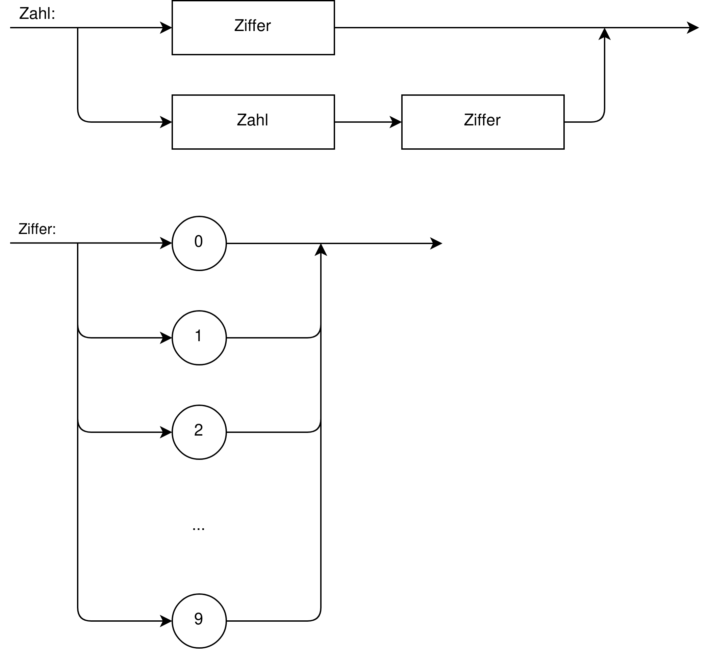
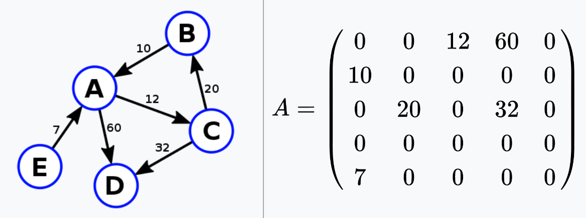

# Kryptografie

Chiffre
: Verfahren zur Verschlüsselung

symmetrische Chiffren
: Sender und Empfänger der Nachricht besitzen den selben Schlüssel und benutzen diesen zur Ver- und Entschlüsselung.

asymmetrische Chiffren
: Sender und Empfänger besitzen unterschiedlichen Schlüssel; der Schlüssel zur Verschlüsselung wird durch den Empfänger als *public Key* bereitgestellt und unterliegt keiner Geheimhaltung.

Substitutionschiffre
: Ersetzung der Zeichen durch andere

Transpositionschiffre
: Veränderung der Position der Zeichen

Kerckhoffssches Prinzip
: Ein kryptologisches System muss immer sicher sein, solange der Schlüssel geheim ist. Das heißt das Verfahren der Verschlüsselung darf keine Sicherheitsfunktion sein.

## Cäsar Chiffre
Bei der Cäsar Chiffre handelt es sich um ein symmetrisches Substitutionsverschlüsselungsverfahren. Der Schlüssel für dieses ist lediglich eine ganze Zahl $k$. Dabei wird verschlüsselt, indem der jeweilige Buchstabe durch den um $k$ verschobenen Buchstaben ersetzt wird. Entschlüsselung geschieht durch Ersetzung um $-k$.

## Einfache monoalphabetische Substitution
Bei dieser Art der Verschlüsselung welche schon von Karl dem Großen und Hildegard von Bingen verwendet wurde, wird jeder Buchstaben im Klartext mit einem ihm zugeordneten Buchstaben im Geheimtextalphabet ersetzt. Das Geheimtextalphabet besitzt dabei die gleiche Länge wie das Klartextalphabet und ist gleichzeitig der Schlüssel der Verschlüsselung. Somit gibt es für das lateinische Alphabet auch $26! = 4,03*10^{26}$ mögliche Schlüssel.

## Homophone Chiffre
Eine weitere monoalphabetische Substitutionschiffre ist die homophone Chiffre. Bei dieser wird eine Häufigkeitsanalyse als Schwachstelle eliminiert, indem charakteristische Buchstabenhäufigkeiten verschleiert werden, indem es für häufig vorkommende Buchstaben mehrere Möglichkeiten zur Substitution gibt.

## Vigenère Chiffre
Um Häufigkeitsanalysen zu erschweren werden polyalphabetische Chiffren verwendet. Bei diesen unterscheidet sich die Substitution jedes Buchstaben zusätzlich durch seine Position im Klartext. Es werden zur Verschlüsselung jeweils unterschiedliche Geheimalphabete verwendet. Welche Substitution verwendet wird, wird dabei durch die repetive Aneinanderreihung des Schlüssels und einer Cäsar-Verschlüsselung mit dem jeweiligen Buchstaben des Schlüssels definiert. Zum leichteren Vorgehen kann ein Vigenère-Quadrat verwendet werden. Bei diesem ist der Klartextbuchstabe auf der $x$-Achse und der Schlüsselbuchstabe auf der $y$-Achse aufgetragen.

### One Time Pad
Eine besondere Form der Vigenère-Verschlüsselung ist das One Time Pad oder kurz OTP. Bei diesem ist der Schlüssel gleich lang wie der Klartext. Hierdurch ist diese Verschlüsselung unknackbar, da auch eine Häufigkeitsanalyse jeder $n$ten Stelle fehlschlägt. Das Problem ist allerdings, dass ein sehr langer Schlüssel sicher übermittelt werden muss.

## Beispiele für Transpositionschiffren
### Gartenzauntransposition

    Klartext:   Informatik
                I f r a i 
                 n o m t k
    Chiffre:    Ifrainomtk

### Skytale
Die Skytale ist eines der ältesten Verschlüsselungsverfahren. Zur Verschlüsselung wird ein Papierstreifen um einen Stab mit bestimmtem Durchmesser gewickelt und nun die Nachricht auf den Stab der Länge nach geschrieben. Nach dem Abwickeln entsteht eine scheinbar willkürliche Reihenfolge, welche mittels eines Stabes mit gleichem Durchmesser entschlüsselt werden kann.

### Fleißnersche Schablone
Bei diesem Verschlüsselungsverfahren wird eine Schablone genutzt, bei welcher ein Viertel aller Felder ausgeschnitten wird. Dabei besteht bei den ausgeschnittenen Feldern keine Symmetrie bei Rotation um 90 Grad. Zur Verschlüsselung wird nun diese Schablone auf ein Stück Papier gelegt und die ausgeschnittenen Feldern mit den Buchstaben des Klartextes gefüllt. Nun wird die Schablone um 90 Grad rotiert. Dieses Verfahren wird vier Mal wiederholt. Man erhält die Chiffre.

## Methoden zum Brechen von kryptographischen Verfahren
### Häufigkeitsanalyse
Zum Entziffern von Chiffren, welche mittels einer Art der einfachen monoalphabetischen Substitutionschiffre erzeugt wurden, kann eine Analyse der Häufigkeit der verschiedenen Buchstaben vorgenommen werden. Wenn diese Häufigkeitsverteilung mit der normalen Häufigkeitsverteilung der Ausgangssprache verglichen wird, so können Rückschlüsse auf den verwendeten Schlüssel gezogen werden und somit der gesamte Text entschlüsselt werden. Die häufigsten Buchstaben im Deutschen sind $E, N, I, S, R$. Zudem können Doppelbuchstaben betrachtet werden. Dabei sind $SS, NN, LL$ besonders häufig im Deutschen.

### Brute-Force-Metode
Das Ausprobieren aller möglichen Kombinationen um den Schlüssel zu erlangen nennt man Brute-Force. Diese Methode funktioniert bei jeder Art der Verschlüsselung ist jedoch sehr aufwendig und somit nur selten praktikabel.

# Formale Sprachen

Syntax
: Regeln nach denene Strukturen einer Sprache gebildet werden

Semantik
: Bedeutung der Strukturen einer Sprache

Pragmatik
: Verwendung und Bedeutung der Sprachkonstrukte in konkreten Situationen

Alphabet
: eine nicht-leere, endliche, geordnete Menge aller Symbole einer Sprache; Bsp.: römische Zahlen: $$\Sigma = \{I, V, X, L, C, D, M\}$$

Wort
: Hineinanderreihung endlich vieler Symbole aus einem vorgegeben Alphabet

leeres Wort
: Wort ohne jegliche Symbole; übliche Bezeichnungen sind $\varepsilon$ oder $\lambda$; Alphabet ohne leeres Wort mit $\Sigma^+$, mit leerem Wort $\Sigma^*$

formale Sprache
: bestimmte Teilmenge der Menge $\Sigma^*$ aller möglichen Wörter über $\Sigma$

## Produktion
Dies sind die Regeln, nach welchen korrekte Wörter einer formalen Sprache gebildet werden können. Ein Beispiel bei den natürlichen Zahlen wäre wie folgt:

    <Zahl> ->   <Ziffer> | <Zahl> <Ziffer>
    <Ziffer> -> '0' | '1' | '2' | '3' | '4' | '5' | '6' | '7' | '8' | '9'

Eine Ableitung über diese Produktionsregeln der Zahl `53` wäre:

    <Zahl> -> <Zahl> <Ziffer>
           -> <Ziffer> '3'
           -> '5' '3'
           -> '53'

Terminale
: Symbole aus dem Alphabet, welche bei der Ableitung bestehen bleiben

Nichtterminale / syntaktische Variablen
: Variablen, welche im Laufe der Ableitung ersetzt werden müssen

Startvariable
: syntaktische Variable, bei welcher die Produktion begonnen wird

Aus all diesen Dingen kann eine Grammatik ($G$) aufgebaut werden. Diese sind im Allgemeinen wie folgt aufgebaut: $$G = \{\Sigma, V, P, S\}$$. Dabei gilt:

$\Sigma$
: Alphabet der Grammatik

$V$
: Menge der syntaktischen Variablen

$P$
: Menge der Produktionen

$S$
: Startvariable, wobei gilt, dass $S \in V$

Die Produktionsregeln können zudem auch als sogenannte Syntaxdiagramme dargestellt werden. Das obere Beispiel würde wie folgt als Syntaxdiagramm dargestellt werden: 

### Erweiterte Backus-Naur-Form
Die bereits oben verwendete Form um Syntaxdiagramme als Text darzustellen, nennt man erweitere Backus-Naur-Form oder kurz EBNF. Durch diese sind alle möglichen Syntax-Diagramme darstellbar. Die Regeln zur Verwendung dieser sind in der folgenden Abbildung dargestellt.

## Endliche Automaten
Unter einem endlichen Automaten, besteht man ein theoretisches Konstrukt, welches eine endliche Anzahl an Zuständen annehmen kann, nachdem ihm eine Zeichenkette als Eingabe gegeben wurde.
Diese können beispielsweise verwendet werden um zu überprüfen, ob ein Wort ein Element einer formalen Sprache ist.
Jeder endliche Automat beginnt bei einem Startzustand und verlüft danach entsprechend der Zeichenkette. Deterministische Automaten können dabei jeweils nur einen Weg gehen. Wenn am Ende der Zeichenkette ein Endzustand (kenntlich gemacht durch einen doppelten Kreis) erreicht ist, dann entspricht dieser einer wahren Ausgabe. Im anderen Fall nicht. Wie ein endlicher Automat dargestellt wird, ist in der zugehörigen Abbildung erkennbar.

# Graphentheorie
Die Graphentheorie beschäftigt sich mit dem mathematischen Modell von Graphen --- einem Netz aus Knoten, welche durch Kanten verbunden sein können. 

Vollständiger Graph
: Graph, in welchem zwischen allen Knoten untereinander eine direkte Verbindung besteht

(un)gewichteter Graph
:   Graph, in welchem die Kanten ein sog. Gewicht haben (Wert) und das Ziel meist min. Gesamtgewicht ist (bsp.: autostrecken haben eine Dauer)

(un)gerichteter Graph
:   Graph, in welchem die Kanten eine bestimmte Richtung haben (gerichtet)(bsp.: Einbahnstraßennetz), bzw. nicht  

Multigraph
:   In einem Multigraph können Knoten mit >1 Kanten verbunden sein  

Nachbarknoten
:   Knoten, der zu einem bestimmten Knoten eine direkte Kante hat  

isolierter Knoten
:   Knoten, welcher keine Kante zum Hauptteil des Graphen besitzt  

Weg / Pfad
:   Kombination aus Kanten, um Strecke zwischen zwei Knoten zu beschreiben  

Kreis / Zyklus
:   Ein Graph, in welchem durch die Kanten/Knoten -relationen ein Kreis (/Zyklus) beschrieben wird

Graphen können entweder einfach graphisch dargestellt werden, aber auch beispielsweise als sogenannte Adjazenzmatrizen. Dabei werden die Verbindungen zwischen zwei Knoten durch einen zugehörigen Eintrag in einer Matrix festgehalten. Dabei gibt die Zeile immer an, von welchem Knoten die Kante ausgeht, während die Spalte angibt, zu welchem Knoten sie führt. Ungerichtete Graphen bilden zudem stets eine zur Diagonalen symmetrische Matrix und ungewichtete Graphen besitzen als Eintrag für eine Kante jeweils eine 1, währen gewichtete Graphen das Kantengewicht als Eintrag besitzen. Ein Beispiel für einen Graphen und eine Adjazenzmatrix, kann in der zugehörigen Abbildung gefunden werden. 

## Färbeproblem
Ein bekanntes Problem der Graphentheorie ist das sogenannte Färbeproblem. Die Aufgabe bei diesem ist es einen Graphen mit möglichst wenigen Farben so einzufärben, dass sich nie die gleiche Farben berühren. Als Graph wird dies dargestellt, indem jedes zu färbende Objekt ein Knoten ist und Nachbarschaft durch eine Kante zwischen den Knoten dargestellt wird. Zum Lösen dieses Problemes gibt es keinen effizienten Algorithmus. Eine mögliche (aber nicht zwangsläufig optimale) Lösung des Problems kann mit einem Greedy-Algorithmus erfolgen. Hierfür wird zunächst ein Knoten eingefärbt. Von diesem ausgehend werden alle weiteren Knoten eingefärbt.

Eine weitere hilfreiche Regel beim Färbeproblem ist, dass man maximal 4 Farben benötigt um eine 2D-Karte einzufärben.

# Sortierung
In der Informatik ist beispielsweise bei der Suche von Elementen in einem Array oder der einfachen Ausgabe es wichtig Arrays zu sortieren. Hierfür werden Sortieralgorithmen verwendet. Diese Sortieralgorithmen sind in der Regel auf effizienz ausgelegt.

Selection Sort
: verläuft wie folgt: Suche des kleinsten Elements im unsortierten Bereich und tausche mit erster Stelle des unsortierten Bereichs

Bubble Sort
: verläuft wie folgt: Vergleiche Elemente des Arrays mit Nachbar und vertausche diese wenn die Reihenfolge nicht stimmt

Insertion Sort
: verläuft wie folgt: erstelle sortierten und unsortierten Bereich und verschiebe jeweils ein Element des unsortierten Bereichs an seine Stelle im sortierten

## Suchen
Zur Suche eines Elements in einer sortierten Liste kann das *Divide an Conquer*-Verfahren verwendet werden. Hierfür wird die sortierte Liste in der Mitte geteilt und überprüft, in welcher Hälfte das gesuchte Element liegt. Dies wird wiederholt, bis das gewünschte Element gefunden ist.

# Logik
In der Informatik wird sich auch grundlegend mit der informationstechnischen Logik beschäftigt. Hierfür gibt es verschiedene Logikverknüpfungen, welche in den folgenden Tabellen zu finden sind.

| Name | langer Name              |
|------|--------------------------|
| AND  | Konjunktion              |
| OR   | Disjunktion              |
| NOT  | Negation                 |
| NAND | Negation der Konjunktion |
| NOR  | Negation der Disjunktion |
| XOR  | Antivalenz               |
| XNOR | Negation der Antivalenz  |

| Name | mathematische Schreibweise | Schaltsymbol |
|-|-|-|
| Und-Gatter, `AND` | $A \wedge B$ |  |
| Oder-Gatter, `OR` | $A \vee B$ |  |
| Nicht-Gatter, `NOT` | $\neg A$ |  |
| NAND-Gatter, `NAND` | $\overline{A \wedge B}$ |  |
| NOR-Gatter, `NOR` | $\overline{A \vee B}$ |  |
| Exklusiv-Oder-Gatter, `XOR` | $A \oplus B$ |  |
| XNOR-Gatter, `XNOR` | $\overline{A \oplus B}$ |  |

