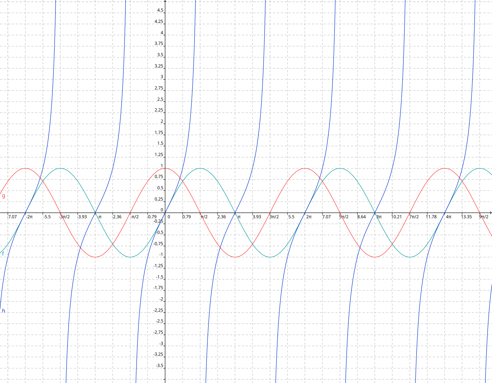
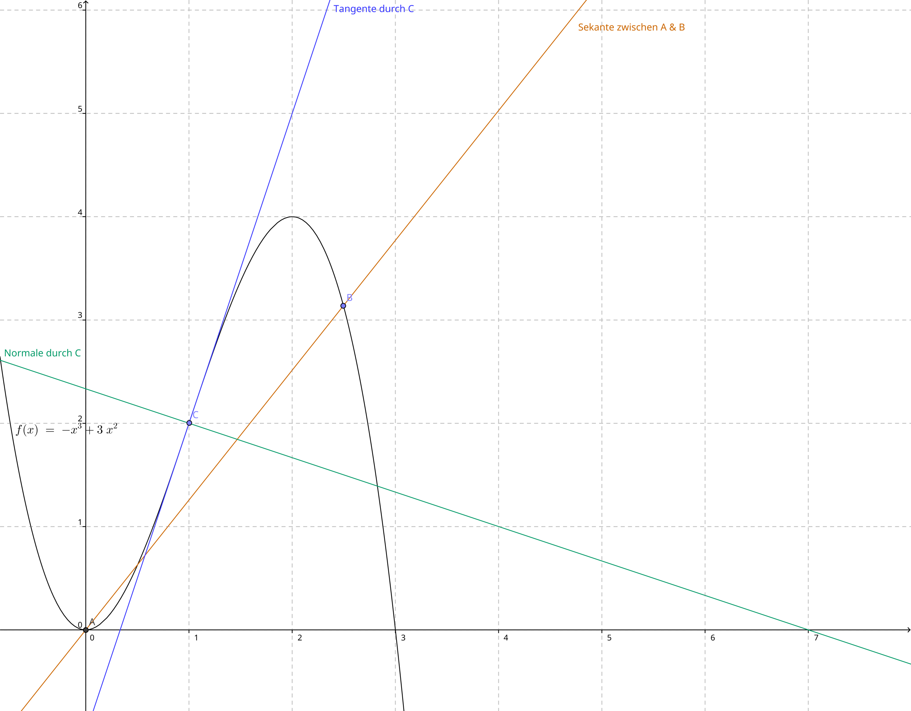
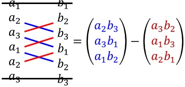
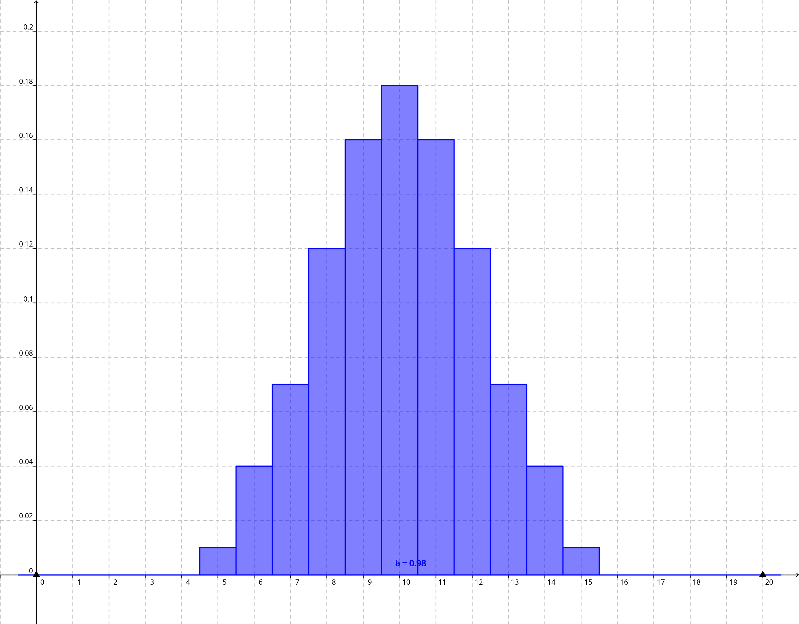
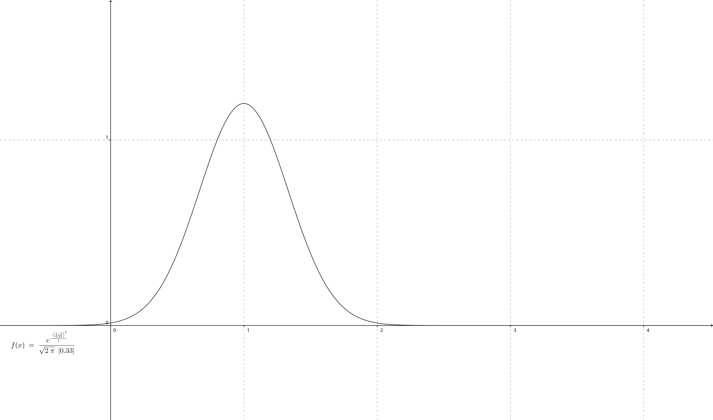

# Analysis
## Funktionstypen
### ganzrationale Funktionen
Unter ganzrationalen Funktionen versteht man einen Typ von Funktionen, welcher eine Summe aus Potenzfunktionen mit natürlichem Exponenten sind. Sie sind also wie folgt aufgebaut: $$f(x) = a_n * x^n + .... + a_1 * x^1 + a_0; \hspace{40pt} n \in \mathbb{N}$$. Dabei gibt $n$ an, von welchem Grad diese Funktion ist. $n$ ist immer äquivalent mit dem größten Exponenten. Auch wird der Faktor vor der Potenz mit höchstem Exponent Leitkoeffizient genannt. Beispielsweise ist $f(x) = -2x^3+4$ vom Grad 3 und besitzt den Leitkoeffizient -2.  

Eine Funktion vom Grad $n$ kann dabei des Weiteren maximal $n$ Nullstellen besitzen.  
Auch ist eine ganzrationale Funktion mit ausschließlich geradzahligen Exponenten immer achsensymmetrisch zur y-Achse und eine mit nur ungeradzahligen Exponenten punktsymmetrisch zum Ursprung.

### Exponentialfunktionen
Der Begriff Exponentialfunktion bezeichnet eine Funktion, welche die Variable im Exponenten hat. Somit können diese zu $f(x) = a^x$ vereinfacht werden. Im Abitur werden nur natürliche Exponentialfunktionen abgefragt, dass heißt, dass als Basis die eulersche Zahl ($e$) verwendet wird. Somit sind die Exponentialfunktionen welche behandelt werden wie folgt aufgebaut: $$f(x) = e^x$$.

### trigonometrische Funktionen
Die trigonometrischen Funktionen beschreiben das Verhältnis zwischen der Seitenlängen eines rechtwinkligen Dreiecks. Zu ihnen gehören $\sin, \cos, \tan$. All diese Funktionen sind periodisch und haben in ungestrecktem Zustand eine Periodenlänge von $2 \pi$ bei Sinus und Kosinus, bzw. $\pi$ beim Tangens, im Bogenmaß (`rad`).  
Sie beschreiben dabei das Verhältnis der folgenden Seiten: $$\sin{(x)} = \frac{|Gegenkathete|}{|Hypotenuse|}$$ $$\cos{(x)} = \frac{|Ankathete|}{|Hypotenuse|}$$ $$\tan{(x)} = \frac{|Gegenkathete|}{|Ankathete|} ( = \frac{\sin{(x)}}{\cos{(x)}})$$.  
Verallgemeinert können die trigonometrischen Funktionen am Beispiel des Sinus zu folgender Gleichung: $$f(x) = a * \sin{(b * (x-c))} + d; \hspace{40pt} a, c, d \in \mathbb{R}, b \in \mathbb{R^+}$$. Dabei verändern die Parameter die Graphen wie folgt (vgl. [Abschnitt Wirkung von Parametern](#wirkung-von-parametern):  

$a$  
: Es kommt zu Streckung ($|a|>1$), bzw. Stauchung ($|a|<1$) in y-Richtung. Bei $a<0$ kommt es zur Spiegelung an der x-Achse.  
: > Der Graph der Sinusfunktion wurde um den Faktor $|a|$, bzw. $\frac{1}{|a|}$ in y-Richtung gestreckt/gestaucht. Die entstandene Amplitude entspricht $a$. Der Graph wurde an der x-Achse gespiegelt

$b$  
: Es kommt zu Streckung ($b<1$), bzw. Stauchung ($b>1$) in x-Richtung. Die Periode der Funktion beträgt dabei immer $p = \frac{2 \pi}{b}$. **$\rightarrow$ desto kleiner b, desto größer die Periodenlänge**
: > Der Graph der Sinusfunktion wurde um den Faktor $1/b$, bzw. $b$ in x-Richtung gestreckt/gestaucht. Die entstandene Periodendauer entspricht $\frac{2 \pi}{b}$.

$c$  
: Es kommt zur Verschiebung in x-Richtung, nach links ($c<0$) bzw. rechts ($c>0$).
: > Der Graph der Sinusfunktion wurde um $|c|$ nach links/rechts verschoben.

$d$  
: Es kommt zur Verschiebung in y-Richtung nach oben ($d>1$), bzw. unten ($d<1$).
: > Der Graph der Sinusfunktion wurde um $|d|$ nach oben/unten verschoben.

Abbildung(vgl. Abbildung trigonometrische Funktionen) der trigonometrischen Funktionen im Koordinatensystem. $f(x)= \sin{(x)}; \hspace{40pt} g(x) = \cos{(x)}; \hspace{40pt} h(x) = \tan{(x)}$  

wichtige Werte der trigonometrischen Funktionen:  

| $x$         | $0$ | $\frac{\pi}{4}$                    | $\frac{\pi}{2}$ | $\frac{3 \pi}{4}$                    | $\pi$ | $\frac{3 \pi}{2}$   | $2\pi$ |
|-------------|-----|------------------------------------|-----------------|--------------------------------------|-------|---------------------|--------|
| $\sin{(x)}$ | $0$ | $\frac{\sqrt{2}}{2} \approx 0,707$ | $1$             | $\frac{\sqrt{2}}{2} \approx 0,707$   | $0$   | $-1$                | $0$    |
| $\cos{(x)}$ | $1$ | $\frac{\sqrt{2}}{2} \approx 0,707$ | $0$             | $-\frac{\sqrt{2}}{2} \approx -0,707$ | $-1$  | $0$                 | $1$    |
| $\tan{(x)}$ | $0$ | $1$                                | $\pm \infty$    | $-1$                                 | $0$   | $\pm \infty$        | 0      |

### Potenzfunktionen
Potenzfunktionen sind Funktionen nach dem folgenden Schema: $$f(x) = a * x^n; \hspace{40pt} n \in \mathbb{N}, a \in \mathbb{R}$$. Sie sind die Basis ganzrationaler Funktionen.

### gebrochen-rationale Funktionen
Unter einer gebrochen-rationalen Funktion versteht man einen Quotienten zweier ganzrationaler Funktionen. Also verallgemeinert folgendes: $$f(x) = \frac{g(x)}{h(x)} = \frac{a_{n_1} * x^{n_1} + .... + a_1 * x^1 + a_0}{a_{n_2} * x^{n_2} + .... + a_1 * x^1 + a_0}; \hspace{40pt} n_1, n_2 \in \mathbb{N}$$. Beim Rechnen mit diesen muss insofern aufgepasst werden, dass wenn der Nenner 0 wird, eine Definitionslücke entsteht (für genaueres siehe [Abschnitt zu Definitionslücken](#definitionslücken-und-senkrechte-asymptoten)).

## Wirkung von Parametern
Bei einer veränderten Funktion $g(x)$ ausgehend von $f(x)$, nach dem folgenden Schema: $$g(x) = a * f(b * (x-c)) + d; \hspace{40pt} a, b, c, d \in \mathbb{R}$$.

$a$  
: Es kommt zu Streckung ($|a|>1$), bzw. Stauchung ($|a|<1$) in y-Richtung. Bei $a<0$ kommt es zur Spiegelung an der x-Achse.  

$b$  
: Es kommt zu Streckung ($|b|<1$), bzw. Stauchung ($|b|>1$) in x-Richtung (**umgekehrte Richtung wie bei a**). Bei $b<0$ kommt es zur Spiegelung an der x-Achse.

$c$  
: Es kommt zur Verschiebung in x-Richtung, nach links ($c<0$) bzw. rechts ($c>0$).

$d$  
: Es kommt zur Verschiebung in y-Richtung nach oben ($d>1$), bzw. unten ($d<1$).

## Zusammengesetzte Funktionen
### Summen/Differenzen von Funktionen
Unter einer Summe, bzw. einer Differenz von Funktionen versteht man eine Verkettung von einzelnen Funktionen durch Addition, bzw. Subtraktion. Also wie folgt: $$f(x) = g(x) \pm h(x) \pm ....$$. Es gilt des weiteren, dass $$g(x) + h(x) + ... = (g+h+...)(x)$$. Dies gilt ebenfalls bei der Subtraktion von Funktionen.  
Kombination aus beidem sind auch möglich, mit den gleichen Regeln.  
Bei dieser Art der Verkettung gelten die üblichen Regeln zur Addition und Subtraktion (Assoziativgesetz, Kommutativgesetz, ....).

### Produkte/Quotienten von Funktionen
Unter einem Produkt, bzw. einem Quotienten von Funktionen versteht man eine Verkettung durch Multiplikation, bzw. Division. Dies geschieht nach dem Schema: $$f(x) = g(x) * h(x) * ....$$, bzw. $$f(x) = \frac{g(x)}{h(x) * ...}$$. Dabei gilt, dass $$g(x) * h(x) * ... = (g * h *...)(x)$$, bzw. mit Division bei einem Quotienten.  
Es sind auch Kombinationen aus Produkt und Quotient möglich, dabei gelten die selben Regeln.  
Bei dieser Art der Verkettung gelten die üblichen Regeln zur Multiplikation und Division (Assoziativgesetz, Kommutativgesetz, ....).

### verkettete Funktionen
Von einer Verkettung von Funktionen spricht man, wenn die Funktionswerte der einen Funktion die x-Werte der anderen bilden. Am Beispiel der Verkettung der Funktionen $g(x)$ und $h(x)$ also wie folgt: $$f(x) = g(h(x))$$. Um den endgültigen Funktionsterm zu bilden, werden dabei alle $x$ durch $h(x)$ in diesem Beispiel ersetzt. Dies kann auch wie folgt aufgeschrieben werden: $$g(h(x)) = g \circ h$$.

## Bestimmung von Funktionen mit vorgegebenen Eigenschaften
### Bestimmung ganzrationaler Funktionen
Um eine ganzrationale Funktion mit gewünschten Eigenschaften zu erhalten, muss zunächst eine Grundfunktion aufgestellt werden. Diese ist immer nach dem Muster aller ganzrationalen Funktionen (vgl. [Abschnitt ganzrationale Funktionen](#ganzrationale-funktionen)): $f(x) = a_n * x^n + .... + a_1 * x^1 + a_0; \hspace{40pt} n \in \mathbb{N}$.  
Nun müssen die allgemeinen Eigenschaften verallgemeinert werden. Beispiele hierfür wären:

- Hochpunkt bei $HP(2|3)$ wird zu $f(2) = 3$, $f'(2) = 0$ und $f''(2)<0$  
- Funktion 3. Grades bedeutet, dass $n=3$ gilt  
- Achsensymmetrie bedeutet, dass nur geradzahlige Exponenten vorkommen dürfen, Punktsymmetrie, dass nur ungeradzahlige Exponenten

Alle somit erhaltenen Eigenschaften müssen nun verarbeitet werden. Dabei gilt als Faustformel, dass Eigenschaften des Funktionsterms (Bsp.: "nur ungeradzahlige Exponenten") direkt auf diesen angewendet werden, Gleichungen die man erhält in ein lineares Gleichungssystem (LGS) übernommen werden und Ungleichungen zur Probe des finalen Terms genutzt werden. **Wenn eine Probe möglich ist, darf diese nicht vergessen werden.**

## Funktionenscharen
Eine Funktionenschar ist eine Menge an Funktionen, wobei diese Funktionen durch einen Parameter variiert werden. Eine Funktionenschar wird wie folgt dargestellt: $$f_t(x) = ...$$. Dabei ist $t$ der Parameter. Ein mögliches Beispiel wäre hier $f_t(x) = x^2 - tx$. Beim Rechnen mit einer solchen Schar von Funktionen wird $t$ als konstante Zahl betrachtet und entsprechend mit diesem vorgegangen. So lassen sich dann beispielsweise auch Integrale oder Extrempunkte bestimmen in Abhängigkeit von $t$, wobei das $t$ in das Ergebnis übernommen wird.

### Bestimmung gemeinsamer Punkte
Um herauszufinden, welche Punkte alle Funktionen der Schar gemein haben, wird die folgende Gleichung gelöst: $$f_a(x) = f_b(x); \hspace{40pt} a \neq b$$. Somit erhält man alle Stellen, an welchen die Funktionen den gleichen y-Wert unabhängig von ihrem Parameter besitzen und somit alle Funktionen einen gemeinsamen Punkt haben. Um diesen Punkt zu berechnen muss lediglich der x-Wert in $f_t(x)$ eingesetzt werden, wobei der Parameter vernachlässigt werden kann.

[//]: # (Beispielrechnung wäre hier wahrscheinlich ganz hilfreich.....)

### Bestimmung der Ortskurve besonderer Punkte
Unter der Ortskurve versteht man die Funktion, auf welcher sich alle besonderen Punkte (Hoch-, Tief- und Wendepunkte) bei Variation des Parameters bewegen.  
Um diese zu bestimmen muss zuerst der Punkt in Abhängigkeit von dem Parameter bestimmt werden. Dafür wird wie bei der sonstigen Bestimmung von Extrem-, bzw. Wendepunkten vorgegangen. Nun kann der x-Wert des Punktes in die Ursprungsfunktionenschar eingesetzt werden und man erhält eine Funktion, welche lediglich Parameter enthält und keine "$x$e". Dies ist die Ortskurve $f(k)$, diese kann nun zu beispielsweise $g(x)$ umbenannt werden.

[//]: # (Auch hier eventuell eine Beispielrechnung)

## Ableitung
Die Ableitung ist der Grenzwert des Differenzenquotienten, bei kleiner werdendem Intervall.

### Differenzenquotient
Der Differenzenquotient gibt die Steigung der Sekante zwischen den beiden Grenzwerten des Intervalls an, oder in anderen Worten die mittlere Änderungsrate im Intervall. Er kann wie folgt im Intervall $I = [a; b]$ berechnet werden: $$m = \frac{f(b) - f(a)}{b - a}; \hspace{40pt} a < b$$.

### Berechnung des Grenzwertes
Zur Berechnung der Ableitung, also des Grenzwertes des Differenzenquotienten wird die Größe des Intervalls mithilfe des Limes gegen 0 bewegt. Hierfür wird die mittlere Änderungsrate im Intervall $[a; a+h]$ bei kleiner werdendem $h$ betrachtet. Somit ergibt sich die Ableitung an der Stelle $a$ als folgender Zusammenhang: $$f'(a) = \lim_{h \to 0} m([a; a+h]) = \lim_{h \to 0} \frac{f(a+h) - f(a)}{h}$$. Dies entspricht der Steigung der Tangente an der Stelle $a$, bzw. der momentanen Änderungsrate an der Stelle $a$.

## Ableitungsfunktion
Wenn alle Ableitungen einer Funktion $f$ zu einer neuen Funktion zusammengefasst werden, so nennt man die entstandene Funktion eine Ableitungsfunktion, oder kurz $f'$. Diese kann entweder wie im [vorigen Abschnitt](#berechnung-des-grenzwertes) gebildet werden, oder durch Verwendung der Ableitungsregeln. Wenn von einer Ableitungsfunktion eine Ableitung gebildet wird, so nennt man das die zweite Ableitung, bzw. eine höhere Ableitung --- also alle Ableitungen über der ersten Ableitung. Diese werden $f''(x), f'''(x), .... f'^{n} (x)$ genannt.

### Ableitungsregeln

Summenregel  
: Wenn eine Summe abgeleitet werden soll, so kann jede Teilfunktion individuell abgeleitet werden. Es gilt also: $$f(x) = g(x) + h(x); \hspace{40pt} f'(x) = g'(x) + h'(x)$$  

Faktorregel
: Ein Vorfaktor bleibt bei der Ableitung bestehen und unbeeinflusst. Somit gilt: $$f(x) = k * g(x); \hspace{40pt} f'(x) = k * g'(x)$$  

Potenzregel
: Eine Potenz wird abgeleitet, indem der Exponent um 1 reduziert wird und der Ursprungsexponent als Vorfaktor hinzugefügt wird. Dies bedeutet folgendes: $$f(x) = x^b; \hspace{40pt} f'(x) = b * x^{b-1}$$

Produktregel
: Ein Produkt aus zwei Teilfunktionen wird wie folgt abgeleitet: $$f(x) = g(x) * h(x) \hspace{40pt} f'(x) = g'(x) * h(x) + g(x) * h'(x)$$
: Dieser Fall unterscheidet sich von der Faktorregel darin, dass in beiden Faktoren die Variable $x$ einen Einfluss nimmt.

Quotientenregel
: Hieraus folgt sogleich auch ein Zusammenhang für die Ableitung einer Division hervor. Dieser ist wie folgt: $$f(x) = \frac{g(x)}{h(x)}; \hspace{40pt} f'(x) = \frac{g'(x) * h(x) - g(x) * h'(x)}{(h(x))^2}$$

Kettenregel
: Eine Verkettung von Funktionen (vgl. [Abschnitt verkettete Funktionen](#verkettete-funktionen)) wird wie folgt abgeleitet: $$f(x) = g(h(x)); \hspace{40pt} f'(x) = h'(x) * g'(h(x))$$

### besondere Ableitungsfunktionen
$$f(x) = c; \hspace{40pt} f'(x) =  0$$
$$f(x) = x^n; \hspace{40pt} f'(x) = n * x^{n-1}$$
$$f(x) = \sqrt{x} = x^{\frac{1}{2}}; \hspace{40pt} f'(x) = \frac{1}{2} x^{- \frac{1}{2}} = \frac{1}{2 \sqrt{x}}$$
$$f(x) = \frac{1}{x} = x^{-1}; \hspace{40pt} f'(x) = -x^{-2} = - \frac{1}{x^2}$$
$$f(x) = \sin{(x)}; \hspace{40pt} f'(x) = \cos{(x)}$$
$$f(x) = \cos{(x)}; \hspace{40pt} f'(x) = - \sin{(x)}$$
$$f(x) = e^x; \hspace{40pt} f'(x) = e^x$$
$$f(x) = \ln{(x)}; \hspace{40pt} f'(x) = \frac{1}{x} = x^{-1}$$

## Tangente, Sekante und Normale
In der folgenden Abbildung (vgl. Abbildung Tangente, Sekante und Normale) ist die Sekante zwischen den Punkten $A(0|f(0))$ und $B(2,5|f(2,5))$, als auch die Tangente und Sekante durch den C(1|f(1)) eingezeichnet. Die Gleichung der Funktion $f$ lautet $f(x) = -x^3 + 3x^2$.  

### Sekante
Unter einer Sekante versteht man eine Gerade durch zwei Punkte auf einem Graphen. Die allgemeine Sekantengleichung durch die Punkte $A(a_1|a_2)$ und $B(b_1|b_2)$ lautet: $$y = \frac{b_2 - a_2}{b_1 - a_1} * (x - a_1) + a_2$$.

### Tangente
Eine Tangente ist eine gerade, welche einen Berührpunkt mit einer Funktion $f$ besitzt und die Steigung dieser am Berührpunkt hat. Somit ist die Steigung einer Tangente gleich der momentanen Änderungsrate von $f$ im Berührpunkt. Allgemein kann die Gleichung einer Tangente wie folgt angegeben werden: $$t: y = f'(u) * (x-u) + f(u)$$, wobei $u$ dem x-Wert des Berührpunkts entspricht.  

Es kann in drei Fälle unterschieden werden, bei der Suche einer Tangentengleichung:

1. Es ist die Tangente in einem Punkt $B(u|f(u))$ des Graphen gesucht. Es ist die Funktion $f$ und der Berührpunkt gegeben. Hierfür muss lediglich $u$ in die allgemeine Tangentengleichung eingesetzt werden, um die Lösung zu erhalten.  

2. Es ist die Tangente parallel zu einer Geraden gesucht. Hierfür muss die Funktion $f$ und die Gerade $g$ gegeben sein. Hierfür wird nun zunächst der Berührpunkt gesucht, indem man die Gleichung $m_g = f'(u)$ nach $u$ auflöst. Durch den Erhalt von $u$ kann nun ähnlich wie gerade vorgegangen werden und $u$ in die allgemeine Tangentengleichung eingesetzt werden.  

3. Es wird die Tangente gesucht, welche durch einen Punkt $P(p_1|p_2)$ verläuft, welcher nicht auf der Funktion liegt. Hierfür muss erneut die Funktion $f$ und der Punkt $P$ gegeben sein. Hierfür wird die allgemeine Tangentengleichung genutzt und man ersetzt $x$ durch die x-Koordinate von $P$ und setzt dies dem y-Wert von $P$ gleich. Somit erhält man dann die Gleichung $p_2 = f'(u) * (p_1 - u) + f(u)$ und muss diese lediglich nach $u$ umstellen. $u$ kann nun verwendet werden um die Tangentengleichung durch einsetzen in die allgemeine Tangentengleichung zu erhalten.

### Normale
Unter einer Normalen versteht man eine Gerade, welche eine Funktion in einem Punkt orthogonal schneidet. Somit ist sie zudem orthogonal zur Tangenten an der gleichen Stelle.  
Die Steigung einer Tangente verhält sich hierdurch wie folgt zur Steigung der Tangenten, bzw. der Ableitung der Funktion an der Stelle $u$: $$m_n = - \frac{1}{m_t} = - \frac{1}{f'(u)}$$.
Die allgemeine Normalengleichung an der Stelle $u$ ist des Weiteren wie folgt: $$n: y = - \frac{1}{f'(u)} * (x-u) + f(u)$$. Hierdurch können sehr ähnliche Aufgaben wie bei der Suche der Tangenten gelöst werden. Dabei wird genauso wie bei der Tangentensuche vorgegangen, nur dass die allgemeine Normalengleichung, statt der allgemeinen Tangentengleichung genutzt wird.

## Kurvendiskussion
### Definitions- und Wertemenge
Die Definitionsmenge gibt an, für welche Werte eine Funktion definiert ist. Das heißt, welche x-Werte einsetzbar sind. Die Wertemenge gibt an, welche Werte die Funktion annehmen kann.  
So wird beispielsweise die Definitions- und Wertemenge von $e^x, \ln{(x)}$ und $\frac{1}{x}$ im Folgenden genauer betrachtet:

- Es gilt $f(x) = e^x$. Da $e^x$ für alle reellen Zahlen definiert ist gilt: $D_f = \mathbb{R}$. Und da die Funktion nur oberhalb der x-Achse verläuft und diese nie berührt gilt: $W_f = (0; \infty) = \mathbb{R^+}$.  

- Es gilt $g(x) = \ln{(x)}$. Da der natürliche Logarithmus nur für alle reellen Zahlen, welche größer als 0 sind, definiert ist gilt: $D_g = (0; \infty) = \mathbb{R^+}$. Da der natüriche Logarithmus alle reellen Zahlen annehmen kann gilt: $W_g = \mathbb{R}$.  

- Es gilt $h(x) = \frac{1}{x}$. Da $h(x)$ für alle reellen Zahlen außer 0 definiert ist gilt: $D_h = \mathbb{R} \backslash \{0\}$. Da die Funktion alle reellen Zahlen annehmen kann gilt: $W_h = \mathbb{R}$.

### Nullstellen
Zur Bestimmung der Nullstellen einer Funktion $f$ muss folgende Gleichung nach $x$ aufgelöst werden: $$f(x) = 0$$. Man erhält alle Nullstellen, bzw. alle x-Koordinaten der Nullpunkte, welche zu einem Punkt, bzw. Punkte $NP(x|0)$ umgeformt werden können.  
Wenn man in der Lösungsmenge eine Nullstelle doppelt vorkommt, so handelt es sich um eine doppelte Nullstelle, bei 3 Vorkommen eine dreifache, usw.. Bei einer zwei-, vier-, sechs-, .... -fachen Nullstelle nähert sich die Kurve dabei nur der x-Achse an und berührt diese, durchstößt diese jedoch nicht. Ein-, drei-, fünf- .... -fache Nullstellen durchstoßen diese. Allgemein lässt sich sagen, dass sich der Graph in der Nähe einer $n$-fachen Nullstelle genauso verhält, wie eine Potenzfunktion vom Grad $n$. 

### Symmetrie
Eine Funktion $f$ ist punktsymmetrisch zum Ursprung, wenn gilt, dass $$f(-x) = -f(x)$$. Die Funktion ist achsensymmetrisch zur y-Achse, wenn gilt, dass $$f(-x) = f(x)$$. Andere Formen der Symmetrie sind für das Abitur nicht relevant.

### Grenzverhalten und Asymptoten
#### allgemeine Hinweise für das Rechnen mit dem Limes
Der Limes wird genutzt, um das Verhalten einer Funktion für einen Wert zu bestimmen, welcher nicht eingesetzt werden darf, da es sich beispielsweise um eine Definitionslücke, bzw. -grenze handelt oder der zu überprüfende Wert $\infty$ ist.  
Wenn der Limes einer Summe bestimmt werden soll, so kann lediglich das Verhalten des Bestandteils mit dem höchsten Exponenten betrachtet werden, wobei eine Exponentialfunktion immer den höchsten Exponenten besitzt. Wenn es sich um ein Produkt oder einen Quotienten handelt, muss jedes Bestandteil hinsichtlich der Vorzeichen betrachtet werden, wobei auch hier gilt, dass der Bestandteil mit dem höchsten Exponenten entscheidet, ob es sich beispielsweise 0 oder $\infty$ annähert.  
Eine weitere schnelle Methode um solch ein Verhalten zu überprüfen ist, dass man in den Taschenrechner die Funktion eingibt und das Verhalten für einen x-Wert nahe an der Grenze betrachtet und so auf das Grenzverhalten schließt.

#### Verhalten für extremale $x$-Werte und waagerechte Asymptoten
Von einer gegebenen Funktion $f$ kann das Verhalten für $x$ gegen $\pm \infty$ untersucht werden. Dafür wird folgende Gleichung gelöst für das Verhalten gegen $\infty$: $$\lim_{x \to \infty} f(x)$$, und $$\lim_{x \to - \infty} f(x)$$ für das Verhalten gegen negativ $\infty$. Mögliche Lösungen sind dabei: $\{ 0; k; \infty ; - \infty \} ; k \in \mathbb{R}$. Wenn dabei $\lim \limits_{x \to \infty} f(x) = \lim \limits_{x \to - \infty} f(x) \neq \pm \infty$ gilt, dann gibt es eine waagrechte Asymptote bei $\lim \limits_{x \to \infty} f(x)$, bzw. $\lim \limits_{x \to - \infty} f(x)$. Dies kann dann als Gleichung der waagerechten Asymptoten wie folgt angegeben werden: $y = \lim \limits_{x \to \infty} f(x) = \lim \limits_{x \to - \infty} f(x)$. 

Vereinfacht werden kann diese Untersuchung mit den folgenden Verallgemeinerungen bei gebrochen-rationalen Funktionen (Grad des Zählers wird mit $z$ abgekürzt, der des Nenners mit $n$):

- Wenn $z < n$ gilt, dann gibt es eine waagrechte Asymptote bei $y = 0$.  

- Wenn $z = n$ gilt, dann gibt es eine waagerechte Asymptote bei $y = c; c \in \mathbb{R} \backslash \{ 0 \}$, wobei $c$ dem Quotienten der Leitkoeffizienten entspricht.  

- Wenn $z > n$ gilt, dann gibt es keine waagrechte Asymptote. 

#### Definitionslücken und senkrechte Asymptoten
Wenn eine Funktion $f$ an einer Stelle nicht definiert ist, so spricht man von einer Definitionslücke. Dies geschieht vor allem, wenn man für das Ergebnis durch 0 teilen müsste.  
In diesem Fall überprüft man welchen Wert der Zähler annimmt, wenn der Nenner eine Nullstelle besitzt. Ist das Ergebnis "= 0" handelt es sich um eine hebbare Definitionslücke und es gibt keine senkrechte Asymptote. Anderenfalls handelt es sich um eine Definitionslücke mit Polstelle, das heißt es gibt auch eine senkrechte Asymptote an der Stelle. Nun kann noch überprüft werden, ob es sich um eine Polstelle mit Vorzeichenwechsel handelt, indem von beiden Seiten der Definitionslücke mithilfe des Limes das Grenzverhalten überprüft wird.

[//]: # (Beispielrechnung wäre angebracht zur Veranschaulichung)

### Monotonie und Krümmungsverhalten
#### Monotonie
Eine Funktion $f$ ist immer dann streng monoton wachsend in einem Intervall $I$, wenn gilt, dass $$f(a) < f(b); \hspace{40pt} a, b \in I; a < b$$. Sie ist streng monoton fallend, wenn gilt, dass $$f(a) > f(b); \hspace{40pt} a, b \in I; a < b$$. Dies bedeutet in einer anderen Formulierung, dass eine Funktion streng monoton wachsend ist, wenn für alle $x \in I$ gilt, dass $f'(x) > 0$ und umgekehrt für streng monoton fallend. Diese zweite Formulierung nennt man auch den Monotoniesatz.  
Des Weiteren gibt es den Fall, dass eine Funktion $f$ im Intervall $I$ lediglich monoton wachsend oder fallend ist, wenn nur gilt, dass $f'(x) \leq 0$, bzw. $f'(x) \geq 0$.  
So wäre die Funktion $f(x) = x^3$ zwar nicht streng monoton wachsend, da die Ableitung an der Stelle 0, 0 entspricht, jedoch monoton wachsend.

#### Krümmungsverhalten
Wenn die Ableitung einer Funktion $f$, also $f'$ auf einem Intervall $I$ streng monoton fallend ist, so ist $f$ in diesem Intervall rechtsgekrümmt. Wenn $f'$ in diesem Intervall streng monoton wachsend ist, so ist $f$ in diesem Intervall linksgekrümmt.  
Dies bedeutet, wenn $f''(x) < 0$ für alle $x \in I$, so ist $f$ rechtsgekrümmt und linksgekrümmt im umgekehrten Fall.

### Extrem- und Wendepunkte
#### Extrem- und Sattelpunkte
Zur Bestimmung der Extrempunkte einer Funktion $f$, müssen zuerst die Extremstellen bestimmt werden durch die Lösung der Gleichung $$f'(x) = 0$$, wobei gelten muss, dass $$f''(x) \neq 0$$. Wenn diese Stelle(n) bestimmt sind, so können die entsprechenden Punkte nach dem Schema $EP(x|f(x))$ bestimmt werden. Wenn $f''(x) = 0$ gilt, so handelt es sich bei der Stelle um eine Sattelstelle und nach dem gleichen Vorgehen kann auch der Sattelpunkt berechnet werden.

#### Wendepunkte
Wenn die Wendepunkte einer Funktion $f$ berechnet werden sollen, müssen zunächst die Wendestellen mittels lösen der folgenden Gleichung bestimmt werden: $$f''(x) = 0$$, wobei wiederum gelten muss, dass $$f'''(x) \neq 0$$ ist. Nun kann der Wendepunkt $WP$ nach dem folgenden Schema bestimmt werden: $WP(x|f(x))$.

## Extremwertbestimmung mit Nebenbedingungen
Zunächst muss der Term bestimmt werden, welcher extremal werden soll. Wenn dieser mehrere Variablen enthält muss mittels der Zusammenhänge zwischen den Variablen einer gefunden werden, mit einer Variable. Diese Funktion nennt man Zielfunktion. Außerdem muss das Intervall bekannt sein, in welchem die Zielfunktion auf Extrembedingungen untersucht werden soll.  Nun kann die Zielfunktion auf Extremwerte untersucht werden, welche im Intervall liegen. Auch muss durch überprüfen der Ränder des Intervalls gesichert werden, dass diese keine höheren (oder sonstigen extremen) Werte besitzen. Nun kann zum Schluss das Ergebnis formuliert werden, wobei angegeben wird, ob der extremste Wert an den Rändern oder in dem Intervall liegt.

## Stammfunktionen
Wenn man die kumulierten Werte einer Funktion bis zu einem Punkt erhalten möchte, so kann man eine Funktion $f(x)$ aufleiten und ihre Stammfunktion $F(x)$ erhalten. Die Aufleitung, bzw. Stammfunktion ist das umgekehrte zur Ableitung einer Funktion. Deshalb gilt auch, dass $F'(x) = f(x)$.  
Des Weiteren ist zu beachten, dass es immer eine unendliche Anzahl an Aufleitungen gibt, da ein konstanter Summand hinzugefügt werden kann, welcher die Stammfunktion nach oben verschiebt. Somit gilt, dass die Stammfunktion von $f$, $$F(x) + c; \hspace{40pt} c \in \mathbb{R}$$ entspricht.

Ähnlich zur Ableitung gibt es auch sogenannte Aufleitungsregeln, und zwar folgende:  

Potenzregel
: Wenn eine Potenzfunktion aufgeleitet werden soll, so muss der Exponent um 1 erhöht werden, und ein Vorfaktor vom Kehrwert des neuen Exponenten hinzugefügt werden. Dies kann wie folgt dargestellt werden: $$f(x) = x^b; \hspace{40pt} F(x) = \frac{1}{b+1} * x^{b+1}; \hspace{40pt} b \in \mathbb{R} \backslash \{ -1 \}$$

Summenregel
: Wenn eine Summe von Funktionen aufgeleitet werden soll, kann auch jede Teilfunktion einzeln aufgeleitet werden. Somit gilt: $$f(x) = g(x) + h(x); \hspace{40pt} F(x) = G(x) + H(x)$$  

Faktorregel
: Wenn eine Funktion mit Vorfaktor aufgeleitet werden soll, so bleibt dieser bestehen und wird nicht verändert. Oder allgemein ausgedrückt: $$f(x) = k * g(x); \hspace{40pt} F(x) = k * G(x)$$

lineare Substitution
: Wenn eine verkettete Funktion nach dem Schema $f(x) = g(a * x + b)$ aufgeleitet werden soll, so gilt: $$f(x) = g(a * x + b); \hspace{40pt} F(x) = \frac{1}{a} * G(a * x + b)$$

Des Weiteren gibt es folgende Sonderfälle bei der Aufleitung:
$$f(x) = \frac{1}{x} = x^{-1}; \hspace{40pt} F(x) = \ln{(|x|)}$$
$$f(x) = \sin{(x)}; \hspace{40pt} F(x) = - \cos{(x)}$$
$$f(x) = \cos{(x)}; \hspace{40pt} F(x) = sin{(x)}$$
$$f(x) = e^x; \hspace{40pt} F(x) = e^x$$

### rekonstruierter Bestand
Die Stammfunktion kann beispielsweise verwendet werden, um einen absoluten Wert für einen x-Wert zu bestimmen, wenn lediglich eine Funktion vorhanden ist, welche die Änderungsrate beschreibt. Hierfür wird einerseits die Funktion $f$ benötigt, welche die Änderungsrate beschreibt, als auch der Anfangsbestand $c$. Dann gilt, dass der absolute Bestand $B$ zu einem Punkt $x$ wie folgt berechnet werden kann: $$B(x) = F(x) + c$$

[//]: # (Hinzufügen, wie eine Stammfunktion durch einen Punkt bestimmt werden kann)

## Integral
Das Integral wird genutzt, um die Fläche zwischen einer Funktion und der x-Achse zu bestimmen. Diese nennt man auch den orientierten Flächeninhalt. Es muss beachtet werden, dass wenn der Graph unterhalb der x-Achse verläuft, dass die Fläche negativ betrachtet wird. Das Integral wird immer in einem Intervall $[a; b]$ bestimmt. Notiert wird das Integral der Funktion $f(x)$ im Bereich von $a$ bis $b$ wie folgt: $$\int_a^b f(x) dx$$. 
Beim Rechnen mit Integralen kann ein Integral in mehrere Teilintegrale wie folgt zerlegt werden: $$\int_a^c f(x) dx = \int_a^b f(x) dx + \int_b^c f(x) dx; \hspace{40pt} a < b < c$$. Des Weiteren kann ein Faktor auch aus dem Integral isoliert werden, wie folgt: $$\int_a^b k * f(x) dx = k * \int_a^b f(x) dx$$.
Zur Berechnung eines Integrals kann die Stammfunktion wie folgt verwendet werden: $$\int_a^b f(x) dx = [F(x)]_a^b = F(b) - F(a)$$. Dies ist durch den ersten Hauptsatz der Differenzial- und Integralrechnung (vgl. [Abschnitt dazu](#hauptsätze-der-differenzial--und-integralrechnung)) definiert.

### Hauptätze der Differenzial- und Integralrechnung
1. Ist die Funktion $f$ im Intervall $[a;b]$ integrierbar und ist $F$ eine Stammfunktion im Intervall $[a;b]$, so gilt $$\int_a^b f(x) dx = F(b) - F(a)$$  

2. Sind $F$ und $G$ verschiedene Stammfunktionen von $f$ im Intervall $I$ so unterscheiden sich $F(x)$ und $G(x)$ nur um eine Konstante $c$, das heißt es gilt $$F(x) = G(x) + c; \hspace{40pt} x \in I; c \in \mathbb{R}$$

### Integralfunktionen
Man kann auch eine Funktion mithilfe eines Integrals erstellen, indem man eine der Grenzen variabel auslegt.  Meist wird die festgesetzte Grenze als Index angegeben. Somit wäre die Integralfunktion von $f$ zur unteren Grenze $u$ wie folgt: $$J_u(x) = \int_u^xf(t) dt = F(x) - F(u)$$. Dabei gelten die folgenden Grundsätze: 

- jede Integralfunktion ist eine Stammfunktion der Ursprungsfunktion, aber nicht zwangsläufig umgekehrt

- die untere Grenze ist immer eine Nullstelle der Funktion

### Berechnung von Flächeninhalten
#### gesamter Flächeninhalt
Wenn statt dem orientierten Flächeninhalt der gesamte Flächeninhalt berechnet werden soll, so muss das Integral $I = [a;b]$ an allen Nullstellen der Funktion $f$ geteilt werden. Dann kann der Flächeninhalt wie folgt berechnet werden: $$A = | \int_a^{x_0} f(x) dx | + | \int_{x_0}^{x_1} f(x) dx | + ... +  | \int_{x_n}^{b} dx |$$

#### Fläche zwischen Graphen
Wenn die Funktionen keinen Schnittpunkt besitzen kann mit der folgenden Formel der Flächeninhalt der von den Funktionen $f$ und $g$ im Intervall $[a; b]$ berechnet werden: $$A = | \int_a^b (f(x) - g(x)) dx |$$. Ansonsten muss das Integral analog zum vorigen Abschnitt in Teilintervalle zerlegt werden und dann die Summe berechnet werden.

### unbegrenzter Flächeninhalt
Wenn man die Fläche einer Funktion $f$ in einem Intervall mit offener Grenze berechnen will, so nennt man dies eine unbegrenzte Fläche. Hierzu wird zunächst das Integral mit einer variablen Grenze $z$ in die Richtung, in welche das Intervall geöffnet ist, bestimmt. Nun wird das Grenzverhalten dieses Integrals mithilfe des Limes (vgl. [Abschnitt Grenzverhalten](#grenzverhalten-und-asymptoten)) berechnet. Wenn das Integral dabei einen endlichen Grenzwert hat, so nennt man das Integral uneigentlich. Der Flächeninhalt eines uneigentlichen Integrals im Intervall $I = [u; w]$, welches nach $w$ unbegrenzt ist, ist somit: $$A = \lim_{z \to w} \int_u^z f(x) dx$$

### Mittelwert von Funktionen
Um den Mittelwert einer Funktion $f$ auf einem Intervall $I = [a;b]$ zu bestimmen kann die folgende Formel verwendet werden: $$\bar{m} = \frac{1}{b-a} \int_a^b f(x) dx$$

### Volumen von Rotationskörpern
Wenn man eine Funktion $f$ um die x-Achse rotieren lässt, so entsteht ein sogenannter Rotationskörper. Dessen Volumen läst sich ähnlich zu dem eines Zylinders, im Integral $[a;b]$ mit $$V = \pi \int_a^b (f(x))^2 dx$$ berechnen. Im Falle, dass ein Körper mit freiem Kern entstehen soll, muss beachtet werden, dass der Kern nicht vor der Berechnung des Integrals von der Funktion subtrahiert werden darf, da sonst eine Verschiebung der Funktion nach unten geschieht und das Volumen nicht mehr stimmt.

# Geometrie
## Vektoren
Ein Vektor ist ein Zahlentupel, also eine Sammlung aus einer bestimmten Anzahl an Zahlen. Dieser kann eine Verschiebung oder Richtung angeben.  
Im Falle eines Ortsvektors gibt ein Vektor die Verschiebung eines Punktes vom Nullpunkt an.  

### Rechnen mit Vektoren
#### Vektoraddition
Um zwei Vektoren zu addieren kann einfach jedes Element des Vektors mit dem jeweiligen Element des anderen Vektors addiert werden. So gilt: $$\vec{u} + \vec{v} = \begin{pmatrix} u_1 \\ u_2 \\ u_3 \end{pmatrix} + \begin{pmatrix} v_1 \\ v_2 \\ v_3 \end{pmatrix} = \begin{pmatrix} u_1 + v_1 \\ u_2 + v_2 \\ u_3 + v_3 \end{pmatrix}$$. Diese Addition von Vektoren nennt man Linearkombination.

#### Multiplikation mit einer Zahl
Wenn ein Vektor mit einer Zahl $k$ multipliziert wird, so wird dieser in alle Dimensionen um $k$ gestreckt. Dabei wird jedes Element des Vektors mit $k$ multipliziert. Dadurch gilt: $$ k * \vec{u} = k* \begin{pmatrix} u_1 \\ u_2 \\ u_3 \end{pmatrix} = \begin{pmatrix} k * u_1 \\ k * u_2 \\ k * u_3 \end{pmatrix}$$

#### Betrag eines Vektors
Um die Länge, bzw. den Betrag eines Vektors zu bestimmen muss die Wurzel aus der Summe der Quadrate aller Einzelelemente gebildet werden. Somit gilt: $$ | \vec{u} | = \sqrt{u_1^2 + u_2^2 + .... u_n^2}$$. Ein Sonderfall ist der sogenannte Einheitsvektor, wobei die Länge dieses genau 1 ist. Um aus einem beliebigen Vektor, bei welchem mindestens ein Element ungleich 0 ist einen Einheitsvektor zu erzeugen, muss lediglich der Vektor mit dem Kehrwert seines Betrages multipliziert werden. Somit gilt $$\vec{u_0} = \frac{1}{| \vec{u} |} * \vec{u}$$

#### Skalarprodukt
Um zu überprüfen ob zwei Vektoren orthogonal zueinander sind, kann das Skalarprodukt verwendet werden. Zwei Vektoren sind orthogonal wenn gilt $$\vec{u} \cdot \vec{v} = 0; \hspace{40pt} \vec{u}, \vec{v} \neq \vec{0}$$. Des Weiteren gilt, dass zwei Vektoren parallel sind, wenn gilt, dass $$\vec{a} \cdot \vec{b} = |\vec{a}| * |\vec{b}|$$. Allgemein kann der Winkel zwischen zwei Vektoren über den folgenden Zusammenhang berechnet werden: $$\cos{(\alpha)} = \frac{\vec{a} \cdot \vec{b}}{|\vec{a}| * |\vec{b}|}$$
Das Skalarprodukt berechnet sich dabei aus der Summe aller Produkte der jeweiligen Elemente des Vektors, also wie folgt: $$\vec{u} \cdot \vec{v} = u_1 * v_1 + u_2 * v_2 + ... u_n * v_n$$. Folgende Rechenregeln gelten dabei: 

Kommutativgesetz
: *vgl. Grundlagen*
: $$\vec{u} \cdot \vec{v} = \vec{v} \cdot \vec{u}$$
: $$\vec{u} \cdot \vec{u} = | \vec{u} |^2$$

Distributivgesetz
: *vgl. Grundlagen*
: $$\vec{u} \cdot (\vec{v} + \vec{w}) = \vec{u} \cdot \vec{v} + \vec{u} \cdot \vec{w}$$
: $$(r * \vec{u}) \cdot (s * \vec{v}) = (r*s) * (\vec{u} \cdot \vec{v})$$

#### Vektorprodukt
Das Vektor- oder Kreuzprodukt wird dazu genutzt einen Vektor zu finden, der zu beiden Vektoren orthogonal ist. Somit gilt: $$\vec{n} = \vec{a} \times \vec{b}; \hspace{40pt} \vec{a} \cdot \vec{n} = \vec{b} \cdot \vec{a} = 0$$. Die Berechnung des Kreuzprodukts geht dabei wie folgt: $$\vec{a} \times \vec{b} = \begin{pmatrix} a_2 b_3 - a_3 b_2 \\ a_3 b_1 - a_1 b_3 \\ a_1 b_2 - a_2 b_1 \end{pmatrix}$$. Dies kann mithilfe des folgenden Schemas vereinfacht hergeleitet werden (vgl. Abbildung Kreuzprodukt).  

## Geraden
Eine Gerade kann mithilfe eines Punktes($P$) und eines Richtungsvektors($\vec{v}$) beschrieben werden. Der Richtungsvektor kann dabei auch durch einen zweiten Punkt ersetzt werden, wobei lediglich der Vektor zwischen den beiden Punkten als Richtungsvektor verwendet wird. Dieser Typ von Geraden ist nach dem folgenden Schema aufgebaut: $$g: X = P + s* \vec{v}; \hspace{40pt} s \in \mathbb{R}$$

## Ebenen
Im dreidimensionalen Raum können des Weiteren auch Ebenen dargestellt werden. Hierfür ist ein Punkt($P$) und zwei Spannvektoren($\vec{u}, \vec{v}$) beispielsweise nötig. In diesem Fall wird eine Ebene dann wie folgt dargestellt: $$E: X = P + r * \vec{u} + s * \vec{v}; \hspace{40pt} r, s \in \mathbb{R}; \vec{u} \nparallel \vec{v}$$

### verschiedene Darstellungsformen
#### Parameterform
Unter der Parameterform versteht man Ebenengleichungen nach dem folgenden Schema: $$E: X = P + r * \vec{u} + s * \vec{v}; \hspace{40pt} r, s \in \mathbb{R}; \vec{u} \nparallel \vec{v}$$.
Die Umrechnung in eine Normalengleichung geht wie folgt: 

- Bestimmung des Normalenvektors mithilfe des Vektorprodukts aus den beiden Spannvektoren, also $\vec{n} = \vec{u} \times \vec{v}$

- Den Punkt $P$ übernehmen

Umgerechnet können diese in die Koordinatenform werden, wie folgt:  

- *vgl. Umrechnung in Normalenform und danach Umrechnung in Koordinatenform*

#### Normalenform
Die dritte mögliche Darstellungsform ist die sogenannte Normalengleichung oder -form, welche die Ebene durch einen Punkt ($P$), welcher in der Ebene liegt und einen sogenannten Normalenvektor ($n$) beschreibt. Dieser Normalenvektor steht orthogonal zur Ebene. Die Darstellung in dieser Form ist nach dem folgenden Schema aufgebaut: $$E: (X - P) \cdot \vec{n} = 0; \hspace{40pt} \vec{n} \perp E$$.
Die Umrechnung in die Parameterform gelingt dabei wie folgt:

- *vgl. Umrechnung in Koordinatenform und danach Umrechnung in Parameterform*

Wenn eine Normalenform in eine Koordinatenform umgerechnet werden soll, so gelingt dies wie folgt:

- Ausmultiplizierung der Gleichung zu $E: X \cdot \vec{n} = P \cdot \vec{n}$

- Auflösung des Skalarprodukts

#### Koordinatenform
Die Koordinatenform oder -gleichung ist eine weitere Darstellungsmöglichkeit von Ebenen. Diese Form kann auch als Umstellung der Normalenform gesehen werden. Häufig ist diese zu finden, in Linearen Gleichungssystemen. Ein großer Vorteil dieser Form ist, dass sich schnell viele Punkte die in der Ebene liegen abgelesen werden können. Gleichungen dieser Form sind wie folgt aufgebaut: $$E: a x_1 + b x_2 + c x_3 = d$$, wobei der Normalenvektor $\vec{n} = \begin{pmatrix} a \\ b \\ c \end{pmatrix}$ enthalten ist, und $d$ das Skalarprodukt aus einem Punkt und dem Normalenvektor ist.  
Die Umrechnung in die Parameterform gelingt wie folgt:

- Bestimmung von 3 Punkten welche in der Ebene liegen, durch ausprobieren, bzw. einsetzen

- Bestimmung der Spannvektoren mittels der bestimmten Punkte

Zur Umrechnung in die Normalenform kann wie folgt vorgegangen werden:

- Ablesen des Normalenvektors $\vec{n} = \begin{pmatrix} a \\ b \\ c \end{pmatrix}$

- Bestimmen eines Punktes, welcher in der Ebene liegt, durch ausprobieren, bzw. einsetzen

### Veranschaulichung von Ebenen
*(vgl. Aufschrieb "4.7 Ebenen veranschaulichen")*

## Lagebeziehungen
### Lagebeziehungen von Ebenen und Geraden
Hierfür wird zunächst eine Ebene ($E$) in Koordinatenform und eine Gerade ($g$) benötigt. Nun kann $g$ in $E$ eingesetzt werden, indem jedes $x$ in der Ebene durch die jeweilige $x$-Koordinate der Gerade ersetzt wird. Danach erhält man eine Gleichung nach dem folgenden Schema: $$E: a x_1 + b x_2 + c x_3 = d, g: X = P + s* \vec{v}$$ $$a * (P_1 + s * v_1) + b * (P_2 + s * v_2) + c * (P_3 + s * v_3) = d$$. Wenn diese Gleichung gelöst wird, gibt es drei Möglichkeiten: 

1. Es handelt sich um eine Ungleichung, das heißt $a * (P_1 + s * v_1) + b * (P_2 + s * v_2) + c * (P_3 + s * v_3) \neq d$. In diesem Fall ist $g$ parallel zu $E$, also $g \parallel E$.

2. Die Gleichung stimmt unabhängig davon, was der Parameter annimmt. In diesem Fall gilt $g \in E$, bzw. $g$ liegt in $E$.

3. Die Gleichung stimmt, wenn der Parameter einen bestimmten Wert annimmt, also wenn die Gleichung wie folgt vereinfacht werden kann $s = k; k \in \mathbb{R}$. In diesem Fall schneidet die Gerade die Ebene. Um den Schnittpunkt zu bestimmen kann $k$ in die Geradengleichung eingesetzt werden.

### Lagebeziehungen von Ebenen
Wenn die Lage zwischen zwei Ebenen bestimmt werden soll, so müssen zunächst die Normalenvektoren ($\vec{n_1}, \vec{n_2}$) der beiden Ebenen bekannt sein. Wenn gilt, dass $\vec{n_1} \parallel \vec{n_2}$, bzw. $\vec{n_1} = r * \vec{n_2}; r \in \mathbb{R}$, dann ind die beiden Ebenen parallel. Wenn dies nicht gilt, so schneiden sie sich. Ein Spezialfall des Schneidens ist, wenn $\vec{n_1} \cdot \vec{n_2} = 0$, da dann die Ebenen sich orthogonal schneiden und $E_1 \perp E_2$ ist.

### Lagebeziehung von Punkt und Ebene
Hierfür wird lediglich der Punkt $P$ für $X$ in der Ebenegleichung eingesetzt, und wenn die Gleichung stimmt liegt $P$ in der Ebene.

### Lagebeziehung von Punkt und Gerade
Hierfür wird gleich vorgegangen und $X$ in der Geradengleichung durch den Punkt $P$ ersetzt und überprüft, ob die Gleichung stimmt. Erneut gilt, dass wenn die Gleichung stimmt, dass $P$ in der Geraden liegt.

### Lagebeziehung von Geraden
Geraden können entweder echt parallel, identisch, windschief oder schneidend sein.  
Zur Überprüfung um was es sich handelt müssen zunächst die Richtungsvektoren($\vec{u}, \vec{v}$) verglichen werden. Wenn gilt, dass $\vec{u} = r* \vec{v}$, bzw. dass die beiden parallel sind, so muss noch unterschieden werden, ob die Geraden echt parallel sind, oder ob sie identisch sind. Hierfür wird überprüft, ob der Punkt der einen Gerade in der anderen liegt.  

Im anderen Fall muss überprüft werden, ob es einen Schnittpunkt gibt. Hierfür werden die beiden Geraden gleichgesetzt und das so entstehende lineare Gleichungssystem gelöst. Wenn das Gleichungsystem eine Lösung besitzt, so können die sich aus der Lösung ergebenden Parameter noch in die Geradengleichung eingesetzt werden, um den Schnittpunkt zu berechnen. Wenn das LGS keine Lösung besitzt, so sind die Geraden windschief.

### Abstand zwischen Punkt und Gerade
Zur Bestimmung des Abstandes zwischen einem Punkt ($P$) und einer Geraden ($g$), nutzt man eine sogenannte Hilfsebene. Diese Ebene ist orthogonal zur Geraden und enthält $P$. Zur Bestimmung des Abstandes wird nun wie folgt vorgegangen:

1. Bestimmung der Hilfsebene, durch Verwendung des Richtungsvektors von $g$ als Normalenvektor und Verwendung von $P$ als Punkt in der Ebene.

2. Bestimmung des Schnittpunkts $F$ zwischen $g$ und der Hilfsebene.

3. Der Betrag des Vektors $\vec{FP}$ ist gleich dem Abstand zwischen $P$ und $g$.

### Abstand zwischen Punkt und Ebene
Um den Abstand zwischen einem Punkt ($R$) und einer Ebene ($E$) zu bestimmen gibt es zwei Ansätze. So kann einerseits die Hesse'sche Normalenform verwendet werden. Dies ist eine Normalengleichung, bei der es sich bei dem Normalenvektor um einen Einheitsvektor handelt (vgl. [Abschnitt Betrag eines Vektors](#betrag-eines-vektors)). Nun kann $R$ für $X$ eingesetzt werden. Der Betrag dieser Gleichung entspricht dem Abstand zwischen Punkt und Ebene. Somit gilt: $$d(E, R)  = |(R-P) \cdot \vec{n_0}|$$.
Wenn lediglich eine Koordinatengleichung nach dem Schema $a_1 x_1 + a_2 x_2 + a_3 x_3 = b$ bekannt ist, so kann des Weiteren mit der folgenden Gleichung der Abstand bestimmt werden: $$d(E, R) = |\frac{a_1 r_1 + a_2 r_2 + a_3 r_3 - b}{\sqrt{a_1^2 + a_2^2 + a_3^2}}|$$

### Abstand windschiefer Geraden
Zur Bestimmung des Abstandes zwischen zwei windschiefen Geraden ($g: X = P + r * \vec{u}, h: X = Q + s * \vec{v}$) gibt es erneut zwei Methoden. So kann einerseits ein lineares Gleichungssystem mit den folgenden Gleichungen gelöst werden: $$\text{I} \hspace{20pt} \vec{GH} \cdot \vec{u} = 0$$ $$\text{II} \hspace{20pt} \vec{GH} \cdot \vec{v} = 0$$. Dann gilt für den Abstand. $d(g, h) = |\vec{GH}|$.

Die zweite Methode ist, dass man eine Hilfsebene mit den Richtungsvektoren der Geraden als Spannvektoren erzeugt. Danach kann der Abstand zwischen der Hilfsebene und dem nicht in der Ebene liegenden Punkt berechnet werden. Somit entsteht zunächst die folgende Hilfsebene: $$E: X = P + r * \vec{u} + s * \vec{v}$$, nach Umrechnung in die Normalen, oder Koordinatenform lässt sich auch der Abstand zwischen $E$ und $Q$ leicht berechnen (vgl. [Abschnitt Abstand Punkt Ebene](#abstand-zwischen-punkt-und-ebene)).

### Schnittwinkel
Um den Schnittwinkel zwischen Geraden und Ebenen untereinander zu bestimmen wird das Skalarprodukt verwendet, da durch dieses der Schnittwinkel zweier Vektoren bestimmt werden kann (vgl. [Abschnitt Skalarprodukt](#Skalarprodukt)).  

Um den Winkel zwischen zwei Geraden zu bestimmen muss lediglich der Winkel zwischen den beiden Richtungsvektoren bestimmt werden. Somit ist der Winkel ($\alpha$) zwischen zwei Geraden ($g: X = P + s * \vec{u}, h: X = Q + r * \vec{v}$): $$\alpha = \cos^{-1}(\frac{\vec{u} \cdot \vec{v}}{|\vec{u}| * |\vec{v}|})$$.
Um den Winkel zwischen zwei Ebenen zu bestimmen wird ähnlich vorgegangen, nur dass der Winkel zwischen den Normalenvektoren statt dem zwischen den Richtungsvektoren. Somit ist der Winkel zwischen zwei Ebenen wie folgt: $$\alpha = \cos^{-1}(\frac{\vec{n_1} \cdot \vec{n_2}}{|\vec{n_1}| * |\vec{n_2}|})$$.
Eine Besonderheit gibt es bei der Winkelbestimmung zwischen Gerade und Ebene, weil hierbei die einzigen verfügbaren Vektoren der Richtungsvektor und der Normalenvektor ist. Da der Winkel zwischen diesen beiden nicht gleich dem Winkel zwischen Gerade und Ebene ist. Hierfür muss statt dem Sinus der Kosinus verwendet werden. Somit gilt für den Winkel ($a$): $$\alpha = \sin^{-1}(\frac{\vec{u} \cdot \vec{n}}{|\vec{u}| * |\vec{n}|})$$

## Spiegelung und Symmetrie
Für das Abitur ist lediglich die Spiegelung eines Punktes an einem anderen Punkt, einer Geraden und einer Ebene relevant. Hierfür wird wie folgt Vorgegangen:

Punktspiegelung
: Der gespiegelte Punkt $P'$ entsteht wie folgt, wenn an dem Punkt $Z$ gespiegelt wird: $P' = Z + \vec{PZ}$.

Spiegelung an einer Geraden
: Hierfür wird eine Hilfsebene $E_h$, aus dem Richtungsvektor der Geraden ($g$) als Normalenvektor und dem Punkt $P$ als Punkt der Ebene, erzeugt. Für diese gilt: $P \in E_h \perp g$. Wenn nun der Schnittpunkt zwischen $E_h$ und $g$ berechnet wird, kann wie bei einer Punktspiegelung am Schnittpunkt verfahren werden. Somit gilt dann, wenn $E_h \cap g = \{F\}$ gilt, dass der gespiegelte Punkt $P'$ wie folgt berechnet wird: $P' = F + \vec{PF}$.

Spiegelung an einer Ebene
: Wenn diese Art der Spiegelung vollzogen werden soll, so muss eine Hilfsgerade durch den Punkt $P$, welche rechtwinklig zu der Ebene $E$ ist erzeugt werden (Normalenvektor gleich dem Richtungsvektor und $P$ als Punkt der Geraden). Nun kann wieder der Schnittpunkt $F$ zwischen Gerade und Ebene bestimmt werden und mit der folgenden Gleichung de gespiegelte Punkt $P'$ berechnet werden: $P' = F + \vec{PF}$. 

## Berechnung von Volumina und Flächeninhalten
Für die Berechnung des Flächeninhalts oder dem Volumen von Körpern, die durch Vektoren, welche die Kanten darstellen definiert sind, ist der Betrag des Kreuzproduktes häufig hilfreich. So werden die folgenden Sachen unter Verwendung dieses berechnet.

Flächeninhalt Parallelogramm
: $A = |\vec{a} \times \vec{b}|$

Flächeninhalt Dreieck
: $A = \frac{1}{2} |\vec{a} \times \vec{b}|$

Volumen Spat
: $V = |\vec{c} \cdot (\vec{a} \times \vec{b})|$

Volumen Pyramide mit viereckiger Grundfläche
: $V = \frac{1}{3} |\vec{c} \cdot (\vec{a} \times \vec{b})|$

Volumen Pyramide mit dreieckiger Grundfläche
: $V = \frac{1}{6} |\vec{c} \cdot (\vec{a} \times \vec{b})|$

## Beschreibung von geradlinigen Bewegungen
Für die Modellierung einer geradlinigen Bewegung im Raum wird eine Zeit-Ort-Gleichung verwendet. Diese ist nach dem Schema $s: X = P + t * \vec{v}$ aufgebaut, wobei $P$ den Punkt zu $t_0$ angibt und $\vec{v}$ die Verschiebung pro Zeiteinheit $t$ angibt. Wenn nun beispielsweise überprüft werden soll, ob es zu einer Kollision zwischen zwei Zeit-Ort-Gleichungen kommt, werden diese gleichgesetzt, wobei beide den Gleichen Parameter $t$ besitzen, sodass überprüft wird, ob es einen Schnittpunkt gibt, bei welchem beide Objekte zum gleichen Zeitpunkt sind.

## Beweise mit Vektoren
\-

[//]: # (Einfügen von vektoriellen Beweisen)

## Scharen
Scharen sind immer eine Menge an Geraden oder Ebenen, welche in einem der Vektoren einen Parameter besitzen. Hierdurch wird bei Variation des Parameters die Ebene, bzw. Gerade verändert.

# Stochastik

Ergebnis
: Möglichkeiten die sich beim durchführen des Experiment ergeben können, beispielsweise $\{ 1, 2, 3, 4, 5, 6 \}$ beim Werfen eines Würfels als Menge aller Ergebnisse

Ereignis
: Teilmenge an Ergebnissen

Gegenereignis
: das genau umgekehrte Ereignis zu einem Ereignis $E$, man schreibt um $\overline{E}$ es anzugeben
: es gilt: $P(\overline{E}) = 1 - P(E)$

Erwartungswert
: der Wert, welcher im Durchschnitt als Ergebnis eines Zufallsexperiments entsteht
: Die zugehörige Formel ist: $E(X) = \mu = p_{X_1} * X_1 + p_{X_2} * X_2 + ....$
: Für Erwartungswert bei der Binomialverteilung vgl. [Abschnitt Binomialverteilung](#binomialverteilung)

Standardabweichung
: ($\sigma$) ist eine Kennzahl für die Breite einer Wahrscheinlichkeitsverteilung
: Näherungsweise gelten des weiteren folgende Werte:
: $P(E - \sigma \leq X \leq E + \sigma) = 68,3 \%$  
: $P(E - 2 \sigma \leq X \leq E + 2 \sigma) = 95,4 \%$  
: $P(E - 3 \sigma \leq X \leq E + 3 \sigma) = 99,7 \%$

## mehrstufige Zufallsexperimente
Wenn ein Zufallsexperiment gemacht werden soll, bei welchem mehrere Einzelereignisse in dem Ereignis zusammengefasst werden, also beispielsweise das Ergebnis von zwei Würfeln betrachtet werden soll, so gilt, dass um die Gesamtwahrscheinlichkeit zu erhalten man die Einzelwahrscheinlichkeiten multiplizieren muss. Dabei nennt man die Kette an Einzelereignissen einen Pfad. Wenn das Ereignis eine Menge ist, so kann die Wahrscheinlichkeit der verschiedenen Pfade addiert werden.

## bedingte Wahrscheinlichkeit
Wenn die Wahrscheinlichkeit, dass ein Ereignis $B$ dadurch verändert wird, dass Ereignis $A$ eingetreten ist, so spricht man von einer bedingten Wahrscheinlichkeit. Um diese Wahrscheinlichkeit anzugeben schreibt man $P_A(B)$. Allgemein gilt, dass: $$P_A(B) = \frac{P(A \cap B)}{P(A)}$$. Wenn zwei Ereignisse nicht bedingt sind --- also unabhängig, so gilt immer $$P_A(B) = P(B) \hspace{40pt} P(A \cap B) = P(A) * P(B)$$

## besondere Experimente
### LaPlace Experiment
Unter einem LaPlace-Experiment versteht man ein Experiment bei welchem alle möglichen Ergebnisse gleich wahrscheinlich sind. Ein Beispiel hierfür wäre das Werfen einer Münze oder eines Würfels. Allgemein gilt dabei hierdurch, dass $$P(E) = \frac{\text{Anzahl Ergebnisse in E}}{\text{Anzahl aller möglichen Ergebnisse}}$$

### Bernoulli Experiment
Das Bernoulli Experiment ist ein mehrstufiges Zufallsexperiment mit zwei Ergebnissen, wobei sich die Wahrscheinlichkeit der Ereignisse über die Versuche hinweg nicht verändert. Es handelt sich also um das klassische Zufallsexperiment mit zurücklegen.  
Das Bernoulli Experiment ist zudem die Ausgangsbasis der Binomialverteilung, bei welcher die Wahrscheinlichkeiten eines Bernoulli Experiment betrachtet werden.

## Binomialverteilung
Wenn ein Bernoulli Experiment durchgeführt wird und die Wahrscheinlichkeit für $r$ Treffer berechnet werden soll, so gilt: $$P(X = r) = B_{n;p}(r) = {n \choose r} * p^r * (1-p)^{n-r}$$, wobei $p$ die Wahrscheinlichkeit eines Treffers angibt und $n$ die Länge der Bernoulli Kette, also wie viele Versuche gemacht werden sollen, in welchen $r$ Treffer vorkommen sollen. ${n \choose r}$ ist der Binomialkoeffizient, also wie viele Kombinationen von $r$ Treffern in $n$ Versuchen es gibt. Er wird wie folgt berechnet: $${n \choose r} = \frac{n!}{r! * (n-r)!}$$. Der Erwartungswert einer solchen Verteilung ist immer $E(X) = n * p$, die Standardabweichung beträgt immer $\tau = \sqrt{n * p * (1-p)}$.  
Wenn $P(X = r)$ berechnet werden soll, so muss `binomialpdf` verwendet werden, wenn die kumulierte Wahrscheinlichkeit $P(X \leq r)$ berechnet werden soll, dann wird `binomialcdf` verwendet.  

Wenn in einer Aufgabe mit der Binomialverteilung gerechnet wird muss immer folgendes angegeben werden: *X ist binomialverteilt mit Parameter $n$ und $p$* oder *X ist $B_{n;p}$-verteilt*.

## Histogramme
Um die Wahrscheinlichkeit für verschiedene Ereginisse zu veranschaulichen werden häufig Histogramme verwendet, welche die Wahrscheinlichkeit für jedes Ereignis anzeigen. Auf der x-Achse ist dabei $X$ aufgetragen, auf der y-Achse $P(X)$. Leicht lässt sich des Weiteren der Erwartungswert in einem solchen Diagramm ablesen, da es sich lediglich um die höchste Säule handelt, da der Erwartungswert das Ereignis mit der höchsten Wahrscheinlichkeit ist, wenn es sich um eine der in den Schulen üblichen Wahrscheinlichkeitsverteilungen handelt. Ein Beispiel für ein Histogramm ist in der Abbildung Histogramm zu sehen. 

## Hypothesentest
Wenn überprüft werden soll, ob eine Hypothese, welche im Zusammenhang mit einer Binomialverteilung steht, stimmt so kann ein Hypothesentest gemacht werden.

### einseitiger Hypothesentest
Wenn lediglich überprüft werden soĺl, ob eine Wahrscheinlichkeit in Wirklichkeit größer oder kleiner ist, so kann ein einseitiger Hypothesentest gemacht werden. Hierfür wird zunächst die Hypothese $H_0$ aufgestellt mit der zutreffenden Wahrscheinlichkeit $p_0$ und eine Alternative $H_1$, dass $p < p_0$ bei einem linksseitigen Test bzw. $p > p_0$ bei einem rechtsseitigen Test. Nun muss noch das Signifikanzniveau $\alpha$ bestimmt werden, ab welchem man die Hypothese verwirft. Ein häufiger Wert ist $\alpha = 5 \%$.  

Bei einem linksseitigen Test muss nun der Ablehnungsbereich bestimmt werden, in dem man die größtmögliche Zahl $g$ bestimmt, für welche $$P(X \leq g) \leq \alpha$$ gilt. Dann ist der Ablehnungsbereich wie folgt: $\{0, 1, ..., g \}$. Des Weiteren kann nun noch die Entscheidungsregel definiert werden.  

Beim rechtsseitigen Test wird ähnlich vorgegangen, nur dass die kleinstmögliche Zahl gesucht wird, für welche gilt $P(X \geq g) \leq \alpha$. Da dies jedoch nicht mit dem Taschenrechner berechnet werden kann wird $g$ für folgende Bedingung gesucht: $$P(X \leq g - 1) \geq 1 - \alpha$$. Hierbei gilt, dass der Ablehnungsbereich $\{g, g+1, ..., n \}$ ist. Dementsprechend kann auch hier die Entscheidungsregel bestimmt werden.  

Für beide Tests wird die Entscheidungsregel dann wie folgt formuliert: *Wenn das Stichprobenergebnis im Ablehnungsbereich liegt, wird $H_0$ verworfen. Anderen Falls wird $H_0$ nicht verworfen.*.  
Auch muss beachtet werden, dass in jedem Fall eine Binomialverteilung verwendet wird, wodurch wie im [Abschnitt Binomialverteilung](#binomialverteilung) bereits beschrieben ein Satz wie folgt angegeben werden muss: *X ist im Extremfall (bei wahrer Nullhypothese $H_0$) $B_{n;p}$-verteilt.*

### zweiseitiger Hypothesentest
Der zweiseitige Hypothesentest ist letztlich eine Kombination aus einem rechts- und einem linksseitigen Test. Durch ihn wird eine Hypothese allgemein auf Richtigkeit überprüft. Zur Berechnung des Ablehnungsbereich werden die Ablehnungsbereiche eines linksseitigen Tests und eines rechtsseitigen kombiniert. Für diese Hypothesentests wird als Signifikanzniveau $\frac{\alpha}{2}$ genutzt, da durch Kombination das Gesamtsignifikanzniveau $\alpha$ ergibt. Auch hier gilt, dass häufig als Signifikanzniveau $\alpha = 2,5 \%$. Da der zweiseitige Hypothesentest eine Kombination aus zwei einseitigen Tests ist, wird ansonsten wie im [vorherigen Abschnitt](#einseitiger-hypothesentest) vorgegangen. Das heißt es werden ein linksseitiger Test mit $P(X \leq g_1) \leq \frac{\alpha}{2}$ und ein rechtseitiger Test mit $P(X \geq g_2) \leq \frac{\alpha}{2}$ durchgeführt und der Ablehnungsbereich $\{0, 1, ..., g_1, g_2, g_2+1, ..., n\}$ erstellt.

### Fehler
Wenn Hypothesen überprüft werden, so können zwei Arten von Fehlern auftreten. Der Fehler 1.Art ist, wenn man die Nullhypothese verwirft obwohl sie richtig ist. Die Wahrscheinlichkeit für diesen Fehler ist gleich der Irrtumswahrscheinlichkeit, also der Wahrscheinlichkeit, welche bei der Berechnung des Ablehnungsbereichs das erste Mal die Bedingung erfüllt. Somit kann die Wahrscheinlichkeit für einen Fehler erster Art vor allem durch die Veränderung des Signifikanzniveaus beeinflusst werden. 

Der Fehler zweiter Art ist, wenn man die Hypothese nicht verwirft obwohl diese falsch ist. Für diesen Fehler die Wahrscheinlichkeit zu berechnen ist nur möglich wenn man die reellen Werte hat. In diesem Fall, muss die Wahrscheinlichkeit berechnet werden, dass mit der reellen Verteilung das Ergebnis im Annahmebereich, also außerhalb des Ablehnungsbereichs liegt. Diese Wahrscheinlichkeit für diese Art von Fehler kann am leichtesten durch die Erhöhung des Stichprobenumfangs verringert werden.

## Dichtefunktionen
Zufallsgrößen können zudem entsprechend einer Dichtefunktion verteilt sein. Dies ist der Fall, wenn es eine unendliche Anzahl an Ergebnissen gibt. Diese Art von Zufallsgrößen nennt man stetige Zufallsgrößen. Für solche gibt das Integral der Dichtefunktion für ein bestimmtes Intervall an, welche Wahrscheinlichkeit besteht, dass ein Ergebnis in diesem Intervall ist. Die Wahrscheinlichkeit für ein bestimmtes Ergebnis ist wiederum immer 0, da es eine unendliche Anzahl an möglichen gibt.  

Damit eine Funktion ($f$) eine Dichtefunktion sein kann, müssen zwei Bedingungen erfüllt sein. So muss gelten, dass die Funktion im Intervall der Zufallsgrößen ($I$) nie unter die x-Achse fällt, also $$f(x) \geq 0; \hspace{40pt} x \in I$$. Zudem muss das Integral über das Intervall genau 1, also 100% ergeben. Also muss gelten, dass $$\int_{I_0}^{I_1} f(x) dx = 1$$

## Normalverteilung
Eine weitere Verteilung von Zufallsgrößen ist die Normalverteilung. Sie beschreibt die Verteilung von stetigen Zufallsgrößen und ist somit eine Dichtefunktion. Diese Form der Verteilung kommt insbesondere häufig in der Natur vor. Der Graph der Dichtefunktion dieser Verteilung beschreibt eine Glockenkurve, mit einem Hochpunkt beim Erwartungswert. Die Breite der Glocke ist zudem direkt durch die Standardabweichung bzw. umgekehrt beeinflusst. Die Glockenkurve wird durch die folgende Funktion definiert: $$\varphi(x) = \frac{1}{\sqrt{2 \pi} * \sigma} * e^{- \frac{(x - \mu)^2}{2 \sigma^2}}$$. Da es sich bei dieser Funktion um eine Dichtefunktion handelt gilt zudem, dass $$\int_{-\infty}^{\infty} \varphi(x) dx = 1$$. Dies muss jedoch nicht bewiesen werden im Abitur. Ein Beispielgraph für eine Normalverteilung mit $\sigma = \frac{1}{3}$ und $\mu = 1$ ist in der Abbildung Normalverteilung zu erkennen.

Wenn eine Wahrscheinlichkeit für normalverteilte Zufallsgrößen berechnet werden soll, wird `normalpdf` und `normalcdf` verwendet. Dabei wird `normalcdf` zur Berechnung der Wahrscheinlichkeit, dass das Ergebnis in dem angegebenen Intervall liegt, genutzt. `normalpdf` liefert die Werte der Dichtefunktion an der angegeben Stelle.

# Anhang
## Grundwissen
### lineare Gleichungssysteme
Für die Lösung eines linearen Gleichungssystems (LGS) nutzt man das sogenannte Gauß-Verfahren. Hierbei wird das LGS zunächst in die Stufenform gebracht, wobei es immer eine Zeile mit einem Element mit Faktor ungleich null weniger gibt. Dies geschieht durch Äquivalenzumformungen zwischen den Zeilen. Wenn diese Stufenform erreicht ist, so kann durch einsetzen der Lösungen aus den vorigen Zeilen jede Zeile bestimmt werden. Gestartet wird hierfür bei der Zeile mit nur einer Variable.

#### Lösungsmengen von LGS
Bei der Lösung eines LGS können drei verschiedene Fälle auftreten, so kann ein LGS keine, eine oder unendlich viele Lösungen haben. Keine Lösung ergibt sich, falls in dem LGS nach Umformung in die Stufenform eine Ungleichung entsteht.  
Eine Lösung entsteht, falls die Zeile mit nur einem Element eine einfache Gleichung mit einer Lösung nach dem Schema $k * x = y; k \in \mathbb{R} \backslash \{0\}$ ist.  
Im dritten Fall entsteht eine Gleichung mit einer unendlichen Anzahl an Lösungen, da diese Gleichung stimmt unabhängig davon, welchen Wert die Variable annimmt. Dies geschieht bei einer Gleichung nach dem Schema $0 * x = 0$. In diesem Fall muss ein Parameter für $x$ eingeführt werden. Dann gilt $x = t; t \in \mathbb{R}$. Dieser Fall tritt des Weiteren bei einem unterbestimmten LGS auf, wobei es $n-a; a > 0$ Gleichungen für die Bestimmung von $n$ Gleichungen gibt, denn in diesem Fall können sich die fehlenden Zeilen als $0 x = 0$ hinzugedacht werden.

### Lösen von Gleichungen
*(vgl. Aufschrieb von Herrn Frey)*

#### Lineare Gleichungen
Für diese Art von Gleichungen nutzt man Äquivalenzumformungen. Dabei muss lediglich beachtet werden, dass nie "durch $x$ geteilt" werden darf, da ansonsten mögliche Lösungen verschwinden, da die Gleichungen nur noch für $x \neq 0$ gelten. Eine Beispielrechnung geht wie folgt: $$7x +25 = -3x-5 \mid +3x$$ $$10x +25 = -5 \mid -25$$ $$10x = -30 \mid : 10$$ $$x = -3$$

##### Satz vom Nullprodukt
Mithilfe des Satzes vom Nullprodukt kann eine Multiplikation von zwei Teilfunktionen mit einer Variable 0 gleichgesetzt werden. Wird diese Regel verwendet, so muss die Verwendung des Satz vom Nullprodukt angegeben werden. Ein Beispiel hierfür wäre. $$(x+5) * (x-3) = 0$$ *Verwendung des Satz vom Nullprodukt* $$x+5 = 0 \rightarrow x_1 = -5; \hspace{40pt} x-3 = 0 \rightarrow x_2 = 3$$

#### Ausklammern
Wenn eine Summe von Produkten besteht, bei welchen alle Summanden einen gleichen Faktor im Produkt haben, so darf dieser mithilfe des Distributivgesetz "ausgeklammert" werden. Eine Beispielrechnung hier für wäre wie folgt aufgebaut: $$x^3 - 2x^2 = 0$$ $$x^2 * (x-2) = 0$$ Nun kann mithilfe des Satzes vom Nullprodukt weiter verfahren werden.

#### quadratische Gleichungen
Gleichungen nach dem Muster $ax^2 + bx + c = 0; a, b, c \in \mathbb{R}$ können relativ elegant mithilfe der Mitternachtsformel gelöst werden. So können immer alle Lösungen einer solchen Gleichung mit der folgenden Formel bestimt werden: $$x_{1/2} = \frac{-b \pm \sqrt{b^2 - 4 a c}}{2a}$$

#### Substitution
Allgemein verkette Funktionen, welche Teil einer Gleichung sind, aber vor allem biquadratische Gleichungen lassen sich mithilfe der Technik der Substitution lösen. Dies wird an einem Beispiel einer biquadratischen Gleichung gezeigt: $$x^4 -7x^2 + 12 = 0$$ *Substituieren mit $z=x^2$* $$z^2 -7z + 12 = 0$$ *$z_{1/2}$ mithilfe der Mitternachtsformel bestimmen* $$z_1 = 3; z_2 = 4$$ *Rücksubstitution:* $$z_1 = 3 = x^2 \rightarrow x_{1/2} = \pm \sqrt{3}; \hspace{40pt} z_2 = 4 = x^2 \rightarrow x_{3/4} = \pm 2$$

#### Potenzgleichungen
Gleichungen mit einer einmalig vorkommenden Potenz zur Basis der Variable können mithilfe einfacher Äquivalenzumformungen und der Verwendung der $n$ten-Wurzel gelöst werden. Eine Beispielrechnung hierfür geht wie folgt: $$x^3 + 7 = -20 \mid -7$$ $$x^3 = -27 \mid \sqrt[3]{}$$ $$x = -3$$. Dabei muss darauf geachtet werden, dass geradzahlige Wurzeln immer zwei Lösungen besitzen.

#### Exponentialgleichungen
Gleichungen mit einer Variable im Exponenten lassen sich mithilfe des Logarithmus lösen. Dies wird hier an einem Beispiel gezeigt: $$5^x = 125 \mid \log_{5}$$ $$x = \log_{5}{(125)} = 3$$

#### Satz von Vieta
Wenn eine quadratische Gleichung nach dem Schema $ax^2 + bx + c = 0; a, b, c \in \mathbb{R}$ mit $a=1$ gelöst werden soll, so kann der Weg etwas verkürzt werden, wenn man folgende Gleichung im Kopf an die zu lösende Gleichung mittels Veränderung von $p$ und $q$ angleicht: $$x_1 = p; x_2 = q$$ $$x^2 - (q+p) * x + (p*q)$$. **Hierbei muss immer angegeben werden, dass der Satz von Vieta verwendet wurde.**

## Abiturrichtlinien
Für genaue Informationen siehe [Dokument](https://rp.baden-wuerttemberg.de/rps/Abt7/Ref75/Fachberater/Documents/Mathe/2021-LF-Konvolut.pdf)^[Regierungspräsidium Baden-Württemberg. Leistungsfach Mathematik Schriftliche Abiturprüfung  2021 Und 2022. Regierungspräsidium Baden-Württemberg, 2019, https://rp.baden-wuerttemberg.de/rps/Abt7/Ref75/Fachberater/Documents/Mathe/2021-LF-Konvolut.pdf.] des Regierungspräsidiums.

