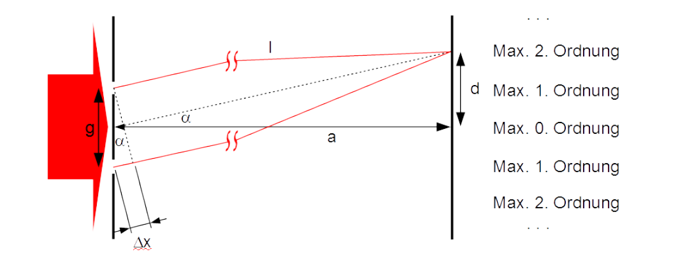

 
# Mechanik
## Bewegungen
gleichförmige Bewegung
: konstanter Geschwindigkeitsvektor; $s = v * t (+ s_0)$, $a = 0$;

gleichmäßig beschleunigte Bewegung
: konstanter Beschleunigungsvektor; $s = \frac{1}{2} a t^2 ( + v_0 * t + s_0)$, $v = a*t (+ v_0)$

gleichförmige Kreisbewegung
: Bewegung mit konstanter Bahngeschwindigkeit auf konstanter Bahn; $v= \frac{2 \pi r}{T}$, $F_z = \frac{m v^2}{r}$

## Newtonsche Gesetze
1. Trägheitsgesetz: Körper behält ohne Kraft seine Bewegung gleichförmig bei

2. Aktionsprinzip: Kraft ist proportional zu Beschleunigung

3. Actio gleich Reactio: Wenn Kraft von A nach B, dann gleich große Gegenkraft

## mechanische Energieformen
potentielle Energie
: $E_{pot} = m * g * h$

kinetische Energie
: $E_{kin} = \frac{1}{2} * m * v^2$ (für kleine Geschwindigkeiten)

Spannenergie
: $E_{spann} = \frac{1}{2} * D * s^2$

Können auch durch den Energieerhaltungssatz gleichgesetzt werden.

## Impuls
Ist der Vektor aus Masse und Geschwindigkeit eines Objektes. Es gilt: $p = m * v$. Des Weiteren gilt der Impulserhaltungssatz

## Leistung
Die Leistung wird auch als Energiestromstärke bezeichnet und gibt an, wie sich die Energie pro Zeiteinheit ändert. Somit gilt: $$P = \frac{\Delta E}{\Delta t} = \frac{F * \Delta s}{\Delta t}$$

## Erhaltungssätze
Energieerhaltungssatz (EES)
: Energie kann weder vernichtet noch erzeugt werden

Impulserhaltungssatz (IES)
: Impuls kann weder vernichtet noch erzeugt werden

# E-Lehre
In einem Stromkreis fließen immer elektrische Ladungen. Meistens sind dies Elektronen. Die Stromstärke gibt dabei die Ladungen pro Zeiteinheit an. Somit gilt, dass $$Q = \int I(t) dt$$. Die Spannung, bzw. die Potentialdifferenz ist dabei die pro Ladung gespeicherte Energie, also $U = \frac{\Delta E}{\Delta Q}$.

## Regeln im Stromkreis
###  Kirchhoffsche Regeln
1. Ladungserhaltung: Summe aller hin- und wegfließenden Ströme an einer Verzweigung ist 0.

2. Maschenregel: Summe aller Einzelspannungen in einem Stromkreis, gleich der Gesamtspannung

### Widerstand
Jeder Leiter setzt dem elektrischen Strom einen Widerstand entgegen (exkl. Supraleiter). Dieser ist nach Ohm wie folgt: $R = \frac{U}{I}$. In einer Reihenschaltung addieren sich zudem die Einzelwiderstände zu dem Gesamtwiderstand ($R_{ges} = R_1 + R_2 + ...$) in einer Parallelschaltung addieren sich die Kehrwerte zum Kehrwert des Gesamtwiderstands ($\frac{1}{R_{ges}} = \frac{1}{R_1} + \frac{1}{R_2} + ...$).  
Zudem kann der Widerstand materialabhängig wie folgt berechnet werden: $R = \rho * \frac{l}{A}$.

# elektrisches Feld
Um das Prinzip der elektrischen Anziehung und Abstoßung zu erklären zeugte Faraday die sogenannten elektrischen Feldlinien, welche um jede Ladung herum existieren. Desto dichter diese sind, desto stärker ist das Feld. Orthogonal zu diesen sind die sogenannten Äquipotentiallinien, welche angeben, dass auf jedem Punkt dieser Linie das gleiche Potential ist und somit die Spannung zu einem dritten Punkt immer die selbe ist.  
Jedes elektrisches Feld übt des Weiteren auch eine Kraft auf andere Ladungen aus, diese ist wie folgt: $F = |\vec{E}| * Q$. $|\vec{E}|$ ist dabei die elektrische Feldstärke. Für diese gilt in einem homogenen elektrischen Feld: $|\vec{E}| = \frac{U}{d}$.

## Kondensatoren
Dieses elektrische Feld kann auch durch Kondensatoren dazu genutzt werden Ladungen zu speichern. Die Ladungsmenge hat dabei folgenden Zusammenhang: $Q \sim U$. Die Menge an Ladung, die pro Spannung dabei gespeichert werden kann nennt sich Kapazität. Für die Kapazität eines Plattenkondensators gilt folgendes: $C = \varepsilon_0 * \varepsilon_r * \frac{A}{d}$.  
Wenn Kondensatoren in einem Stromkreis benutzt werden sollen, so gilt für die Gesamtkapazität in einer Parallelschaltung $C_{ges} = C_1 + C_2 + ...$ und bei einer Reihenschaltung $\frac{1}{C_{ges}} = \frac{1}{C_1} + \frac{1}{C_2} + ...$. 

## Energie im elektrischen Feld
Wenn ein elektrisches Feld erzeugt wird, so ist dies immer ein Energiespeicher, da in diesem Ladungen getrennt, bzw. zusammengebracht sind und die Energie, die dafür notwendig ist auch wieder abgeben können. Die Formel für diese Energie lautet: $E = \frac{1}{2} Q * U$, was im Falle eines Kondensators folgendes bedeutet: $E = \frac{1}{2} C * U^2$. Dies kommt dadurch zustande, dass die Energie pro Ladung die für eine weitere Ladungstrennung zunimmt und somit ein Dreieck bei der Gesamtenergie entsteht. Die Ladung einer einzelnen Ladung, bzw. die elektrische Energie beträgt dabei $E_{el} = q * U$. Diese Energie pro Ladung kann auch dazu genutzt werden, um die Geschwindigkeit dieses nach der Beschleunigung durch ein elektrisches Feld zu bestimmen, dabei gilt, dass  $E_{kin} = E_ {el} \rightarrow v = \sqrt{\frac{2 * q * U}{m}}$. Dieser Effekt wird beispielsweise auch bei der Kathodenstrahlröhre genutzt (vgl. Abbildung Kathodenstrahl).  

Eine weitere Anwendung der Beschleunigung von geladen Objekten im elektrischen Feld ist die Ablenkung dieser, beim Durchflug durch einen Plattenkondensator. Dabei werden diese von ihrer eigentlichen Flugrichtung abgelenkt und es entsteht eine überlagerte Bewegung, welche uns etwas über das Verhältnis von Ladung, Masse und Geschwindigkeit verrät.

# Magnetfeld
Das Magentfeld ist vergleichbar zum elektrischen Feld, indem es ebenfalls Feldlinien gibt, mit ähnlichen Eigenschaften. Der einzige Unterschied besteht darin, dass Magnetfeldlinien nicht immer orthogonal auf der Oberfläche stehen und dass sie immer geschlossen sind. Ein Magnetfeld kann entweder durch einen Permanentmagnet entstehen, oder durch bewegte Ladungen. Für Magnetfelder um Ladungen gilt die rechte, bzw. linke Daumenregel. Allgemein übt ein Magnetfeld auch eine Kraft auf bewegte Ladungen in diesem aus, welche die rechte. bzw. linke Handregel befolgen. Diese Kraft auf einen stromdurchflossenen Leiter kann man wie folgt berechnen: $F = B * I * l$, bzw. allgemeiner für alle Ladungen, in der Form der Lorentzkraft: $$F_L = q * v * B$$.  

Zusammen mit der bereits angesprochenen Ablenkung durch das elektrische Feld kann durch Kombination eines elektrischen und magnetischen Felds ein sogenannter Wienscher Geschwindigkeitsfilter erstellt werden, bei welchem nur Teilchen mit der gewünschten Geschwindigkeit nicht abgelenkt werden, unabhängig ihrer anderen Eigenschaften.  

Des Weiteren kann diese Kraft genutzt werden, um die stärke eines Magnetfelds mithilfe einer Hall-Sonde zu bestimmen. Dabei wird ein Körper von einem Strom durchflossen, durch die Ablenkung dieses entsteht jedoch orthogonal zur Stromrichtung auch eine Spannung, welche proportional zur Magnetfeldstärke ist. Diese ist wie folgt definiert: $U_H = \frac{I * B}{d * n * q_{e^-}}$.  

Soll die magnetische Flussdichte von einer (langen) Spule berechnet werden, so gilt: $B = \mu_0 * \mu_r * I * \frac{n}{l}$.

## Induktion
Wenn es zu einer Änderung des magnetischen Flusses($\phi$) kommt, so wird in einen elektrischen Leiter eine Spannung induziert. Die Formel für diese Spannung lautet: $$U_{ind} = - n * \dot{\phi} = - n * (\dot{A} * B + A * \dot{B})$$. Dass ein negatives Vorzeichen verwendet wird, liegt an der sogenannten Lenzschen Regel, wo nach die Induktionsspannung immer der Ursache entgegengesetzt ist. Diese Regel kann zum Beispiel mit dem Thomsonschen Ringversuch beobachtet werden, wobei ein Ring welcher Parallel zu einer Spule gelagert ist beim Einschalten des Stroms durch die Spule abgestoßen wird und angezogen wird beim Ausschalten. Ein weiterer Anwendungsfall dieses Phänomens ist die Wirbelstrombremse, wobei in einem Metall, welches durch ein Magnetfeld bewegt wird in dem Metall sogenannte Wirbelströme entstehen, also geschlossene Stromkreise, welche nur durch die Induktion angetrieben werden. Das Magnetfeld dieser Wirbelströme bremst dabei die Bewegung des Metalls ab, da nach Lenz die Induktion der Ursache entgegengesetzt ist.  

Um das Phänomen der Induktion zusammenzufassen erstellte Maxwell die sogenannten 4 Maxwellschen Gleichungen:

1. "Elektrische Ladungen sind die Quellen des elektrischen Feldes“

2. "Magnetfeldlinien sind immer geschlossen.“

3. "Zeitlich verändernde Magnetfelder erzeugen ein elektrisches Feld mit geschlossenen Feldlinien"

4. "Ein magnetisches Feld mit geschlossen Feldlinien wird erzeugt durch einen elektrischen Strom oder durch ein sich änderndes elektrisches Feld.“

Des Weiteren gibt es das Phänomen der Selbstinduktion, dabei erzeugt die Erhöhung der Stromstärke in einer Spule, dass ein sich zeitlich-änderndes Magnetfeld entsteht, wodurch eine Spannung in der Spule selbst induziert wird, welche jedoch aufgrund der Lenzschen Regel der Erhöhung der Stromstärke entgegenwirkt. Somit steigt der Strom durch eine Spule nie unendlich schnell an und wird immer abgebremst. Analog dazu gilt auch, dass beim herunterfahren der Stromstärke eine Spannung induziert wird, welche den Strom aufrecht erhalten will. Dieses Verhalten einer Spule nennt man Induktivität, und kann wie folgt berechnet werden: $$L = \mu_0 * \mu_r * \frac{A * n^2}{l}$$. Außerdem gilt für die Selbstinduktion: $$U_{ind} = - L * \dot{I}$$. Diese Induktivität einer Spule kann auch als Energiespeicher fungieren, bzw. ist ein Energiespeicher, durch das Magnetfeld. Die Formel für die gespeicherte Energie lautet: $$E_{magn} = \frac{1}{2} * L * I^2$$

# harmonische Schwingungen
Unter einer harmonischen Schwingung versteht man eine Schwingung, bei der die rücktreibende Kraft immer proportional zur Auslenkung von der Ruhelage ist, wodurch diese eine sinusartige Schwingung vollzieht. Dass es sich um eine sinusartige Schwingung handelt, lässt sich durch lösen der folgenden Differentialgleichung ableiten (siehe Skript S. 89 für genaueres): $$0 = \ddot{s}(t) + k * s(t)$$. Für das Federpendel lässt sich diese Gleichung unter der folgenden Bedingung lösen: $\omega = \sqrt{\frac{D}{m}}$. Dann gilt, dass $s(t) = \hat{y} * \sin{(\omega * t)}; v(t) = \hat{y} * \omega * \cos{(\omega * t)}; a(t) = - \hat{y} * \omega^2 * \sin{(\omega * t)}$.  
Dies ist beim Fadenpendel ähnlich, lediglich, dass gilt: $\omega = \sqrt{\frac{g}{L}}$ und beachtet werden muss, dass nur für kleine Auslenkungen der Fehler vernachlässigbar ist, der durch die Anwendung der Kleinwinkelnäherung eingegangen wird.  

Für die Energie in einem harmonischen Oszillator gilt, dass diese immer in anderer Form gespeichert sein kann, wobei die Gesamtmenge immer gleich ist. So gibt es beispielsweise den Fall, welcher in der Ruhelage eintritt, dass die gesamte Energie in kinetischer Energie vorliegt, aber zu einem anderen Zeitpunkt (bei der max. Auslenkung) als potentielle Energie (Fadenpendel), bzw. Spannenergie (Fadenpendel) vorliegt.  

Zwei Schwingungen können auch überlagert werden, dabei kommt es zur Addition der beiden Amplituden, bei konstruktiver und subtraktion bei destruktiver Interferenz (Phasenverschiebung 0 vs. $\pi$). Allgemein gilt des Weiteren, dass die beiden Wellenfunktionen auch einfach addiert werden können um eine Gesamtwellenfunktion zu erhalten.

# Wellen
Wenn sich die bereits beschriebenen Schwingungen im Raum ausbreiten, so spricht man dann von Wellen. Es kann unterschieden werden in longitudinal (Auslenkung parallel zur Ausbreitung) und transversal (Auslenkung orthogonal Ausbreitung). Nur bei Transversalwellen kann es zum Phänomen der Polarisation kommen. Bei der Polarisationsrichtung betrachtet man die Auslenkungsrichtung und wie sich diese verändert. Verändert diese nicht spricht man von linearer Polarisation, im anderen Fall von zirkularer Polarisation. Mithilfe eines Polarisationsfilters kann jede Welle zudem zu einer linear polarisierten Welle mit bestimmter Ausbreitungsrichtung umgewandelt werden. Für die entstehende Amplitude gilt dabei: $\hat{y}_{danach} = \hat{y}_{davor} * \cos{(\alpha)}$. Allgemein gilt für Wellen noch der Zusammenhang $$v_{Welle} = c = \frac{\lambda}{T} = \lambda * f$$, wobei die Geschwindigkeit für einen bestimmten Wellentyp in einem bestimmten Medium konstant ist und die Wellenlänge die räumliche Ausdehnung einer kompletten Welle angibt, also der Abstand über zwei Extrema.

Nach dem Huygenschen Prinzip (jeder Punkt einer Wellenfront ist der Ausgangspunkt einer neuen Wellenfront) entstehen mehrere Phänomene, wenn eine Welle mit Materie interagiert. So kommt es beispielsweise zur Beugung, wenn diese durch einen Spalt hindurchtritt. Es gilt, umso kleiner der Spalt, desto größer die Beugung. Ein weiteres Phänomen welches durch Huygens zu erklären ist, ist die Brechung, wobei sich die Ausbreitungsrichtung einer Welle ändert, wenn diese in ein Medium eintritt, in welchem sie eine andere Ausbreitungsgeschwindigkeit besitzt.  

Etwas anderes, was auch bei Wellen auftreten kann ist die Interferenz, wobei es wieder konstruktive und destruktive Interferenz gibt und man die Wellengleichungen einfach addieren kann um die Gesamtwelle zu erhalten.

Wenn Wellen reflektiert werden und wieder auf dem gleichen Weg zum Erzeuger zurückkehren kommt es zu einer stehenden Welle. Diese zeichnet sich dadurch aus, dass die Position der Berge und Täler im Raum fix ist und somit Bäuche und auch Knoten entstehen. Es wird unterschieden zwischen Reflektion an einem offenen und an einem geschlossenen Ende. Dabei gilt, dass bei gleichen Enden (beide offen bzw. beide geschlossen) stehende Wellen von halber, ganzer, 1.5-facher.... Wellenlänge möglich sind und bei verschiedenen $\frac{1}{4}, \frac{3}{4}, \frac{5}{4}...$ möglich sind.

## elektromagnetische Wellen
Die einfachste Form um eine elektromagnetische Schwingung zu erzeugen ist der elektromagnetische Schwingkreis. Eine einfacher Stromkreis mit einer Spule und einem Kondensator. Wenn der Kondensator dabei einmal geladen wird, würden die Ladungen wenn man Verluste ignoriert unendlich lang in dem Kreis "schwingen", da der Kondensator entladen wird, wenn dieser ausgeglichen ist die Spule den Strom aufrecht erhält und ihn wieder lädt. Weiter vereinfacht wurde diese Schaltung weiterhin im Hertzschen Dipol, wobei es sich lediglich um eine Eisenstange handelt, welche zugleich die Spule als auch den Kondensator darstellt. Allgemein gilt für einen Schwingkreis und dessen Schwingung durch lösen einer Differentialgleichung, dass $$\omega = \sqrt{\frac{1}{LC}}$$.
Ein solcher Schwingkreis erzeugt des Weiteren auch immer eine elektromagnetische Welle, denn durch die bewegten Ladungen entstehen magnetische Felder, welche durch die unterschiedliche Stromstärken ebenfalls schwingen. Auch erzeugen diese sich ändernden Magnetfelder immer ein elektrisches Feld, welches wieder ein magnetisches erzeugt und so setzt sich die Welle durch den Raum fort. Ausbreiten tut sie sich mit der Lichtgeschwindigkeit, also $c$, wobei gilt dass: $$c = \sqrt{\frac{1}{\mu_0 * \varepsilon_0 (* \mu_r * \varepsilon_r)}}$$. Auch können diese Wellen in einem Lecherleiter untersucht werden, was ein u-förmiger Draht ist, in welchem sich eine stehende elektromagnetische Welle ausbilden kann. 

### Wellenoptik
In der Optik wird sich damit beschäftigt, wie sich elektromagnetische Wellen beeinflussen lassen. Häufig wird hierbei zeitlich und räumlich kohärentes Licht (also eine elektromagnetische Welle) verwendet - also Licht einer Frequenz (zeitlich) und einer Ausbreitungsrichtung (räumlich). Sonst verhält sich Licht genauso wie mechanische Wellen und gleiche Phänomene lassen sich beobachten (vgl. Brechung, Beugung, Interferenz in [Abschnitt Wellen](#wellen)).  
Ein Phänomen welches häufig bei Lichtwellen untersucht wird ist der sogenannte Doppelspalt. Hierbei kommt es zu einem Interferenzmuster, wenn Licht durch diesen geschienen wird und auf einen dahinter liegenden Schirm trifft. Eine mögliche Skizze zur Erklärung sieht wie folgt aus (vgl. Abbildung Doppelspalt).

Denn es kommt immer zu einem Maximum, wenn der Gangunterschied ein vielfaches der Wellenlänge beträgt, also folgendes gilt: $$n * \lambda = \Delta x = \sin{(\alpha)} * g; \hspace{40pt} n \in \mathbb{N} = {0, 1, ...}$$. Die Minima liegen entsprechend dazwischen bei $\Delta x = \frac{(2n+1) \lambda}{2}$.  
Wenn nun statt eines Doppelspaltes eine sogenanntes optisches Gitter (mit sehr vielen Spalten) verwendet wird, so entstehen zusätzlich zu den bereits betrachteten Maxima Nebenmaxima, welche eine nicht ganz so hohe Intensität wie die Hauptmaxima besitzen, an welchen sich das Licht aus allen den Spalten konstruktiv überlagert. Zusätzlich zu den Nebenmaxima entstehen auch mehre Minima entstehen. Es gilt, dass bei einem $n$-fach Spalt zwischen Hauptmaxima $n-1$ Minima und $n-2$ Nebenmaxima entstehen. Des Weiteren wird das Bild durch steilere Intensitätsflanken schärfer.  

Dass dies jedoch nicht vollständig das ganze Phänomen erklärt zeigt sich schon daran, dass man bei den Versuchen eine starke Abnahme der Intensität zu den Rändern des Interferenzmusters erkennt. Dies liegt daran, dass sich das Licht eines Einzelspaltes sich auch gegenseitig auslöschen kann. Dies ist immer dann der Fall, wenn $$\sin{(\alpha)} = n * \frac{\lambda}{b}$$ gilt. Dies lässt sich dadurch erklären, dass für jeden Lichtstrahl im Bündel es dann einen "umgekehrten" gibt und diese sich destruktiv überlagern.  
Wenn nun dieses Intensitätsbild mit dem eines Gitters bzw. Doppelspalts überlagert erhält man ein sogenanntes reales Doppelspalt-Interferenzbild bzw. reales Gitter-Interferenzbild.  

Wenn die Interferenz durch ein optisches Gitter betrachtet wird, fällt auf, dass die Lage der Maxima unter anderem auch abhängig von der Wellenlänge ist. Hierdurch kann man das optische Gitter auch als Spektrometer verwenden, wobei gilt dass längere Wellenlängen ("röter") weiter außen auf dem Schirm liegen.  

Wie bereits erwähnt gibt es auch bei elektromagnetischen Wellen Brechung wenn diese in ein Medium eintreten. Folgender mathematische Zusammenhang ist dabei wichtig: $$\frac{\sin{(\alpha_1)}}{\sin{(\alpha_2)}} = \frac{c_1}{c_2} = \frac{\lambda_1}{\lambda_2} = \frac{n_2}{n_1}$$. Dabei ist $_1$ immer vor der Brechung. $n$ ist der sogenannte Brechungsindex eines Mediums. Auch hier gilt, dass die Stärke der Brechung abhängig von der Wellenlänge ist. Dies nennt man Dispersion. Allgemein gilt, dass "blau bricht's sich besser".

# Quantenphysik
Mithilfe des Fotoeffekts, wobei Elektronen mithilfe von Licht aus einem Metall gelöst werden, kam die Idee auf, dass elektromagnetische Wellen als Pakete vorliegen, den sogenannten Photonen. Insbesondere durch die Nobelpreisarbeit von Einstein zu dem Thema wurde diese Idee begründet. Da diese Objekte jedoch wie in der Wellenoptik beschrieben sich auch wie eine Welle verhalten kam die Idee auf, dass alle kleinen Objekte als Quantenobjekte (QO) sich so verhalten. Das heißt beispielsweise auch Elektronen können interferieren. Hierfür wird jedem Objekt eine sogenannte $\Psi$-Welle zugeschrieben. Die $\Psi$-Welle kann dabei zur Berechnung der Interferenz genutzt werden, indem sie addiert werden. Die Aufenthaltswahrscheinlichkeit ist dabei proportional zum Betragsquadrat und ist somit solange es nicht zur Interferenz kommt immer gleich. Die Wellenlänge entspricht dabei der de-Broglie-Wellenlänge, welche wie folgt berechnet werden kann: $$\lambda_B = \frac{h}{p} = \frac{h}{m*v}$$  

Allgemein wurden für diese QO folgende Regeln aufgestellt:

- sie werden immer als ganzes gemessen und sind nicht teilbar bei der Messung

- ihre Position ist zufällig entspricht aber einer Wahrscheinlichkeitsverteilung der Position

- ihre Position ist solange unbekannt, bis man sie misst in welchem Moment sie sich nicht mehr als QO verhalten

- werden sie nicht nachgewiesen muss jede Möglichkeit betrachtet werden (z.B. alle Wege durch Doppelspalt und entstehende Interferenz)

- es gilt die Heisenbergsche Unbestimmtheitsrelation, wonach Ort und Impuls nie gleichzeitig unendlich genau bestimmt werden können als auch die Energie-Zeit-Unbestimmtheit, es gilt: $$\Delta x * \Delta p = \Delta E * \Delta t \approx \frac{h}{2}$$

# Anhang
Alle verwendeten Bilder sind aus dem [Skript](https://moodle.nbg.pf.schule-bw.de/moodle/pluginfile.php/39241/mod_resource/content/0/PHYSIK%202020%2011%2021%20ohne%20L%C3%B6sungen%2020201206%20HUR%20Magn.pdf)^[Matthias Sickmüller. PHYSIK Skript. 12.12.2020., 2020. https://moodle.nbg.pf.schule-bw.de/moodle/pluginfile.php/39241/mod_resource/content/0/PHYSIK%202020%2011%2021%20ohne%20L%C3%B6sungen%2020201206%20HUR%20Magn.pdf.
] von Herrn Sickmüller entnommen. 

Dies ist eine grobe Zusammenfassung des gesamten Pflichtstoffs für das Abitur, wobei auch andere Themen abgefragt werden können, wobei das dazu nötige Wissen dann in der Klausur angegeben wird und eine Interpretation oder ähnliches erwartet wird.  

Allgemein werden auch grundlegende mathematische Kenntnisse zum umformen von Gleichungen und Co. erwartet. Für genaueres Wissen zur Mathematik auch *Zusammenfassung Mathematik* zu erwähnen.

