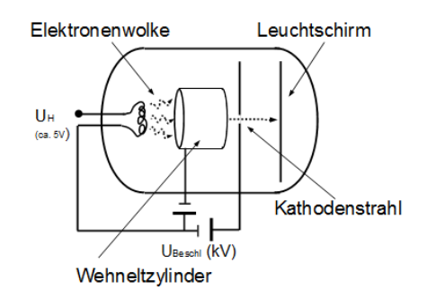

 
# Mechanik
## Bewegungen
gleichförmige Bewegung
: konstanter Geschwindigkeitsvektor; $s = v * t (+ s_0)$, $a = 0$;

gleichmäßig beschleunigte Bewegung
: konstanter Beschleuigungsvektor; $s = \frac{1}{2} a t^2 ( + v_0 * t + s_0)$, $v = a*t (+ v_0)$

gleichförmige Kreisbewegung
: Bewegung mit konstanter Bahngeschwindigkeit auf konstanter Bahn; $v= \frac{2 \pi r}{T}$, $F_z = \frac{m v^2}{r}$

## Newtonsche Gesetze
1. Trägheitsgesetz: Körper behält ohne Kraft seine Bewegung gleichförmig bei

2. Aktionsprinzip: Kraft ist proportional zu Beschleunigung

3. Actio gleich Reactio: Wenn Kraft von A nach B, dann gleich große Gegenkraft

## mechanische Energieformen
potentielle Energie
: $E_{pot} = m * g * h$

kinetische Energie
: $E_{kin} = \frac{1}{2} * m * v^2$ (für kleine Geschwindigkeiten)

Spannenergie
: $E_{spann} = \frac{1}{2} * D * s^2$

Können auch durch den Energieerhaltungssatz gleichgesetzt werden.

## Impuls
Ist der Vektor aus Masse und Geschwindigkeit eines Objektes. Es gilt: $p = m * v$. Des Weiteren gilt der Impulserhaltungssatz

## Leistung
Die Leistung wird auch als Energiestromstärke bezeichnet und gibt an, wie sich die Energie pro Zeiteinheit ändert. Somit gilt: $$P = \frac{\Delta E}{\Delta t} = \frac{F * \Delta s}{\Delta t}$$

## Erhaltungssätze
Energieerhaltungssatz (EES)
: Energie kann weder vernichtet noch erzeugt werden

Impulserhaltungssatz (IES)
: Impuls kann weder vernichtet noch erzeugt werden

# E-Lehre
In einem Stromkreis fließen immer elektrische Ladungen. Meistens sind dies Elektronen. Die Stromstärke gibt dabei die Ladungen pro Zeiteinheit an. Somit gilt, dass $$Q = \int I(t) dt$$. Die Spannung, bzw. die Potentialdifferenz ist dabei die pro Ladung gespeicherte Energie, also $U = \frac{\Delta E}{\Delta Q}$.

## Regeln im Stromkreis
###  Kirchhoffsche Regeln
1. Ladungserhaltung: Summe aller hin- und wegfließenden Ströme an einer Verzweigung ist 0.

2. Maschenregel: Summe aller Einzelspannungen in einem Stromkreis, gleich der Gesamtspannung

### Widerstand
Jeder Leiter setzt dem elektrischen Strom einen Widerstand entgegen (exkl. Supraleiter). Dieser ist nach Ohm wie folgt: $R = \frac{U}{I}$. In einer Reihenschaltung addieren sich zudem die Einzelwiderstände zu dem Gesamtwiderstand ($R_{ges} = R_1 + R_2 + ...$) in einer Parallelschaltung addieren sich die Kehrwerte zum Kehrwert des Gesamtwiderstands ($\frac{1}{R_{ges}} = \frac{1}{R_1} + \frac{1}{R_2} + ...$).  
Zudem kann der Widerstand materialabhängig wie folgt berechnet werden: $R = \rho * \frac{l}{A}$.

# elektrisches Feld
Um das Prinzip der elektrischen Anziehung und Abstoßung zu erklären zeugte Faraday die sogenannten elektrischen Feldlinien, welche um jede Ladung herum existieren. Desto dichter diese sind, desto stärker ist das Feld. Orthogonal zu diesen sind die sogenannten Äquipotentiallinien, welche angeben, dass auf jedem Punkt dieser Linie das gleiche Potential ist und somit die Spannug zu einem dritten Punkt immer die selbe ist.  
Jedes elektrisches Feld übt des Weiteren auch eine Kraft auf andere Ladungen aus, diese ist wie folgt: $F = |\vec{E}| * Q$. $|\vec{E}|$ ist dabei die elektrische Feldstärke. Für diese gilt in einem homogenen elektrischen Feld: $|\vec{E}| = \frac{U}{d}$.

## Kondensatoren
Dieses elektrische Feld kann auch durch Kondensatoren dazu genutzt werden Ladungen zu speichern. Die Ladungsmenge hat dabei folgenden Zusammenhang: $Q \sim U$. Die Menge an Ladung, die pro Spannung dabei gespeichert werden kann nennt sich Kapazität. Für die Kapazität eines Plattenkondensators gilt folgendes: $C = \varepsilon_0 * \varepsilon_r * \frac{A}{d}$.  
Wenn Kondensatoren in einem Stromkreis benutzt werden sollen, so gilt für die Gesamtkapazität in einer Parallelschaltung $C_{ges} = C_1 + C_2 + ...$ und bei einer Reihenschaltung $\frac{1}{C_{ges}} = \frac{1}{C_1} + \frac{1}{C_2} + ...$.

## Energie im elektrischen Feld
Wenn ein elektrisches Feld erzeugt wird, so ist dies immer ein Energiespeicher, da in diesem Ladungen getrennt, bzw. zusammengebracht sind und die Energie, die dafür notwendig ist auch wieder abgeben können. Die Formel für diese Energie lautet: $E = \frac{1}{2} Q * U$, was im Falle eines Kondensators folgendes bedeutet: $E = \frac{1}{2} C * U^2$. Dies kommt dadurch zustande, dass die Energie pro Ladung die für eine weitere Ladungstrennung zunimmt und somit ein Dreieck bei der Gesamtenergie entsteht. Die Ladung einer einzelnen Ladung, bzw. die elektrische Energie beträgt dabei $E_{el} = q * U$. Diese Energie pro Ladung kann auch dazu genutzt werden, um die Geschwindigkeit dieses nach der Beschleunigung durch ein elektrisches Feld zu bestimmen, dabei gilt, dass  $E_{kin} = E_ {el} \rightarrow v = \sqrt{\frac{2 * q * U}{m}}$. Dieser Effekt wird beispielsweise auch bei der Kathodenstrahlröhre genutzt (vgl. Abbildung Kathodenstrahl).  

Eine weitere Anwendung der Beschleunigung von geladen Objekten im elektrischen Feld ist die Ablenkung dieser, beim Durchflug durch einen Plattenkondensator. Dabei werden diese von ihrer eigentlichen Flugrichtung abgelenkt und es entsteht eine überlagerte Bewegung, welche uns etwas über das Verhältnis von Ladung, Masse und Geschwindigkeit verräht.

# Magnetfeld
Das Magentfeld ist vergleichbar zum elektrischen Feld, indem es ebenfalls Feldlinien gibt, mit ähnlichen Eigenschaften. Der einzige Unterschied besteht darin, dass Magnetfeldlinine nicht immer orthogonal auf der Oberfläche stehen und dass sie immer geschlossen sind. Ein Magnetfeld kann entweder durch einen Pemanentmagnet entstehen, oder durch bewegte Ladungen. Für Magnetfelder um Ladungen gilt die rechte, bzw. linke Daumenregel. Allgemein übt ein Magnetfeld auch eine Kraft auf bewegte Ladungen in diesem aus, welche die rechte. bzw. linke Handregel befolgen. Diese Kraft auf einen stromdurchflossenen Leiter kann man wie folgt berechnen: $F = B * I * l$, bzw. allgemeiner für alle Ladungen, in der Form der Lorentzkraft: $$F_L = q * v * B$$.  

Zusammen mit der bereits angesprochenen Ablenkung durch das elektrische Feld kann durch Kombination eines elektrischen und magnetischen Felds ein sogenannter Wienscher Geschwindigkeitsfilter erstellt werden, bei welchem nur Teilchen mit der gewünschten Geschwindigkeit nicht abgelenkt werden, unabhängig ihrer anderen Eigenschaften.  

Des Weiteren kann diese Kraft genutzt werden, um die stärke eines Magnetfelds mithilfe einer Hall-Sonde zu bestimmen. Dabei wird ein Körper von einem Strom durchflossen, durch die Ablenkung dieses ensteht jedoch orthogonal zur Stromrichtung auch eine Spannung, welche proportional zur Magnetfeldstärke ist. Diese ist wie folgt definiert: $U_H = \frac{I * B}{d * n * q_{e^-}}$.  

Soll die magnetische Flussdichte von einer (langen) Spule berechnet werden, so gilt: $B = \mu_0 * \mu_r * I * \frac{n}{l}$.

# Induktion

