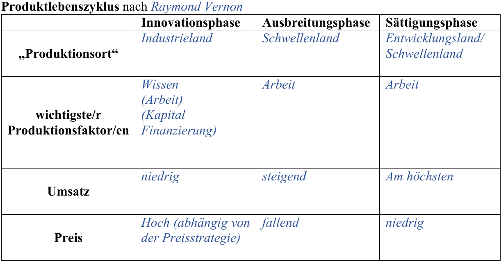

# Staat
## Wirtschaftsordnungen
### Ordoliberalismus
Diese Wirtschaftsordnung ist eine Kombination aus den Vorzügen der freien Marktwirtschaft und einer Ordnung mit Eingriff des Staates. Dies geschieht dadurch, dass im Allgemeinen Angebot und Nachfrage den Markt bestimmen, der Staat jedoch den Ordnungsrahmen vorgibt und Eingriffe in die Wirtschaft vornimmt, falls die Notwendigkeit besteht beispielsweise zum Schutz des Wettbewerbs durch Monopolaufsicht. Diese Wirtschaftsordnung, wie sie von Walter Eucken ins Leben gerufen wurde, gilt zudem als Wegbereiter der sozialen Marktwirtschaft. Die Prinzipien des Ordoliberalismus sind gleich derer der sozialen Marktwirtschaft. Die Gegenbewegung inzwischen zum Ordoliberalismus ist der Neoliberalismus, welcher die soziale Marktwirtschaft wieder liberaler (ähnlicher der freien Marktwirtschaft) gestalten will.

### Soziale Marktwirtschaft
Die Wirtschaftsordnung der Bundesrepublik Deutschland ist die soziale Marktwirtschaft. Die geistigen Väter Ludwig Erhardt und Alfred Müller-Armack sahen in dieser Form der wirtschaftlichen Ordnung die Möglichkeit auf "Wohlstand für alle" und die Möglichkeit "das Prinzip der Freiheit auf dem Markte mit dem sozialen Ausgleich zu verbinden". Dies geschieht durch die Mischung einer Marktwirtschaft mit staatlichen Eingriffen, wie es beim Ordoliberalismus ebenfalls gehandhabt wird. Auch wenn die soziale Marktwirtschaft nicht im Grundgesetz festgeschrieben ist, so ist dieses weder mit der freien Marktwirtschaft (Rechtsstaatlichkeit (Art. 28 (1))) noch mit der Zentralverwaltungswirtschaft (persönliche Freizügigkeit (Art. 2 (1), Art. 11), Freiheit Gewerkschaften zu bilden (Art. 9 (3)), Berufsfreiheit (Art. 12 (2))) vereinbar. Des Weiteren äußert sich die soziale Marktwirtschaft im Grundgesetz im Rahmen der sogenannten Sozialpflichtigkeit. So ist in Artikel 14 festgehalten, wie es sich um Eigentum in der Bundesrepublik verhält. So ist Privateigentum möglich, es gilt jedoch: "Eigentum verpflichtet. Sein Gebrauch soll zugleich dem Wohle der Allgemeinheit dienen" (Art. 14 (2)).

Das System der sozialen Marktwirtschaft kann in vier Grundprinzipien nach Müller-Armack zusammengefasst werden. Diese sind wie folgt:

1. *Wettbewerbsprinzip*: Staat muss durch Regeln den freien Wettbewerb erhalten; in Deutschland u. a. durch Bundeskartellamt sichergestellt

2. *Sozialprinzip*: Unterstützung des Staates für sozial Schwache; beispielsweise durch Art. 28 (1) GG sichergestellt

3. *konjunkturpolitische Prinzipien*: abschwächen von Konjunkturschwankungen durch Staat; durch z.B. Zentralbank oder Bundeswirtschaftsministerium durchgeführt

4. *Prinzip der Marktkonformität*: alle staatlichen Handlungen dürfen die Wirtschaft nur so wenig wie unbedingt nötig beeinflussen

Walter Eucken fasst die Prinzipien der sozialen Marktwirtschaft wie folgt zusammen:

- Das Ziel der sozialen Marktwirtschaft sind primär die *freien Preise*, durch einen freien Wettbewerb, was zudem für Moral und Gerechtigkeit in der Wirtschaft sorgen soll, bzw. durch diese unterstützt werden soll.
- Dies wird durch sechs Kernprinzipien gewährleistet. Diese sind wie folgt:
  1. *Primat der Währungspolitik*: Verhinderung von Inflation und Deflation, was zu einem stabilen Wirtschaftsrahmen führt, u. a. durch stabile Preise und Planungssicherheit
  2. *Haftung*: jeder Wirtschaftsakteur ist für sein eigenes wirtschaftliches Handeln verantwortlich und muss für dessen Folgen haften
  3. *Vertragsfreiheit*: es ist für jeden Wirtschaftsakteur möglich Verträge frei und ohne Vorgaben zu schließen, solange keine Nachteile für unbeteiligte Dritte daraus entstehen
  4. *Offene Märkte*: der freie Markt ist in der sozialen Marktwirtschaft für jeden zugänglich; Einschränkungen für z.B. den Umweltschutz sind allerdings möglich
  5. *Privateigentum*: Produktionsmittel sind in der sozialen Marktwirtschaft privat, um einen freien, fairen Wettbewerb zu erzeugen; zudem darf das mögliche staatliche Eigentum den Wettbewerb nicht verzerren; auch gelten die in Art. 14 GG genannten Einschränkungen
  6. *Konstanz der Wirtschaftspolitik*: durch eine stetige Wirtschaftspolitik soll Sicherheit in der Wirtschaft gewährleistet werden
- Diese Kernprinzipien werden durch die folgenden vier Instrumente umgesetzt:
  1. *Monopolkontrolle*: stellt fairen Wettbewerb durch Unterbindung von Monopolen und Kartellen sicher
  2. *Einkommenspolitik*: der Staat nimmt eine Umverteilung des Vermögens für mehr soziale Gerechtigkeit durch, durch beispielsweise die gestaffelte Lohnsteuer
  3. *Vorkehrungen gegen anomale Angebotsreaktionen*: da solche Angebotsreaktionen schnell in einer Spirale enden, wird versucht diese zu verhindern; diese treten auf, wenn ein höheres Angebot bei sinkenden Preisen entsteht, beispielsweise wenn Bauern mehr verkaufen müssen bei geringen Preisen um die Existenz zu erhalten
  4. *Korrektur externer Effekte*: externe Effekte werden durch das Verursacherprinzip ausgeglichen durch Abgaben, Steuern und Reglementierungen

Allgemein gilt in der sozialen Marktwirtschaft, dass der Staat die Wirtschaft primär durch ordnungspolitische Maßnahmen reglementiert, jedoch diese durch Prozesspolitik unterstützt und ergänzt werden, wo dies notwendig ist.

## Staat in der Wirtschaft
Für den Staat als Wirtschaftsakteur im Wirtschaftskreislauf siehe [Grundwissen/Wirtschaftskreislauf](#wirtschaftskreislauf)

### Funktionen des Staates
#### Allokationsfunktion
Die Allokationsfunktion des Staates umfasst die gerechte und passende Verteilung der Produktionsfaktoren und Produktionsmittel, da diese nur begrenzt zur Verfügung stehen aber unbegrenzte Bedürfnisse an diesen gegenüber stehen. Der Staat versucht bei der Verteilung dieser den maximalen Nutzen für die Gesamtheit zu erlangen, ohne zu große Einschnitte wie in der Zentralverwaltungswirtschaft vorzunehmen. Mittel zur Erreichung der optimalen Verteilung sind die Ordnungspolitik, die Wettbewerbspolitik aber auch die Umweltpolitik.

Unter der Ordnungspolitik versteht man die wirtschaftspolitischen Maßnahmen des Staates, welche den Handlungsraum des Markts eingrenzen und sozusagen die Spielregeln für den freien Markt sind. Dies geschieht durch legislative Maßnahmen wie Gesetze und andere Regelungen und sind somit auch in ihrer Wirksamkeit auf Langfristigkeit ausgelegt, da der Gesetzgebungsprozess schon alleine zu langwierig für kurzzeitiges Eingreifen ist. Beispiele für ordnungspolitische Maßnahmen sind der Wettbewerbsschutz, der Arbeitsschutz, Umweltregelungen, Arbeitsrechte, die Unabhängigkeit der Zentralbanken, aber auch die im Grundgesetz definierten Eigentumsrechte (Art. 14) oder die Tarifautonomie (Art. 9 (3)).

Die Wettbewerbspolitik umfasst all die gesetzlichen Maßnahmen, welche den freien Wettbewerb auf dem Markt gewährleisten sollen. Oberstes Ziel ist wie bereits genannt die Erhaltung des freien Wettbewerbs sowie die Schaffung von fairen Preisen. Diese ist ein Bestandteil der sozialen Marktwirtschaft und wird in Deutschland beispielsweise durch das Bundeskartellamt gewährleistet. Alle wettbewerbspolitischen Maßnahmen sind im *Gesetz gegen Wettbewerbsbeschränkungen*(GWB) festgehalten. So gibt es in Deutschland ein allgemeines Kartellverbot(§1 GWB), Regelungen für den Umgang mit einer marktbeherrschenden Stellung (§19 GWB, §20 GWB) und gesetzliche Maßnahmen zum Umgang mit Fusionen (§35 - 44 GWB). In diesem Rahmen kommen immer wieder die Begriffe Monopole, Oligopole und Kartelle auf. Diese sind wie folgt definiert:

rechtliche Selbstständigkeit
: eigene Rechtspersönlichkeit (z.B. GmbH)

wirtschaftliche Selbstständigkeit
: eigene wirtschaftliche Aktionen (z.B. Preiskalkulation, Marketing)

Kooperation
: vertragliche Zusammenarbeit von Unternehmen, wobei diese ihre wirtschaftliche Selbstständigkeit beibehalten  
: Bsp.: Kartell (Zusammenarbeit in einem Bereich), Konsortium (Zusammenarbeit für ein Projekt), Joint Venture (langfristige Zusammenarbeit)

Konzentration
: Zusammenschluss von Unternehmen, bei dem mindestens ein Unternehmen die wirtschaftliche/rechtliche Selbstständigkeit verliert  
: Bsp.: Konzern (Verlust der wirtschaftlichen Selbstständigkeit bei beibehaltener rechtlicher Selbstständigkeit), Trust/Fusion (Verlust der rechtlichen Selbstständigkeit)

Monopol
: Existenz eines alleinigen Anbieters auf dem Markt, welcher hierdurch enorme Marktmacht besitzt

Oligopol
: Existenz von nur wenigen Anbietern auf einem bestimmten Markt; in der Praxis relativ häufig anzutreffen (CPUs, Mineralöl, Kameras, etc.); erhöhen den Wettbewerbsdruck, da auf jede Reaktion eines Mitanbieters eine Gegenreaktion folgen muss; Gefahr von Absprachen (Kartellverbot)

Kartell
: vertragliche und nicht-vertragliche Absprache von Unternehmen auf dem gleichen Markt um Wettbewerbsvorteile zu erlangen; Unternehmen bleiben rechtlich eigenständig

Die Umweltpolitik versucht die negativen Auswirkungen aus wirtschaftlichem Handeln auf die Umwelt zu reduzieren und diese somit zu schützen. Dies geschieht durch Erhöhung der Kosten oder ein generelles Verbot von umweltschädlichem Handeln. Hierdurch steigen zudem die Produktionskosten für Unternehmen, da die Umwelt nicht mehr als kostenloses Gut betrachtet werden kann. Die umweltpolitischen Maßnahmen können wie in der Abbildung dargestellt, zusammengefasst werden. 

Eine weitere Maßnahme, wie der Staat die optimale Allokation sicherstellt sind öffentliche Güter. Dies sind Güter, nach welchen eine allgemeine Nachfrage, bzw. es ein allgemeines Bedürfnis danach gibt und welche deshalb von der öffentlichen Hand für die Allgemeinheit ohne Benutzungseinschränkungen (weil diese auch schwer umzusetzen sind) bereitgestellt werden. Beispiele sind Verkehrsstraßen, die Straßenbeleuchtung, aber auch Frieden als immaterielles Gut. Ein weiterer Aspekt von öffentlichen Gütern ist, dass diese besonders kostengünstig der Allgemeinheit bereitgestellt werden können, verglichen damit was die Kosten für jeden individuell wären ("Es braucht nur eine Straße von A nach B und nicht jeder Mensch braucht eine eigene.").

Im Rahmen der Allokation kommt es auch zu dem sogenannten Trittbrettfahrerproblem. Darunter versteht man, dass eine Nutzung eines Guts entsteht, wobei der Nutzende nicht für die Kosten für diese Nutzung aufkommt. Ein Beispiel ist die übermäßige Nutzung einer Straße, welche ein öffentliches Gut ist, jedoch ohne Beteiligung an den Kosten für die Reparatur durch dieses Nutzungsverhalten.

Zu der Allokationsfunktion des Staates gehört auch, wie dieser mit externen Effekten umgeht, bzw. wie dieser versucht diese auszugleichen. Externe Effekte sind alle positiven oder negativen Folgen, welche aus dem Handeln eines Wirtschaftsakteurs für unbeteiligte Dritte entstehen, ohne dass diese ausgeglichen werden. Ein Beispiel hierfür wäre der Wertverlust von Immobilien aufgrund von Lärmverschmutzung durch Industrieanlagen. Da negative externe Effekte einen Nachteil für die Betroffenen darstellt, wird von der Politik versucht diese zu verringern. Dies kann entweder dadurch geschehen, dass die externen Effekte reduziert werden, oder aber dass sie entschädigt werden. Zudem wird versucht Handlungen mit positiven externen Effekten zu begünstigen.  

Dies beides geschieht vor allem durch die sogenannte Internalisierung von externen Effekten, das heißt die externen Effekte werden versucht in die Entscheidungsfindung zu einer bestimmten Handlung integriert zu werden. Eine einfache Möglichkeit wie dies geschieht, sind private Verhandlungen zwischen Verursacher und Betroffenem um eine gemeinsame Lösung zu finden. Dies wird unter dem Coase-Theorem zusammengefasst. Laut diesem finden sich beide Parteien zu einer vertraglichen Regelung zusammen, da beide hiervon profitieren können. Im Falle eines negativen externen Effekts wäre dies beispielsweise, dass der Geschädigte dem Verursacher Zahlungen anbietet, sodass dieser die externen Effekte minimiert. Eine Lösung ist gefunden, wenn die Kosten der Reduktion gleich hoch sind wie der Nutzen dieser Reduktion für den Geschädigten. Das Problem an diesem Theorem ist, dass nicht immer ein einziger Verursacher beispielsweise auszumachen ist, oder dass die Verhandlungen Kosten mit sich bringen, welche die Verhandlung unattraktiv machen.  

Aufgrund dessen kann der Staat Auflagen erstellen, welche die Verursacher dazu zwingen ihre externen Effekte zu reduzieren. Dies sieht man beispielsweise bei der Vorschrift, dass Autos mit Verbrennungsmotor einen Katalysator besitzen müssen, da hierdurch die externen Effekte durch Umweltverschmutzung reduziert werden. Ökonomen kritisieren an diesem Vorgehen allerdings, dass dies zwar effektiv ist, jedoch der freie Markt eine effizientere Lösung finden kann. So mag es für den einen Verursacher leichter sein die externen Effekte zu reduzieren, als für einen anderen, wodurch eine Ineffizienz entsteht.  

Deshalb gibt es einen weiteren Ansatz zur Internalisierung von externen Effekten, die Pigou-Steuern. Dies sind vom Gesetzgeber festgelegte Steuern, welche bei Aktionen mit negativen externen Effekten gezahlt werden müssen. Somit wird der Verursacher gezwungen die Kosten für seine externen Effekte in seine Überlegungen einzubeziehen. Das Problem bei diesen Abgaben ist allerdings, dass die Höhe dieser vom Gesetzgeber nicht genau zu wissen ist, aber eine zu geringe Abgabe die externen Effekte nicht ausreichend reduziert und eine zu hohe den Nutzen aus der auslösenden Handlung verhindert. Dieses optimale Niveau wird auch $Q_{opt}$ genannt und liegt an dem Punkt, wo die gesellschaftlichen Grenzkosten (Kosten die der Gesellschaft aufgrund der externen Effekte entstehen) gleich dem Grenznutzen (dem Nutzen aus der auslösenden Handlung) entspricht. Ein Beispiel für eine Pigou-Steuer ist die $CO_2$-Steuer.  

Zudem gibt es noch die handelbaren Emissionsrechte. Dies sind Zertifikate, welche vom Staat ausgegeben werden und den Ausstoß einer bestimmten Menge an Schadstoffen zulassen (diese Emission resultiert in einem negativen externen Effekt). Dabei handeln die Unternehmen untereinander mit den Emissionsrechten, was dazu führt, dass Angebot und Nachfrage den Preis für Emission definieren und manche Anbieter beispielsweise lieber ihre Produktion umgestalten, um die Emissionen zu verringern, als die Preise für eine Emission zu zahlen. Ähnlich wie bei den Pigou-Steuern gibt es hier allerdings ebenfalls das Problem, dass der Staat festlegen muss wie viele Emissionsrechte er auf den Markt gibt, sodass diese erneut dem optimalen Niveau entsprechen.

#### Distributionsfunktion
Unter der Distributionsfunktion des Staates versteht man primär, dass dieser für die gerechte Verteilung von Gütern und Vermögen in der Gesellschaft zuständig ist. Dies geschieht durch staatliche Einkommens- und Vermögensumverteilung. Dabei gilt allgemein gesehen das Prinzip von "oben nach unten", das heißt dass die Finanzmittel der wohlhabenderen Bevölkerungsteile zu den niedrigeren umverteilt wird, um die Gerechtigkeit zu erhöhen. Dabei kommen die Begriffe Primär- und Sekundäreinkommen auf. Dabei bezeichnet das primäre Einkommen das Einkommen aus Gehaltszahlungen, Zinsen usw., und das sekundäre die Einnahmen aus Sozialleistungen wie beispielsweise dem Kindergeld. Dabei soll das Sekundäreinkommen die Ungerechtigkeit durch das Primäreinkommen ausgleichen. 

Zur Distributionsfunktion gehört auch die Einkommenspolitik. Dieser Bereich der Wirtschaftspolitik beinhaltet alles, was direkt mit der Einkommensverteilung und Vermögensbildung zusammenhängt. Sie kann sich direkt oder indirekt äußern, beispielsweise durch eine Lohngrenze oder die Verbesserung der Marktlage in einem bestimmten Sektor, zur Förderung des Lohns in diesem.

Auch gehört die Sozialpolitik zur Distributionsfunktion. Sie beinhaltet all dies, was die soziale Sicherheit für die Bürger, in wirtschaftlicher Sicht, sicherstellt. Die Ziele der Sozialpolitik sind die Sicherung eines Existenzminimus, die Absicherung der erreichten Lebensstandards und die Sicherung eines Mindestmaßes an Chancengerechtigkeit (vgl. Grundlagen). Ein prominentes Beispiel für die Sozialpolitik in Deutschland sind die Sozialversicherungen, denn diese helfen grundlegend bei der Zielerreichung. Die deutschen Sozialversicherungen sind die folgenden fünf: 

1. *Arbeitlosenversicherung*: soll Erwerbslose finanziell absichern und ihnen somit den Wiedereinstieg ermöglichen und die Vermittlung von Erwerbslosen verbessern; Träger die Bundesagentur für Arbeit; unterteilt in Arbeitsvermittlung (Berufsorientierung, Berufsausbildungsbeihilfe, Beratungsgespräche) und finanzielle Unterstützung (Arbeitslosengeld I (60% des Nettolohns des Vorjahres für 12 Monate (24 Monate für über 50-jährige)) und II (Mindestversorgung durch ca. 440€ pro Monat, im Volksmund "Hartz IV")); Einführung des aktuellen Systems im Rahmen der Agenda 2010: Prinzip: "Fördern und Fordern", Hartz I - IV Gesetze, Minijobs wurden geschaffen, Zusammenlegung von Arbeitslosen- & Sozialhilfe, System von ALG I & II
2. *Gesetzliche Unfallversicherung*: Ziel: weniger Arbeitsunfälle, durch Unfallvermeidungsmaßnahmen, aber auch finanzieller Unterstützung im Falle eines Unfall; Berufsgenossenschaften sind Träger der Versicherung (Körperschaft des öffentlichen Rechts, bei der alle Unternehmen sich zwangsversichern müssen); Finanzierung ausschließlich durch Arbeitgeber; Zahlung von Kosten eines Unfalls, Sterbegeld, Hinterbliebenenrente
3. *Gesetzliche Krankenversicherung*: erschafft soziale Absicherung im Krankheitsfall durch: Prävention von Krankheiten, Zahlung von ärztlichen Behandlungen, Versorgung mit Arzneimittel, häusliche Krankenpflege, Rehabilitation nach beispielsweise Unfällen im privaten Bereich, Verhütung, Krankengeld bei längerem Verdienstausfall (nach Lohnfortzahlung); zu jeweils Hälfte von Arbeitgeber und -nehmer gezahlt; Betrag abhängig vom Einkommen
4. *Deutsche Rentenversicherung*: finanzielle Unterstützung von Personen, die aus dem Berufsleben ausgeschieden sind; Höhe abhängig von geleisteten Beiträgen; neben klassischer Altersrente auch Erwerbsminderungsrente (Eintritt aufgrund von Berufsunfähigkeit vor dem 65. Lebensjahr) & Hinterbliebenenrente (für "Witwen und Waisen"); Finanzierung durch aktuelle Arbeitenden (je 9,3% von Arbeitgeber und -nehmer, steuerliche Zuschüsse vom Staat)
5. *Pflegeversicherung*: Ziel: Pflegebedürftigkeit verringern und Kosten für Pflege tragen; Träger sind Krankenkassen; Beitrag: 3,05% von je Arbeitgeber und -nehmer; Zuschuss von Pflegekosten je nach Pflegegrad (1 - 5) für häusliche, ambulante und stationäre Pflege

Die durchschnittlichen Beiträge für die Versicherungen sind wie folgt:

| Sozialversicherung | Arbeitnehmeranteil |
|-|-|
| Rentenversicherung | 9,3% |
| gesetzliche Krankenversicherung | 7,3% |
| Pflegeversicherung | 1,525% |
| Arbeitslosenversicherung | 1,25% |

All dies soll Armut in Deutschland verhindern. Als von Armut gefährdet gelten Personen, welche weniger als 60% des mittleren Einkommens zur Verfügung haben, was in Deutschland ca. 16,7% (2014) sind.

Im Rahmen der Distributionsfunktion kommen auch Steuern und allgemein Abgaben auf, da diese häufiges Mittel zur Umverteilung sind. Da sie auch eine wichtige Einnahmequelle des Staates sind, wird ihnen ein eigener Abschnitt zugesprochen, weshalb an dieser Stelle nicht genauer darauf eingegangen wird.

Die soziale Sicherheit in Deutschland wird zudem durch die folgenden Prinzipien realisiert:

Versicherungsprinzip
: alle Beitragzahlenden erhalten im Krisenfall Leistungen und sichern sich somit gegenseitig ab

Versorgungsprinzip
: Personen, welche außergewöhnliches Leisten erhalten Leistungen ohne Beitragszahlung; Bsp.: Krankenversicherung von Beamten

Fürsorgeprinzip
: im überprüften Notfall werden Leistungen vergeben an Personen, welche auch keinen Beitrag gezahlt haben; Bsp.: Wohngeld

Äquivalenzprinzip
: höheres Risiko einer Person führt zu höheren Beiträgen; Bsp.: private Krankenversicherung mit Staffelung nach Alter

Solidaritätsprinzip
: die Personen mit besseren Lebensumständen finanzieren größeren Teil / Umverteilung der Beiträge und Leistungen;  
: drei Varianten: von nicht krank zu krank, von reich zu arm, von Beitragszahlern zu mitversicherten Familienangehörigen

Subsidiaritätsprinzip
: Leistungen müssen sofern möglich zunächst von jedem selbst übernommen werden, Sozialsystem erst ab bestimmter Schwelle; Bsp.: geringpreisige Arzneimittel

#### Stabilisierungsfunktion
Auch hat der Staat die Aufgabe die Schwankungen in der Wirtschaft abzuschwächen und somit eine gesamtwirtschaftliche Stabilität zu erzeugen. Dabei versucht er sich einerseits an der Stetigkeit der Wirtschaftspolitik als eine Art Anker und versucht zudem konjunkturelle Schwankungen abzumildern.

Im sogenannten magischen Vier- bzw. Sechseck sind die wirtschaftspolitischen Hauptziele des Staates zusammengefasst. Dabei muss allerdings immer ein Kompromiss aus all diesen Zielen eingegangen werden, da die Ziele unter anderem auch in einem Konflikt untereinander stehen. So führt beispielsweise das Wirtschaftswachstum zumeist zu Umweltschädigung, welche nicht mit dem Ziel der Erhaltung einer lebenswerten Umwelt vereinbar ist. Deshalb versucht die Wirtschaftspolitik immer ein Kompromiss zwischen den Zielen zu erreichen, bei welchem alle Ziele möglichst stark erfüllt sind. Die Ziele sind dabei wie in der Abbildung erkennbar. 

Das magische Viereck, welches nur die vier Hauptziele beinhaltet ist zudem um den Umweltschutz und die gerechte Einkommensverteilung eingekürzt und beinhaltet somit lediglich: 

1. Preisniveaustabilität (knapp unter, nahe 2 Prozent Zunahme des Verbraucherpreisindexes)
2. hoher Beschäftigungsstand (man spricht von Vollbeschäftigung ab einer Arbeitslosenquote von $< 3 \%$)
3. außenwirtschaftliches Gleichgewicht (leicht positiver Außenbeitrag der Zahlungsbilanz)
4. stetiges und angemessenes Wirtschaftswachstum (Anstieg des BIP von 2 bis 3 Prozent)

Diese Ziele sind auch in §1 StabG, dem *Gesetz zur Förderung der Stabilität und des Wachstums der Wirtschaft* festgehalten. Es gibt allerdings auch Kritikpunkte an diesen Zielen, da andere negative Folgen durch ausschließliche Fokussierung auf die Ziele außer Acht gelassen werden. Dieses Gesetz bietet zudem die Grundlage für die antizyklische Wirtschaftspolitik nach dem keynesschen Modell, des britischen Ökonomen John Maynard Keynes, in Deutschland. Diese Art der Wirtschaftspolitik wird auch als nachfrageorientierte Wirtschaftspolitik bezeichnet.

Damit die wirtschaftspolitischen Ziele wie sie im magischen Vier- bzw. Sechseck sind dauerhaft und nicht nur phasenweise erreicht werden, versucht der Staat die konjunkturellen Schwankungen in ihrer Gesamtheit abzuschwächen und eine Stetigkeit in die Wirtschaftsentwicklung zu bringen. Denn auf einen extremen Boom folgt zumeist auch eine extreme Depression, in welcher die Vollbeschäftigung, das Wirtschaftswachstum und die Preisniveaustabilität gefährdet sind. Aber um die Möglichkeiten des Staates hierbei zu betrachten, muss zunächst die Konjunktur als ein ganzes betrachtet werden. Die Konjunktur lässt sich entsprechend der Abbildung in die vier Phasen Expansion (Aufschwung), Boom (Hochkonjunktur), Rezession (Abschwung) und Depression (Krise) einteilen.

Dazu, wie diese Schwankungen erklärt werden können, gibt es mehrere Theorien. Namentlich die monetäre Theorie, die Überinvestitions- und Unterkonsumtionstheorie und die exogene Theorie. Bei der monetären Theorie geht man davon aus, dass eine Erhöhung der Geldmenge im Umlauf durch mehr Konsum und Investition zu einem Aufschwung führt. Dieses Zunehmen der Geldmenge wird jedoch zeitgleich versucht von den Nationalbanken zu verhindern, da eine höhere Geldmenge auch mit einer Kaufkraftabnahme, also einer Inflation einher geht. Deshalb versuchen die Nationalbanken durch Anhebung der Leitzinsen die Geldmenge im Umlauf zu reduzieren, wodurch es zu einem Abschwung kommt, welcher mit einer Erhöhung der Geldmenge wiederum aufgefangen wird. Hierdurch entsteht ein Zyklus.  
Die Unterkonsumtions- und Überinvestitionstheorie sind in ihrem grundlegenden Ansatz sehr ähnlich. Sie begründen den konjunkturellen Abschwung mit einer Diskrepanz zwischen getätigten und durch den steigenden Konsum benötigten Investitionen im Aufschwung. So tritt ein Abschwung bei beiden Theorien ein, wenn eine zu starke Expansion der Produktion geschieht. Dies kann entweder damit begründet werden, dass die Unternehmen von einem stärkeren als real eintretenden Wachstum ausgehen oder damit, dass der Konsum hinter seinem möglichen Potenzial zurückbleibt, da dieser langsamer wächst als das Angebot, durch langsamer steigende Löhne der privaten Haushalte. Dies beides führt dazu, dass die kosten durch Investition nicht durch eine größere Nachfrage ausgeglichen werden können und die dadurch steigenden Stückpreise zu einem Abschwung führen. In Zahlen ausgedrückt bedeutet dies, dass die Grenzkosten größer sind als die Grenzerlöse, durch eine nach oben beschränkte Nachfrage.  
Die dritte Theorie zur Erklärung der Konjunkturschwankungen ist die externe Theorie. Dabei werden die Schwankungen in der Wirtschaft durch außerwirtschaftliche Ereignisse ausgelöst. Dies können Naturkatastrophen oder politische Gründe (Wahlen, etc.) sein. Ein Beispiel, wie sich die externen Theorie zeigte ist die Rezession ausgelöst durch die Coronapandemie.

Zur Erkennung, in welcher Phase des Konjunkturzyklus sich die Wirtschaft aktuelle befindet und wie stark diese ausfällt werden die sogenannten Konjunkturindikatoren verwendet. Diese können in drei Kategorien eingeteilt werden: Frühindikatoren, Präsenzindikatoren und Spätindikatoren.

| Frühindikatoren | Präsenzindikatoren | Spätindikatoren |
|-|-|-|
| werden für die Erstellung von Prognosen zur zukünftigen wirtschaftlichen Entwicklung verwendet  | zeigen die aktuelle konjunkturelle Situation | reagieren langsam auf wirtschaftliche Entwicklungen und werden zur späteren Analyse der Konjunktur verwendet |
|  |  |  |
|  |  |  |
| Aktienindex | Bruttoinlandsprodukt (BIP) | Arbeitslosenquote |
| Auftragseingänge | Industrieproduktion | Bruttoinlandsprodukt (BIP) |
| Einzelhandelsumsätze | Kapazitätsauslastung | Inflationsrate |
| Geldmengenwachstum | Lagerbestände | Insolvenzen |
| Geschäftsklimaindex | Offene Stellen | Preisniveauentwicklung |
| Gewinnerwartungen | Preise | Steuereinnahmen |
| Lagerbestände | Sparquote | Zinsniveauentwicklung |

Eine Möglichkeit, wie der Staat solche Schwankungen ausgleichen kann und somit zu Stabilität führen kann ist durch die expansive und restriktive Geldpolitik. Diese beschäftigt sich mit der Erhöhung bzw. Begrenzung der im Umlauf befindlichen Geldmenge. Dies kann beispielsweise mittels der Zentralbanken geschehen. Eine geringere Geldmenge im Umlauf führt zu einem geringeren Angebot an Währung auf dem Markt, wodurch allgemein das Preisniveau steigt. Zudem führt dies dazu, dass weniger investiert wird, da die Zinsen steigen. Hierbei kommt es so gesehen zu einem umgekehrten Multiplikator- und Akzeleratoreffekt.

Bei diesen Maßnahmen muss jedoch auch die Staatsverschuldung beachtet werden. Siehe hierfür den zugehörigen [Abschnitt](#staatsverschuldung).

#### Strukturpolitik
Die Strukturpolitik ist kurz gesagt der Teil der Wirtschaftspolitik, welcher sich mit dem Ausgleich der Folgen des Strukturwandels, neuer Produkte und der Globalisierung befasst. Also aktuell beispielsweise den Auswirkungen aus dem Wandel Deutschlands hin zu einer dienstleistungsorientierten Wirtschaft in einer zunehmend technisierten, digitalen und globalen Welt.  
Dafür werden vor allem Subventionen und Steuervergünstigungen für manche Bereiche genutzt, aber auch beispielsweise die Einführung von Schutzzöllen gehört dazu. Es handelt sich also um Maßnahmen der Prozesspolitik.

#### Tarifpolitik
In Deutschland herrscht grundlegend durch das Grundgesetz die Tarifautonomie (Art. 9 (3)). Demnach dürfen die Lohn- und Arbeitsbedingungen von beiden Tarifparteien (Arbeitgeber und Arbeitnehmer, evtl. durch jeweilige Vereinigung) frei ohne staatliche Eingriffe ausgehandelt werden.

Hierbei spielen auch Tarifverträge eine wichtige Rolle. Sie regeln alles was mit der Beziehung zwischen Arbeitgeber und -nehmer zu tun hat, wie Rechte und Pflichten beider. Sie werden grundsätzlich von den Vereinigungen dieser ausgehandelt. Wenn beide Arbeitsvertragsparteien tarifgebunden sind, gilt ein solcher Tarifvertrag auch unmittelbar für dieses Arbeitsverhältnis.  
Allgemein wird bei den Tarifverträgen unterschieden, in welchem Geltungsraum sie wirken und was sie beinhalten. So wird unterschieden in Flächen-/Branchen-Tarifvertrag und Firmentarifvertrag, wobei ersteres für mehrere Unternehmen gilt, letzteres nicht. Zudem kann auch unterschieden werden in Manteltarifvertrag, Rahmentarifvertrag und Lohn-/Gehaltstarifvertrag. Diese regeln dann jeweils folgendes:

Manteltarifvertrag
: Allgemeine Arbeitsbedingungen (Arbeitszeit, Arbeitsschutz, Urlaub, Kündigungsfristen)

(Lohn-/Gehalts-)Rahmentarifvertrag
: Regelt in welche Lohngruppen die Arbeitgeber nach ihren Arbeitsinhalten einzuordnen sind

Lohn-/Gehaltstarifvertrag
: beinhaltet Löhne, Zulagen, usw.

Allgemein bieten solche Tarifverträge sowohl dem Arbeitgeber als auch dem Arbeitnehmer Sicherheit, denn es herrscht Planbarkeit durch die Friedenspflicht während der Laufzeit des Tarifvertrags, als auch einem besseren Arbeitsverhältnis und leichter Verhandlungen, da diese zentral geführt werden. Zudem können sich hierdurch Arbeitnehmer absichern, weil eine Unausgewogenheit in den Arbeitsverhältnissen durch den Zusammenschluss verhindert werden kann. Zudem können beispielsweise in Krisenzeiten wie der Finanzkrise 2008 Massenentlassungen verhindert werden. Dies kann unter den folgenden Funktionen eines Tarifvertrags zusammengefasst werden:

Ordnungsfunktion
: einheitliche Arbeitsbedingungen sorgen für Rechtssicherheit zwischen den Tarifparteien

Schutzfunktion
: verlässliche Mindestarbeitsbedingungen werden festgelegt (z.B. Arbeitszeiten)

Friedensfunktion
: keine ständigen Arbeitskampfmaßnahmen, was zu Planbarkeit führt

Verteilungsfunktion
: Flexibilität um auf branchenspezifische Ereignisse/Bedürfnisse einzugehen, was zu einem Interessenausgleich zwischen Arbeitgeber und Arbeitnehmer führt

Weitere wichtige Begriffe zu diesem Thema sind:

Tarifeinheit
: nach dem Grundsatz: "Ein Betrieb --- ein Tarifvertrag"; Bundesarbeitsgericht in 2010: unvereinbar mit Art. 9 GG (Koalitionsfreiheit)

Tarifpluralität
: Es gelten mehrere Tarife für verschiedene Arbeitsverhältnisse

Tarifkonkurrenz
: Mehrere Tarife sind auf dasselbe Arbeitsverhältnis anwendbar

### Einnahmequellen des Staates
Die Einnahmequellen des Staates sind in der zugehörigen Abbildung übersichtlich dargestellt.

Zudem können Steuern in direkte und indirekte Steuern unterschieden werden. Direkte Steuern müssen vom Verbraucher direkt an das Finanzamt abgegeben werden, während indirekte Steuern wie beispielsweise die Umsatzsteuer nicht direkt vom Verbraucher an das Finanzamt abgegeben werden. Zu den indirekten Steuern zählen allgemein alle Verbrauchssteuern.

Die Höhe des aktuellen Bundeshaushalts liegt im Bereich von 320 - 340 Mrd. €.

### Staatsverschuldung
Laut dem Grundgesetz (Art. 109 und Art. 115) ist der deutsche Staat dazu angehalten die Neuverschuldung sehr gering zu halten. So darf die strukturelle (über Konjunkturzyklus hinweg quasi) Neuverschuldung nicht mehr als 0,35% des BIP pro Jahr betragen. Hiervon darf nur durch  wieder ausgeglichene Neuverschuldung bei konjunkturellen Schwankungen und bei Schuldenaufnahme durch Notsituationen wie Naturkatastrophen abgewichen werden. Zudem benötigt jeder Bundeshaushalt (jährlich und eventueller Nachtragshaushalt) die Zustimmung von Bundestag sowie Bundesrat. Hiermit ist der Bundeshaushalt auch demokratisch legitimiert. Für die Länder besteht zudem das komplette Verbot sich neu zu verschulden.  
Dieses Vorgehen bei der Neuverschuldung wird auch als schwarze Null bezeichnet.

#### Probleme durch Staatsverschuldung

Crowding-Out-Effekt
: Verdrängung der privaten Nachfrage durch staatliche;  
: geschieht durch steigende Zinsen, aufgrund der gestiegenen Kapitalnachfrage;  
: kann zudem zu Inflation führen durch gestiegene Kosten durch teurere Investitionen;  
: zudem sind staatliche Investitionen weniger rentabel, da sie nicht zwangsläufig zu einem gesteigerten Gewinn wie bei Unternehmen führen

Schuldenfalle
: bei zu großer Schuldenaufnahme besteht die Gefahr, dass die Rückzahlung so groß wird, dass neue Kreditaufnahme nötig ist; gipfelt in Spirale

sinkende Bonität
: durch hohe Kreditaufnahme vergeben Rating-Agenturen schlechtere Ratings an Staaten;  
: führt zu schlechteren Kreditbedingungen

#### Probleme durch die schwarze Null

- Scheu vor Schulden kann langfristige negative Folgen haben
  - schlechte Infrastruktur, Bildung, etc.
  - Konjunktur wird nicht ausreichend ausgeglichen durch mangelnde Liquidität für antizyklische Wirtschaftspolitik

Sparpolitik wird auch allgemein als Austeritätspolitik bezeichnet.

## Arten der Wirtschaftspolitik
### Angebotsorientierte Wirtschaftspolitik
Dieser wirtschaftspolitische Ansatzpunkt --- begründet von F.A. Hayek und Milton Friedman --- geht davon aus, dass die Wirtschaft sich recht selbstständig erholen kann, wenn lediglich das Angebot gefördert wird, da der Markt immer ein Gleichgewicht anstrebt (Stichwort Saysches Theorem). Der Staat kann dies nicht so gut, da er nie alle Wirtschaftsakteure gleichzeitig überblicken kann. Deshalb sollte allgemein versucht werden die freie Wirtschaft zu fördern, durch Deregulierung und Senkung der Kosten für Unternehmen. Der Staat soll lediglich durch die Geldmenge die Gesamtwirtschaft steuern und die Währung stabil halten. Diese Art der Wirtschaftspolitik wird auch im Zuge des Neoliberalismus genannt.

Als Initialzündung für ein wirtschaftliches Wachstum kann beispielsweise eine Steuersenkung wirken. Danach folgt eine Wirk-Kette:

1. Ertragskraft der Unternehmen wird gestärkt
2. mehr private Innovationen und dafür Investitionen
3. mehr Beschäftigung in der Investitionsgüterindustrie
4. Modernisierung des Produktionsapparates

{ width=70% }

Saysches Theorem
: "Jedes Angebot schafft sich seine Nachfrage."  
: durch Produktion von Angebot kommt es zu Konsum und somit zu Nachfrage

| Maßnahmen | Kritik |
|-|-|
| *Minderung der öffentlichen Staatsausgaben*:  \newline -> weniger Staatsschulden -> geringere Nachfrage auf Kreditmarkt -> niedrige Zinsen | - muss in Übereinstimmung mit EZB sein \newline - fördert Fehlinvestitionen \newline - kann Depression provozieren \newline - Geld für Investitionen fehlt (F&E; E-Auto-Förderung) |
| *Senkung der Personalkosten*: \newline - Bsp.: kein Mindestlohn, geringere Lohnsteuer, weniger Sozialversicherungen | - geringere gesamtwirtschaftliche Nachfrage \newline - fehlen der Sozialversicherungserträge, etc -> geringere Staatseinnahmen |
| *Steuersenkungen/Einführung eines leistungssteigernden Steuersystems*: \newline - weniger Steuern -> mehr Liquidität für Konsum und Investition -> Nachfrage | - sinkende Staatseinnahmen \newline - nicht zwangsläufig höhere Nachfrage (zielgerichtet?) \newline - kann zu Steuersenkungswettläufen kommen (z.B. D vs. F) ("Race to the bottom") |
| *Rückführung der Sozialtransfers und der öffentlichen Beschäftigung*. \newline - geringere Sozialleistungen -> mehr Liquidität für Konsum und Investition | - Abnehmen der Nachfrage der unteren sozialen Schichten \newline - schlechtere Sozialstandards |
| *Deregulierung*: \newline - geringere Kosten für Einhaltung der Regelungen und Gesetze | - Missbrauch der ökonomischen Macht -> Monopolbildung \newline - Abnehmen der sozialen Standards/Umweltstandards |

### Nachfrageorientierte Wirschaftspolitik
Diese Art der Wirtschaftspolitik, nutzt als Ansatzpunkt, dass die staatliche Nachfrage und die vom Staat geförderte Nachfrage der gesamten Wirtschaft mittels Akzelerator- und Multiplikatoreffekt hilft. Der Staat setzt so gesagt die Initialzündung für den wirtschaftlichen Aufschwung durch antizyklisches Handeln. Da diese Art durch John Maynard Keynes begründet wurde, wird sie auch Keynesianismus genannt.

Multiplikatoreffekt
: Nachfrage führt zu weiterer Nachfrage nach Konsumgütern;  
: Bsp.: Bauarbeiter kaufen am Schulkiosk ein, nachdem sie für den Staat arbeiten

Akzeleratoreffekt
: Nachfrage führt zu Nachfrage an Investitionsgütern;  
: Bsp.: Bauarbeiter kaufen neuen LKW für Transport

Mögliche Maßnahmen der Nachfragepolitik sind:

| Maßnahmen | Kritik |
|-|-|
| *Nachfrageprogramme der öffentlichen Hand*:  \newline (Programme der öffentlichen Hand finanziert durch zusätzliche Kredite \newline | - Neuverschuldung des Staates  \newline - nur kurze Zeit realisierbar |
| *Zinssenkung durch Geldpolitik des Staates*:  \newline (Staat senkt Mittels der Zentralbank den Leitzins um Kreditaufnahme zu vergünstigen und damit Geldmenge zu regulieren \newline | -verzögerte und schwache Wirkung  \newline - schlecht für Sparer und Gläubiger\newline - Abzug von Investitionskapital |
| *Erhöhung der verfügbaren Realeinkommen*:  \newline (Änderung der Kaufkraft durch gestiegene Löhne bei gleichen Preisen oder durch sinkende Preise\newline -> höhere Kaufkraft \newline | - nur mit anderen Maßnahmen zielgerichtet\newline - begrenzte Wirkung\newline - geringere Staatseinnahmen\newline - möglicher Abfluss ins Ausland |
| *Ausweitung der öffentlichen Beschäftigung, der Sozialtransfers und der Arbeitsmarktpolitik*:  \newline (Abflachung sozialer Unterschiede durch Förderung der sozial Schwachen durch gezielte Förderung der Einkommensumverteilung \newline | - führt nicht zwangsläufig zu positiver Nachfrageentwicklung\newline - Fehlallokation möglich\newline - Verzerrung des Arbeitsmarktes möglich (vgl. ABM) |
| *Förderprogramme des Staates*:  (Steigerung der Nachfrage durch gezielte Anreize; durch den Staat finanziert) \newline | - muss zielgerichtet und zeitlich gut gezielt sein  \newline - eher aus politischen als aus wirtschaftlichen Gründen genutzt\newline - Staatsverschuldung\newline - einseitig |

### Ordnungs- und Prozesspolitik
Zudem wird unterschieden, wie der Staat wirtschaftspolitisch agiert. Wenn er lediglich den Regelrahmen für die Wirtschaftspolitik vorgibt ist dies ordnungspolitisch, wenn er aktiv in das Wirtschaftsgeschehen eingreift, ist es prozesspolitisch. Dadurch ergibt sich der folgende Vergleich.

| Ordnungspolitik |  | Prozesspolitik |
|-|-|-|
| Regelrahmen für die Wirtschaft \newline | Was? | Eingriff in das Wirtschaftsgeschehen \newline |
| wie Spielregeln eines Fußballspiels \newline | Spielvergleich | Spielzug im Fußballspiel \newline |
| Zielerreichung durch gesetzliche Regelungen und Maßnahmen \newline | Wie? | Zielerreichung durch aktives Eingreifen in ökonomische Kennzahlen \newline |
| legislative \newline | Wer? | exekutive \newline |
| langfristig \newline | Wie lange? | kurz- und mittelfristig \newline |
| Wettbewerbsschutz, Arbeitsschutz, Umweltregelungen, Eigentumsrechte, Tarifautonomie, ... \newline | Beispiele für Maßnahmen | Subventionen für Unternehmen/Haushalte, Verbote, Zinspolitk der EZB, ... \newline |

## Wirtschaftliche Entwicklung der letzten Jahre
### Beschäftigung
siehe Abbildungen *Arbeitslosenquote* und *Arbeitslosenzahl*

### Geldwert
siehe Abbildungen *Inflationsrate langzeit* und *Inflationsrate letztes Jahr*

### Außenbeitrag
siehe Abbildung *Außenbeitrag*

### Bruttoinlandsprodukt
siehe Abbildungen *Bruttoinlandsprodukt der letzten Jahre* und *Prognose des BIP*

\newpage

## Gerechtigkeit im Staat
### Verteilungsgerechtigkeit
Die Verteilung des Vermögens in einem Staat --- auch die Schere zwischen Arm und Reich genannt --- spielt vor allem in einer sozialen Marktwirtschaft eine große Rolle, da sie ein großer Faktor in der sozialen Ungerechtigkeit spielt.  
Eine mögliche Form, wie diese Ungerechtigkeit gemessen werden kann ist der sogenannte Gini-Koeffizient. Für diesen wird die Lorenzkurve (vgl. Abbildung *Lorenzkurve*) eines bestimmten Wirtschaftsraums betrachtet. Die Lorenz-Kurve ist die aufsteigende kumulierte Funktion der Einkommen der Einzelpersonen in einem Wirtschaftsraum. Somit lässt sich beispielsweise ablesen, wie viel Prozent des Einkommens die untersten $x$ Prozent der Bevölkerung verdienen. Somit lässt sich leicht die Ungleichverteilung erkennen, denn ein perfekt gleichverteilter Wirtschaftsraum hätte eine Gerade als Lorenzkurve. Diese Eigenschaft macht sich auch der Gini-Koeffizient zu nutze, welcher das Verhältnis zwischen der Fläche zwischen realer Lorenzkurve und gleichverteilter Lorenzkurve zu Fläche unter der gleichverteilten Lorenzkurve ist (vgl. Abbildung *Gini-Koeffizient*). Als Gleichung dargestellt ergibt sich: $$GUK = \frac{A_{gl} - A_{real}}{A_{gl}}$$

{ width=53% }
{ width=47% }
\begin{figure}[!h]
\begin{subfigure}[t]{0.53\textwidth}
\caption{Lorenzkurve}
\end{subfigure}
\hfill
\begin{subfigure}[t]{0.47\textwidth}
\caption{Gini-Koeffizient}
\end{subfigure}
\caption{Lorenzkurve und Gini-Koeffizient}
\end{figure}

### Wohlstand im Staat
Häufig wird das BIP als Wohlstandsindikator verwendet. Dies wird allerdings immer mehr kritisiert, da viele Leistungen (nicht steuerpflichtig) in diesem nicht enthalten sind und auch beispielsweise negative Folgen zur Erreichung des BIPs, welche zu Kosten führen ignoriert werden. Zudem beinhaltet das BIP viele Aspekte wie Zufriedenheit gar nicht. Deshalb gibt es Indizes wie zum Beispiel den HDI oder den HPI. Zudem muss betrachtet werden, dass eine Aussage über die Veränderung des BIP nur Aussagekräftig ist, wenn das reele BIP statt dem nominalen verwendet wird, da nur dann ein Preisanstieg herausgerechnet wird.

Zudem muss unterschieden werden in BIP und BNE. Während das Bruttoinlandsprodukt den Wert aller Güter und Dienstleistungen in einem Land von In- und Ausländern betrachtet, beschränkt sich das Bruttonationaleinkommen auf die Güter und Dienstleistungen von Inländern im In- und Ausland.

#### Berechnung des Bruttoinlandsprodukts

Das BIP kann auf verschiedene Arten und Weisen berechnet werden. Man unterscheidet die Entstehungs-, Verwendungs- und Verteilungsrechnung. Während sich die Entstehungs- und Verwendungsrechnung darauf fokussiert, wie sich die Güter und Dienstleistungen niederschlagen, betrachtet die Verteilungsrechnung wie sich der durch das BIP entstehende Wohlstand in Form des Volkseinkommens verhält. Die Verteilungsrechnung addiert hierfür das Einkommen der privaten Haushalte, und den Gewinn der Unternehmen, die abgegebenen Steuern und Abschreibungen und subtrahiert die Subventionen, als auch die Zahlungsströme ins Ausland (genau genommen Primäreinkommen), erhält man so das BIP.  

Hierzu im Gegensatz konzentriert sich die Entstehungsrechnung auf die entstandenen Güter und Dienstleistungen und subtrahiert von deren Wert den Wert der Vorleistungen (verbrauchte Güter im Rahmen der Produktion) und rechnet erneut Steuern und Subventionen heraus. Auch auf diese Weise erhält man das Bruttoinlandsprodukt eines Landes.  
Die letzte Berechnungsmethode ist die Verwendungsrechnung. Hierbei wird der Konsum von privaten Haushalten und dem Staat addiert. Hierzu werden zudem die Anlageinvestitionen der Unternehmen addiert, also die Summe aus Investitionen wie neuen Anlagen oder Erhöhung des Lagerbestands. Nun wird noch der Außenbeitrag addiert und man erhält ebenfalls das BIP.

# Ausland
internationale Arbeitsteilung
: multinationale Aufteilung des Wertschöpfungsprozesses; optimale Nutzung der Standortvorteile der verschiedenen Länder; nicht nur Aufteilung nach Rohstoffproduzent und Konsumgüterproduzent

intraregionaler Handel
: Waren- und Dienstleistungshandel innerhalb einer Region (bsp.: Europa)

interregionaler Handel
: Waren- und Dienstleistungshandel über Regionen hinweg

transnationale Unternehmen
: Unternehmen mit beispielsweise Niederlassungen oder Tochterunternehmen im Ausland, welche einen multinationalen Absatzmarkt haben; von Heimatstandort aus weltweite Steuerung; Nutzen die Standortvorteile der verschiedenen Länder; Schaffung von beispielsweise Arbeitsplätzen im Ausland

terms of trade
: Tauschbedingungen im internationalen Warenhandel; Verhältnis aus Menge an Import pro Einheit des Exports; bessere terms of Trade entsprechen einem höheren möglichen Import pro Exporteinheit

## Ursachen der Globalisierung
### Ökonomische Ursachen

- Deregulierung
- Privatisierung
- zunehmende ausländische Direktinvestitionen

### Politische Ursachen

- veränderte politische Gegebenheiten durch Machtzunahme von China
- Zusammenbruch des Ostblocks
- Staatenbund in Europa

### Technologische Ursachen

- steigende Transportkapazität durch beispielsweise größere Containerschiffe
- schnellere und einfachere Kommunikation durch Internet und Telefon
- günstigere Arbeit durch Mechanisierung
- fortschreitende Digitalisierung

### Soziokulturelle Ursachen

- einheitlicher werden der Kulturen ("McDonaldisierung")

## Außenhandel
### Außenhandelstheorien
### Absolute Kostenvorteile
Die Außenhandelstheorie nach Adam Smith geht davon aus, dass zwei Länder globalen Handel betreiben, wenn je ein Land ein Gut günstiger herstellen kann. Nach dieser Theorie muss sich auch jedes Land auf das Gut fokussieren, welches es absolut am Günstigsten herstellen kann, was am Ende zu den maximalen Vorteilen für beide Länder führt.

### Komparative Kostenvorteile
Die Außenhandelstheorie nach David Ricardo geht davon aus, dass jedes Land das Gut produzieren muss, für welches die Opportunitätskosten im Vergleich geringer sind. Das heißt ein Land produziert nicht zwangsläufig alle Güter, welches es absolut günstiger herstellen kann, sondern achtet auch darauf, welches er im Vergleich günstiger herstellen kann. Dies wird im nachfolgenden Beispiel besonders anschaulich.

|  | Deutschland | China |
|-|-|-|
| Textilien | 50 Einheiten | 100 Einheiten |
| Medizinprodukte | 40 Einheiten | 50 Einheiten |

Nach Ricardo würde sich Deutschland auf die Medizinprodukte, China auf die Textilien spezialisieren. Auch wenn es China möglich wäre absolut mehr Medizinprodukte als Deutschland zu produzieren.

### Faktorproportionentheorie
Die neue Außenhandelstheorie nach Heckser und Ohlin betrachtet die Produktionsfaktoren (vgl. Anhang) eines bestimmten Landes. So wird sich jedes Land auf Güter fokussieren, welche eine große Menge eines Produktionsfaktors benötigt, welches das Land viel hat. Ein kapitalintensives Gut wird dann beispielsweise von Deutschland produziert, da Deutschland vergleichsweise wenig Arbeitskraft besitzt.

In diesem Zusammehang kommt auch oft das Leontief-Paradoxon auf. Denn nach Heckscher-Ohlin müssten die USA viel kapitalintensive Güter produzieren und deshalb diese wenig importieren, was jedoch nicht der Realität entspricht. Dies ist damit zu erklären, dass in den USA allgemein eine sehr hohe Nachfrage nach solchen Gütern besteht. Zudem lässt sich das damit erklären, dass die USA mit ihren Arbeitskräften auch viele Güter produzieren können, welche im Ausland stark nachgefragt werden und sich deshalb auf diese konzentrieren.

### Zahlungsbilanz
Die Zahlungsbilanz gibt alle Transaktionen an, welche ein Land in einem bestimmten Zeitraum mit dem Ausland getätigt hat. Der Aufbau ist dabei wie in der Abbildung zu erkennen.

Als Bilanz ist Aktiva und Passiva auch bei der Zahlungsbilanz stets ausgeglichen. Zudem besteht ein Gleichgewicht zwischen dem Leistungsbilanzüberschuss und dem Kapitalbilanzüberschuss, welcher durch die Zusammenhänge der Zahlungsbilanz zu erklären ist. Dieser Zusammenhang lässt sich leicht an einem Beispiel erkennen: Wenn ein Land mehr importiert als exportiert (Leistungsbilanzdefizit) muss es das dafür nötige Kapital aus dem Ausland beziehen (Kapitalbilanzdefizit).

Deutschland strebt mit einem seiner Ziele der Wirtschaftspolitik ein Außenhandelsgleichgewicht an. Das heißt, dass die Handelsbilanz ausgeglichen ist. Dies ist damit begründet, dass ein überproportionaler Import zu Verschuldung führt. Dies ist zwar bei einem Handelsbilanzüberschuss nicht gegeben, jedoch ist das aufgebaute Kapital durch den Import aus Ländern mit Staatsverschuldung, welche drohen Bankrott zu gehen, mit den entsprechenden Folgen.

### Freihandel und Protektionismus
In der globalen Finanzwelt kommt immer wieder die Debatte über den Freihandel auf. Dieser ermöglicht bessere Zusammenarbeit über Landesgrenzen hinweg, wenn auch die eigene Wirtschaft nicht so gut geschützt werden kann. 

Zum Schutz der eigenen Wirtschaft werden dabei immer wieder Handelhemmnisse genutzt. Diese lassen sich unterteilen in tarifär und nichttarifär. Tarifäre Handelshemmnisse sind Zölle, also Mengen- und Wertzölle.  
Nichttarifäre Hemmnisse sind Aktionen wie Preisbeeinflussung durch Subventionen und Dumping, Mengenbeschränkungen beim internationalen Handel durch Kontingente, Quoten, Ein- & Ausfuhrverbote, Boykotte und Embargos und administrative Beschränkungen durch Grenzformalias, technische Standards und Vorschriften zu Gesundheit, Umweltschutz und Sicherheit.

Dumping
: Subvention der Produktion von Gütern, sodass diese unter Herstellkosten verkauft werden können

Kontingent
: absolutes Limit der Menge, welche eingeführt werden kann, von einem bestimmten Gut

Quoten
: vorgeschriebenes Verhältnis der Mengen von Im- und Export eines bestimmten Gut

Boykott und Embargo
: Ausschluss eines anderen Staats vom Wirtschaftsverkehr;  
: "Der Begriff Embargo [...] wird ausschließlich für Staaten benutzt und auch auf staatlich angeordneten und durchgesetzten Ausschluss vom Geschäftsverkehr angewendet, der Begriff Boykott umfasst dagegen – über staatliche Anordnungen hinaus – freiwillige, privatwirtschaftliche Maßnahmen und betont diese."

Trotz dessen haben sowohl Freihandel, als auch Protektionismus Vorteile, wie in der zugehörigen Abbildung zu erkennen ist.

Beim Freihandel wird zudem in verschiedene Arten des Zusammenschlusses zum Freihandel unterschieden:

Freihandelszone
: Wirtschaftsgebiet, in dem Zölle abgebaut und Handelshemmnisse zwischen den teilnehmenden Staaten verboten sind.; z.B. EFTA (Europäische Freihandelsassoziation)

Zollunion
: Vereinigung von Staaten, die sich zu einem einheitlichen Zollgebiet zusammenschließen, alle Binnenzölle abschaffen und gemeinsame Außenzölle für Importe aus Drittstaaten vereinbaren; z.B. Europäische Wirtschaftsgemeinschaft (EWG)

Binnenmarkt
: Ein Gebiet, wo sich das gesamte wirtschaftliche Geschehen nach weitgehend einheitlichen Regeln und gleichen Bedingungen abspielt. Der Binnenmarkt ist gewöhnlich identisch mit dem Hoheitsgebiet eines Staates. Besteht er aus mehreren Staatsgebieten – wie der Europäische Binnenmarkt – ist er wirtschaftlich gesehen Inland

## Globaler Finanzmarkt
### Verschiedene Teilmärkte
| Teilmarkt | Definition |
|-|-----|
| Geldmarkt | Teilmarkt, auf dem kurzfristige finanzielle Mittel gehandelt werden |
| Kapitalmarkt | Teilmarkt, auf dem mittel- und langfriste Finanzmittel gehandelt werden: \newline (1) *Primärmarkt für Wertpapierfinanzierung*: \newline Hier gibt ein Kapitalnehmer Wertpapiere aus (Emission), um im Gegenzug finanzielle Mittel für mittel- oder langfristige Investitionen zu erhalten. Bei den Wertpapieren handelt es sich beispielsweise um Aktien eines Unternehmens oder Anleihen eines Staates. Diese werden etwa von Banken, Versicherungen oder Investmentfonds gekauft, die finanzielle Mittel bereitstellen. \newline (2) *Sekundärmarkt für Wertpapierhandel*: \newline Hier können bereits auf dem Markt befindliche Finanzprodukte gehandelt werden. Benötigt z. B. ein Anleger sein in Wertpapieren gebundenes Kapital, kann er die Wertpapiere hier verkaufen. |
| Kreditmarkt | Teilmarkt, auf dem ausschließlich bilaterale Kreditverträge individuell vergeben und abgeschlossen werden. Dabei vergeben Banken kurz-, mittel- oder langfristige Kredite an Unternehmen, Regierungen und Privathaushalte, um deren Geschäfte zu finanzieren. |
| Devisenmarkt | Teilmarkt, auf dem ausländische Währungen gehandelt werden und so der internationale Zahlungsverkehr zwischen Ländern bzw. Zonen mit unterschiedlichen Währungen ermöglicht wird. V. a. Großbanken. |
| Derivatemarkt | Teilmarkt, auf dem abgeleitete Finanzprodukte gehandelt werden. Diese leiten ihren Wert von anderen Basiswerten (z. B. Rohstoffe, Aktien, Zinssätze) ab. Bei Derivaten handelt es sich i. d. R. um Termingeschäfte, bei denen der Kauf oder Verkauf von Gütern zu einem zukünftigen Zeitpunkt vereinbart wird. Vertragsbedingungen und Preise werden bereits heute festgeschrieben. |

### Finanzkrise
Vor dem Hintergrund der globalen Finanzwelt wird auch immer wieder auf die Probleme durch globale Abhängigkeiten bei Finanzkrisen hingewiesen.  
Eine der großen Finanzkrisen der letzten Jahre war die Weltwirtschaftskrise ab 2007, bei welcher nach dem Platzen der Immobilienblase in den USA die globale Bankenwelt fast zum erliegen kam und durch welche auch maßgeblich die anschließende Eurokrise verursacht wurde.

Die Krise begann damit, dass in den Vereinigten Staaten Kredite an Haushalte für den Hausbau ausgegeben wurden. Dies wurde durch günstige Zinsen und die Subvention des Hausbaus weiter verstärkt. Die starke Nachfrage nach Immobilien ließ dabei auch die Nachfrage nach diesen und somit den Marktpreis steigen. Dies führte dazu, dass auch sogenannte Subprime-Kredite vergeben wurden --- Kredite an Schuldner mit geringer Bonität mit Immobilie als einzige Sicherheit ---, da im Falle eines Zahlungsausfalls die Immobilie mit Gewinn verkauft werden konnte. Dies gipfelte sogar in sogenannten ninja-Krediten (*no income, no job, no assets*). Im Aufschwung dieser Kredite war das Wachstum sogar so groß und vielversprechend, dass auch ausländische Investoren am Boom teilhaben wollten, weshalb die Kredite in sogenannten CDOs (*Collateralised Debt Obligations*) als Derivate gehandelt wurden. Das Risiko wurde von den kreditvergebenden Banken an die Investoren ausgelagert, wodurch die Banken noch mehr risikobehaftete Kredite vergaben. Um die CDOs weiterhin attraktiv zu gestalten wurden sie auch mit "guten Wertpapieren" aufgewertet und die Kredite in Tranchen eingeteilt nach ihrem Risiko (investment grade > mezzanine > untere Tranche (toxic)). Die Rating-Agenturen vergaben *AAA*-Ratings.  
Nach Erhöhung der Leitzinsen durch die Fed (Federal Reserve, US-Notenbank) und der ausstehenden Rückzahlungen von Schuldnern platzte diese Spekulationsblase allerdings und durch das extrem hohe Angebot an Immobilien fielen die Preise, wodurch auch die Kredite der bestehenden Schuldner nicht mehr ausreichend gedeckt waren und alle Investoren die Derivate möglichst schnell ablegen wollten. Auch das Angebot an CDOs war übersättigt, wodurch deren Wert gedrückt wurde (unterstützt durch die neuen Ratings, welche deutlich schlechter waren).  
Die Krise war mit der Insolvenz der Lehman Brothers Investmentbank an ihrem Hochpunkt. Zudem vertrauten sich die Banken untereinander nicht mehr, da sie vermuteten die andere Bank würde ebenfalls insolvent gehen, aufgrund des Besitztes von amerikanischen Immobilienderivaten. Letzten Endes mussten sogar die Staaten eintreten um die Banken zu retten, welche nach dem Prinzip *to big to fail* nicht insolvent gehen durften (Bsp.: Deutsche Bank).

Indirekt durch die Weltwirtschaftskrise ausgelöst kam es in den Euro-Staaten auch zu der Eurokrise. Diese wurde jedoch zudem von dem desolaten Zustand der Staatsfinanzen der Hauptkrisenstaaten (Griechenland, Portugal, Spanien, Italien, Irland), die zwar gleiche Geld- aber nicht abgestimmte Fiskalpolitik der Euro-Länder, der mangelnden Durchsetzung der Konvergenzkriterien und starke wirtschaftliche Unterschiede zwischen den Euro-Staaten, sehr stark begünstigt. Die Krise äußerte sich dann in einer Schuldenkrise, bei der viele Staaten nicht mehr in der Lage waren ihre eigenen Staatsfinanzen zu stemmen. Verstärkt wurde dieser Engpass an Liquidität der Staaten durch immer schlechtere Ratings der Staatsanleihen, aufgrund der Überschuldung der Länder. 

Konvergenzkriterien
: Kriterien, welche im Vertrag von Maastricht festgehalten wurden und die wirtschaftliche Zusammenarbeit der EU-Staaten erleichtern soll; 
: Diese sind wie folgt:
: 
: - *Preisniveaustabilität*: Die Inflationsrate darf nicht mehr als 1,5 Prozentpunkte über derjenigen der drei preisstabilsten Mitgliedstaaten liegen.
: - *Haushaltsdisziplin*: Der staatliche Schuldenstand darf nicht mehr als 60 % des Bruttoinlandsprodukts betragen und das jährliche Haushaltsdefizit darf nicht mehr als 3 % des Bruttoinlandsprodukts betragen
: - *Wechselkursstabilität*: Der Staat muss mindestens zwei Jahre lang ohne Abwertung am Wechselkursmechanismus II teilgenommen haben. Dabei darf die Währung des Landes nur in einer bestimmten Wechselkursbandbreite (meist 15 %) vom Eurokurs abweichen; bei größeren Abweichungen muss die Zentralbank des Landes intervenieren.
: - *Langfristige Zinssätze*: Der Zinssatz langfristiger Staatsanleihen darf nicht mehr als 2 Prozentpunkte über dem Durchschnitt der drei preisstabilsten Mitgliedstaaten liegen.

Staatsanleihen
: festverzinste Schuldscheine eines Staates, zur Erhöhung der eigenen Liquidität des betreffenden Staates

Rating-Agentur
: privates Unternehmen, welches Finanzprodukte in ihrem Risiko bewertet und die Bonität von Banken und Staaten beurteilt; ihre Urteile müssen stets objektiv und transparent sein, trotz dessen Befürchtung von Interessenkonflikten, da Kunden der Agentur Interesse an gutem Rating haben

Maßnahmen, welche in Reaktion auf die Eurokrise getroffen werden lassen sich in der zugehörigen Abbildung erkennen.

\newpage

### Wechselkurse
In der globalen Wirtschaft besteht auch häufiger die Notwendigkeit andere Währungen zu verwenden. Hierfür können Währungen gegeneinander getauscht werden. Den Tauschkurs welchen man dabei verwendet, nennt man Wechselkurs. In der immer globaleren Wirtschaft kommt diesen deshalb auch eine immer größere Bedeutung zu. 

Wechselkurse können sowohl in der sogenannten Mengen-, als auch in der Preisnotierung angegeben werden. Dabei gibt die Mengennotierung an, eine wie große Menge an ausländischer Währung ich für eine Einheit meiner inländischen Erhalte. Die Preisnotierung gibt an, wie viel mich eine Einheit ausländischer Währung in meiner inländischen kostet. Die Mengennotierung ist in der heutigen Welt die häufigere und sie eignet sich auch besonders für Preis-Mengen-Diagramme zu Wechselkursen.

| Mengennotierung | Preisnotierung |
|-|-|
| $1 \hspace{5pt} \text{EUR} = 1,1741 \hspace{5pt} \text{USD}$ | $1 \hspace{5pt} \text{USD} = 0,8517 \hspace{5pt} \text{EUR}$ |

Allgemein wird unterschieden zwischen festen und freien Wechselkursen. Zunächst einmal entsteht jeder Wechselkurs aufgrund von Angebot und Nachfrage. Bei einer geringen Menge der Währung auf dem Kapitalmarkt bei einer gleichzeitig hohen Nachfrage nach dieser, führt zu hohen Wechselkursen. Da die Zentralbanken allerdings eine große Kontrolle über das Angebot einer Währung auf dem Markt haben, können diese den Wechselkurs zu einer anderen Währung fixieren. Dies kann entweder durch gezielte Steuerung der Geldmenge geschehen, oder aber einfacher durch das einfache Festschreiben eines Kurses, gegen welche sie die Währungen tauschen (*Currency Board*), letztlich aber immer durch den gezielten An- und Verkauf von Devisen (*Devisenmarktintervention*).  
Feste Wechselkurse werden unter anderem von südamerikanischen Staaten in Bezug auf den US-Dollar benutzt, um die eigene Wirtschaft zu stabilisieren und den Handel mit den USA zu begünstigen (Argentinischer Peso zu US-Dollar). Ein weiteres bekanntes Beispiel von festen Wechselkursen ist das System von Bretton Woods. Hierbei handelt es sich um ein Übereinkommen von 44 Staaten zu "flexiblen, festgesetzten Wechselkursen" (geringfügige Abweichungen erlaubt, max. $\pm 1 \%$) zum US-Dollar. Gesichert wurde das System dadurch, dass die Vereinigten Staaten den US-Dollar in eine festgelegte Goldmenge umgetauscht haben. 1973 wurde das von den Briten und den den USA ins Leben gerufene System endgültig außer Kraft gesetzt.

Dass beide Systeme Vorteile für sich haben, lässt sich in der folgenden Tabelle erkennen:

| Vorteile von festen Wechselkursen | Nachteile von festen Wechselkursen |
|-|-|
| - Kursspekulationen effektiv verhindert -> Stabilität \newline- politische Zusammenarbeit gefördert (Abhängigkeit voneinander, wirtschaftliche Auswirkungen ähnlicher) \newline- Planung wird erleichtert, kein Kursrisiko \newline- Preise und Zinsen vergleichbar \newline- Preisschwankungen durch Wechselkurse verhindert (vgl. Ölpreis) | - nicht marktgerechte Wechselkurse aufgrund unterschiedlicher Entwicklungen möglich \newline- plötzliche Kursschwankungen bei Anpassung der Wechselkurse -> Inflationsgefahr \newline- wirtschaftspolitische Maßnahmen müssen im Einklang geschehen \newline- Import von Inflationen möglich \newline- Zentralbanken müssen weiteres Ziel verfolgen und intervenieren |

Zur Erklärung der Schwankungen bei den Wechselkursen gibt es mehrere Theorien, welche alle in der Praxis einen Teil beitragen:

1. *Kaufkraftparitätentheorie*: (in Praxis nur 5% der gesamten Schwankungen allerdings): Wenn durch die Wechselkurse der Kauf eines Guts im Ausland günstiger ist, werden für den Kauf Einheiten in dieser Währung nachgefragt und der Wechselkurs steigt, bis der Preis ausgeglichen ist.
2. *Kapitalbewegungen*: Um höhere Renditen zu erreichen, wechseln Investoren ihr Kapital um, wodurch der Wechselkurs aufgrund der höheren Nachfrage nach der Währung steigt. Zudem sinkt aufgrund des höheren Angebots der Zinssatz und somit die Rendite.
3. *Spekulationen*: Um durch Wechselkurse Profit zu schlagen, wird auf die Wechselkurse, ähnlich wie an der Aktie spekuliert.

Allgemein gilt, dass schwache Wechselkurse insbesondere für den Export gut sind, da die exportierten Güter für das Ausland aufgrund der schwachen Wechselkurse günstig zu kaufen sind. Zudem wird der Import auf umgekehrte Weise hierdurch reduziert, da importierte Waren in ihrem Preis für Konsumenten des Inlands steigen.  
Des Weiteren sorgen schwache Wechselkurse für die Verhinderung einer Deflation, aufgrund einer höheren Güternachfrage im Inland nach obigem Wirkgefüge. Dieser Zusammenhang ist in der Abbildung *Preisentwicklung durch Wechselkurse* zu erkennen.

{ width=60% }

## Deutschland als Wirtschaftsstandort
| Schwächen |  | Stärken |
|-|-|-|
| - Rohstoffarmut \newline - hohe Umweltauflagen \newline | natürliche Ressourcen | - ständige Verfügbarkeit durch offene Grenzen \newline - hoch entwickelte Umwelttechnologie \newline |
| - inflexibler Arbeitsmarkt \newline - hohe Lohnkosten \newline - lange Ausbildungszeit, praxisferne Ausbildung \newline | Arbeitskräfte | - sozialer Friede \newline - ausgebildete Fachkräfte \newline - duale Ausbildung \newline |
| - Risikokapitalmarkt klein \newline - schwierige Startkapitalbeschaffung \newline | Kapital | - hohe Ersparnisse \newline - freier Kapitalmarkt \newline |
| - schlechter Breitbandausbau im ländlichen Raum \newline | Infrastruktur | - gute Infrastruktur \newline |
| - hohe Staatsverschuldung \newline - hohe Steuern \newline - Abgrenzung gegen Außer-EU \newline - hohe Bürokratie \newline | Politik und Verwaltung | - gut organisierte Verwaltung \newline - Rechtssicherheit \newline - politische Sicherheit \newline - großer Binnenmarkt durch EU \newline - keine Korruption \newline |
| - "überzogener Sozialstaat" \newline - schlechtes Rentensystem \newline | Sozialbereich | - sozialer Friede \newline - breite Einkommensstreuung \newline - gute Gesundheitsversorgung \newline |
| - Überalterung \newline | Gesellschaft | - breite Mittelschicht \newline |
| - nicht bedarfsorientiert \newline - unzureichende Kooperation mit Industrie \newline - wenig Umsetzung der Neuerungen \newline | Forschung und Entwicklung | - hoch entwickelte Grundlagenforschung \newline - innovative Klein- und Mittelbetriebe \newline - gute Schulbildung \newline |
| - hoher Anteil in traditioneller Industrie \newline - Tertiärsektor unterentwickelt \newline - einige strukturschwache Gebiete (BB, MP,...) \newline - teilweise unrentable Industrien durch Subventionen \newline - mangelnde Prozessorientierung in Unternehmen \newline | Wirtschaftsstruktur | - Sekundärsektor hochentwickelt \newline - viele Ballungszentren \newline - hohe Spezialisierung \newline - starker Mittelstand \newline - große Exportstärke \newline |

## Internationale Wirtschaftsorganisationen
### Europäische Wirtschaft
#### EZB
Als Zentralbank aller Staaten des Euro-Raums ist die Europäische Zentralbank von hoher Bedeutung ---  für die Wirtschaft Deutschlands, der EU, aber auch weltweit. Als Zentralbank ist EZB unabhängig. Das oberste Ziel der EZB ist als Zentralbank die Erhaltung der Stabilität des Euros, also genau genommen die Preisniveaustabilität (Art. 127 AEUV (Vertrag über die Arbeitsweise der Europäischen Union)). Dabei ist das Ziel der EZB die Inflation im Euro-Raum "unter, aber nahe 2 Prozent" zu halten. Hierfür besitzt die EZB mehrere geldpolitische Instrumente, welche die EZB verwenden kann. Hierzu zählen die Fazilitäten, die Offenmarktgeschäfte und die Mindestreservepflicht.

Der größte Teil der geldpolitischen Handlungen stellen Offenmarktgeschäfte dar. Hierbei schreibt die EZB als Zentralbank den Geschäftsbanken liquides Kapital zur Verfügung (durch Gutschreibung auf ein EZB-Konto der Geschäftsbank) im Gegenzug für Sicherheiten der Geschäftsbank. Zudem können sie beispielsweise Wertpapiere ankaufen. Es wird unterschieden in endgültige Transaktionen (Outright-Geschäfte) und Geschäfte mit einer sogenannten Rückkaufvereinbarung (Repo-Geschäfte; von "repurchase agreement"). Den größten Teil dieser Offenmarktgeschäfte stellen die Hauptrefinanzierungsgeschäfte dar. Dies sind auf 7 Tage befristete Offenmarktgeschäfte. Der Zinssatz dieser ist der wichtigste Leitzins der EZB, da sie einen so großen Teil der Handlungen der EZB ausmachen. Durch die Regelung der Offenmarktgeschäfte kann die Geldmenge und somit auch das Preisniveau im Euro-Raum, gezielt gesteuert werden. Aktuell wird Geld im Rahmen der Hauptrefinanzierungsgeschäfte über das Mengentenderverfahren vergeben. Das heißt die EZB legt einen Zinssatz fest, für welchen die Geschäftsbanken eine beliebige Menge Zentralbankgeld erhalten.

Zudem stellt die EZB Liquidität im Rahmen der Fazilitäten den Geschäftsbanken zur Verfügung. Dies geschieht durch die Spitzenrefinanzierungsfazilitäten. Dabei stellt die EZB der Bank Zentralbankgeld auf Nachfrage der Bank zum Spitzenrefinanzierungssatz für eine Nacht zur Verfügung. Da anders wie bei den Tenderverfahren bei den Offenmarktgeschäften die Vergabe dieser Kredite auf Nachfrage der Banken geschieht, ist dieser Zinssatz auch in der Regel höher. Zudem stellt dieser letztlich eine Höchstgrenze für Tageszinssätze dar, da keine Bank Kapital für höhere Zinssätze aufnehmen wird, wenn sie dieses von der EZB erhalten können.  
Die andere Fazilität, welche die EZB zur Verfügung stellt, ist die Einlagefazilität. Diese ermöglicht es den Banken ihr Kapital bei der Zentralbank kurzfristig einzulagern. Der Zinssatz der Einlagefazilitäten stellt die untere Grenze für den Tagesgeldzinssatz dar aus ähnlichen Gründen.  
Die Fazilitäten können durch ihre Zinssätze ebenso zur Steuerung der Geldmenge verwendet werden.

Die dritte Möglichkeit der EZB die Geldmenge zu steuern ist durch die Veränderung des Mindestreservesatzes. Durch die Mindestreservepflicht der EZB sind Geschäftsbanken verpflichtet immer eine bestimmte Menge an Kapital (abhängig von den reservepflichtigen Verbindlichkeiten) auf Zentralbankkonten zu haben. Durch die Steuerung des Mindestreservesatzes kann die EZB zudem die Geldmenge im Umlauf steuern, da bei einem höheren Satz die Banken weniger Geld vergeben können, da dieses auf Konten der Zentralbanken sein muss. Auch erfüllt die Mindestreservepolitik der EZB eine Puffer- und Stabilisierungsfunktion, da Banken zunächst dieses Geld nicht dauerhaft auf den Konten haben müssen und nur der Durchschnitt über einen Zeitraum in der Höhe stimmen muss und Banken immer Zugriff auf sicheres Kapital haben, wobei sie nicht auf andere Banken angewiesen sind.

Die Veränderung der Zinssätze führt dabei nach dem Transmissionsmechanismus zu einer Veränderung des Geldwerts und der Kaufkraft. Dieser ist in der zugehörigen Abbildung dargestellt.

{ width=60% }

Unabhängigkeit der EZB
: operativ/funktionell, finanziell, institutionell, personell;  
: Methoden zur Zielerreichung, eigener Haushalt mit eigener Verfügung, keine Anweisungen aus Politik, Mitarbeiter nur EZB unterstellt

#### EWWU
Die europäische Wirtschafts- und Währungsunion ist die Währungsunion der EU. Formell sind alle EU-Mitgliedsstaaten verpflichtet an dieser teilzunehmen. Somit sind auch die Staaten verpflichtet nach der Erfüllung der Konvergenzkriterien (vgl. [Abschnitt Finanzkrise](#finanzkrise)) den Euro einzuführen.

Alle Staaten der Union gelten volkswirtschaftlich gesehen als Inland und beim innereuropäischen Markt handelt es sich um einen Binnenmarkt, da er nach innen keine Grenzen hat und nach außen als Einheit auftritt (vgl. Definition Binnenmarkt im [Abschnitt Freihandel und Protektionismus](#freihandel-und-protektionismus)).

### Multilaterale Übereinkommen und Organisationen
#### WTO
Die Welthandelsorganisation ist eine internationale Organisation, welche den Abbau von Handelshemmnissen und die Schaffung internationaler Rahmenbedingungen, fördern soll.  Sie entstand aus den Unterzeichnerstaaten des *General Agreement on Tariffs and Trade* (GATT), welcher das gleiche Ziel verfolgte. Heute bestehen folgende Übereinkommen in der WTO: GATT (Regelungen für den Warenhandel), GATS (Regelungen für Dienstleistungen; *General Agreement on Trade in services*), TRIPS (Regelungen für das geistige Eigentum; *Agreement on Trade-Related Aspects of Intellectual Property Rights*) (und GPA (Beihilfe- und Vergaberecht) (nicht alle Länder)). Zudem dient die WTO als internationales Forum zur Streitbeilegung (DSU; *Dispute Settlement Understanding*) und als Rahmen für die Schaffung von Handelsabkommen.

DSU
: gilt für alle WTO-Abkommen;  
: zunächst Vermittlung, danach Empfehlung durch Gremium (Panel), darauf Berufung vor Appelate Body (Berufungsgericht; aktuell handlungsunfähig aufgrund fehlender Richter, Blockade der USA) möglich, Sanktionen möglich

In der WTO gelten zudem bestimmte Grundprinzipien, wozu alle Teilnehmerländer verpflichtet sind. Dazu gehört das Inländerprinzip, das Prinzip der Meistbegünstigung, das Prinzip der Nichtdiskriminierung und sowohl der Grundsatz der Transparenz, als auch der Gegenseitigkeit und Liberalisierung.

Grundsatz der Meistbegünstigung
: (Art. 1 GATT), Vorteile die einem Handelspartner gegeben werden, müssen auch den anderen gewährleistet werden

Inländerprinzip
: (Art. 3 GATT), inländische Wirtschaftsakteure dürfen nicht anders behandelt werden, wie ausländische

Grundsatz der Nichtdiskriminierung
: Diskriminierung einzelner WTO-Mitglieder ist nicht zulässig

Grundsatz der Transparenz
: (Art. 10 GATT), alle außenwirtschaftlichen Aktionen eines Landes müssen transparent gestaltet sein

Grundsatz der Gegenseitigkeit
: alle Teilnehmer der WTO müssen sich gegenseitig Zugeständnisse machen, keine Einseitigkeit

Grundsatz der Liberalisierung
: das Ziel der WTO ist der Abbau aller Handelshemmnisse; z.B. Verbot von mengenmäßigen Beschränkungen (Art. 11 GATT)

#### Andere Institutionen
| Organisation | Ziel | heute | Kritik |
|-|-|-|-|
| WTO | Abbau von Handelshemmnissen | Vermittlung bei Streitigkeiten, Fördern von Handelsabkommen | - westliche Länder schaden Entwicklungsländern durch viele Exporte \newline - Entwicklungsländer benötigen Schutz vor Freihandel |
| OPEC | Interessensvertretung der Öl-Exporteure | gleiche Ziele wie bei Gründung, durch Streitigkeiten häufig nicht handlungsfähig | - nicht das Wohl der Verbraucher im Blick \newline - Öl als politische Waffe verwendet \newline - keine Zukunftsperspektiven nach Öl |
| OECD | Wiederaufbau von Europa nach WW2 | Förderung von Demokratie, Lebensqualität und Marktwirtschaft, Empfehlungen für Regierungshandeln | - geschlossener gehobener Kreis \newline - zu starke Orientierung an freie Marktwirtschaft \newline - Empfehlungen häufig nicht umsetzbar |
| IWF | Förderung der Zusammenarbeit in Währungspolitik, Hilfe bei Finanzkrisen | Kreditvergabe bei Krisen und gefährdetem Haushalt eines Staats | - zu strenge Auflagen bei Kreditvergabe \newline - zu starke Orientierung an freie Marktwirtschaft \newline - Stimmrecht über Kapitalanteil -> hohe Kontrolle der Industriestaaten |
| Weltbank | Förderung des Wideraufbaus nach WW2, Schaffung stabiler Währung | Armutsbekämpfung und Hilfe für Entwicklungsländer | - Förderungen von Projekten ohne Rücksicht auf Bevölkerung \newline - keine Prüfung von Menschenrechtsverletzungen |

#### Washingtoner Konsens
Der Washingtoner Konsens ist ein Maßnahmen-Paket, welches wirtschaftlich geschädigten Länder umsetzen sollen um wieder auf die Beine zu kommen. Dabei handelt es sich um eine Reihe von wirtschaftspolitischen Maßnahmen und Regelungen. Dieses Maßnahmen-Paket wurde auch durch den IWF und die Weltbank im folgenden als Bedingung für die Kreditvergabe verwendet. Vor allem durch seinen stark wirtschaftsliberalisierenden Charakter wird der Washingtoner Konsens immer wieder kritisiert.

Die Maßnahmen, welche stark neoliberal veranlagt sind, sind wie folgt:

- Kürzung der Staatsausgaben
- Abwertung des Wechselkurses
- Liberalisierung der Handelspolitik
- Deregulierung von Märkten
- Privatisierung öffentlicher Unternehmen
- Entbürokratisierung
- Abbau von Subventionen

### Global Governance
Global Governance ist der Versuch die Politik und das Handeln der Staaten auf globaler Ebene zusammenzufassen in einer Art Einheitsregierung für die gesamte Welt. Hierfür soll das Zusammenwirken verschiedener staatlicher und nicht-staatlicher, mulitalteraler Organisationen genutzt werden.

Global Governance wird zudem in 5 Bereiche gegliedert, die sogenannten 5 Säulen der Global Governance.

1. *Welthandelsordnung*: Kartellbehörden werden ergänzt durch WTO, OECD und UNCTAD
2. *Weltfinanzordnung*: Zentralbanken werden ergänzt durch IWF, Weltbank, FSB und BIZ
3. *Weltwährungsordnung*: gleich wie *Weltfinanzordnung*
4. *Weltökologieordnung*: UNEP und die Agenda 21 sollen diese gewährleisten
5. *Weltsozialordnung*: ILO als zentrales Element

Säulen 1-3 werden zudem durch die G8 und G20-Zusammenschlüsse und das Weltwirtschaftsforum unterstützt. Bei Säulen 4 und 5 spielt Global Compact als UN-Organisation eine Rolle. Ein weiteres internationales Netzwerk zu Säule 5 ist das Weltsozialforum.

UNCTAD
: Welthandels- und Entwicklungskonferenz (*United Nations Conference on Trade and Development*); Ziel ist die Förderung des Handels zwischen Industrie- und Entwicklungsländern

FSB
: *Financial Stability Board*; Ziel ist die Sicherung des globalen Finanzsystems durch Überwachung dessen

BIZ
: *Bank für internationalen Zahlungsausgleich*; Forum für den internationalen Austausch zwischen den Zentralbanken, fördert internationale Zusammenarbeit zwischen den Zentralbanken

*UNEP*
: *United Nations Environment Program*; Programm der UN, welches auf die aktuellen Bedrohungen der Umwelt hinweisen soll und unter anderem multilaterale Umweltverträge ins Leben ruft

## Industrie-, Schwellen- und Entwicklungsländer

Entwicklungsland
: Land mit schlechten wirtschaftlichen und gesellschaftlichen Bedingungen;  
: schlechte Nahrungsmittelversorgung, hohe Armut und soziale Ungleichheit, schlechte Gesundheitsversorgung, schlechter Bildungsstand
: Bsp.: Angola, Argentinien, Burkina Faso

Schwellenland
: Unterart der Entwicklungsland, welches sich durch ein hohes Wirtschaftswachstum auszeichnet und nicht mehr alle Bedingungen eines Entwicklungslands erfüllt, häufig große Wirtschaft in Nischensparten;
: Bsp.: Indien, Brasilien, Südafrika

LDC
: *Least Developed Countries*; Teil der Entwicklungsländer, welche als besonders rückständig gelten;
: ausschlaggebend für die Einordnung sind: BNE pro Kopf, HAI (*Human Assets Index*), EVI (*Economic Vulnerability Index*);  
: Bsp.: Bhutan, Benin, Ruanda

Industrieland
: Länder die im Gegenssatz zu den Entwicklungsländern eine große Wirtschaft aufweisen und auch gesellschaftlich fortgeschritten sind, großer Fokus auf tertiärem Sektor in der Wirtschaft;  
: Bsp.: Deutschland, Frankreich, USA

BRIC(S)-Staaten
: Brasilien, Russland, Indien, China, Südafrika; Sammlung von Staaten mit extrem hohem Wirtschaftswachstum

Triade
: Kombination aus NAFTA-Staaten (US, CA, MX), EU und industrialisiertes Ostasien (JP, TW, SK, HK, SG); 3 größten Wirtschaftsräume der Welt

HDI
: *Human Developement Index*; umfasst Bildungsdauer, Lebenserwartung und Einkommen in einem Land (seit 2010; NHDI)
: 

### Disparitäten
Vor allem durch naturräumliche, endogene und exogene Faktoren kam es in der globalen Welt zu einem unterschiedlichen Entwicklungsstand der unterschiedlichen Länder. Zur Behebung dieser Unterschiede gibt es die sogenannten Entwicklungstheorien. Namentlich die Modernisierungstheorie und die Dependenztheorie. Die Behebung dieser Missstände ist auch für die westlichen Länder attraktiv, da die Unterschiede auch zu Migration führen.

Die Moderinisierungstheorie geht davon aus, dass vor allem endogene Faktoren die Ursache sind und behoben werden müssen. Dafür sollen die zu entwickelnden Länder die eigene Wirtschaft nach dem Vorbild der Industriestaaten weiter entwickeln. Der Anreiz zu dieser Nachahmung in Wirtschaft, Gesellschaft und Kultur kann von außen kommen.  
Auf der anderen Seite gibt es die Dependenztheorie, welche die exogenen Ursachen als Hauptfaktor, welchen es zu beheben gilt, sieht. Für diese Befreiung der Länder muss der Anreiz allerdings von innen kommen, da sonst von außen die nächste Abhängigkeit geschaffen wird. Maßnahmen sind eine Autarkie von der Welt durch Abgrenzung der Politik und Schutz des eigenen Wirtschaftsraums.

naturräumliche Faktoren
: z.B. Ressourcenausstattung, Klima

endogene Faktoren
: inländische Faktoren, z.B. hohes Bevölkerungswachstum, Korruption, Unruhen

exogene Faktoren
: ausländische Faktoren, z.B. Kolonialisierung, Abhängigkeit von westlichen Ländern

### Herausforderungen durch die Globalisierung
Durch die Globalisierung kommt es immer wieder zu Problemen, welche über Landesgrenzen hinweg gehen. Insbesondere die Schwellen- und Entwicklungsländer sind von diesen Problemen immer besonders betroffen. Zu den Problemen zählen grenzüberschreitende negative externe Effekte, globale Asymmetrien, Interdependenzen und Destabilisierungsgefahren.

globale Asymmetrien
: vgl. [Abschnitt Disparitäten](#disparitäten), Informationsasymmetrien (zwei Parteien haben unterschiedliches Wissen, z.B. beim Aktienkauf oder internationalen Verträgen)

Interdependenzen
: Abhängigkeiten im weltweiten Handel, bei Krisen und Staatsfinanzen; Anpassungsdruck um globaler Konkurrenz gerecht zu werden

Destabilisierungsgefahren
: internationale Finanz- und Verschuldungskrisen, anhaltende Ungleichgewichte im Außenhandel

Maßnahmen gegen diese globalen Probleme umfassen moralische Appelle, internationale Verhandlungen, Gebote und Verbote, Steuern und Subventionen, Mengenlösungen wie den Emissionshandel oder das Gemeinlastprinzip. Ein Überblick über ihre Wirksamkeit kann in der zugehörigen Abbildung gefunden werden.

Gemeinlastprinzip
: Allgemeinheit, beispielsweise in Form des Staates, kommt für Folgen auf

### UN-Ziele
Die Vereinten Nationen waren Forum für die Schaffung zweier Ziel-Sammlungen zur Nachhaltigkeit. Die UN-Milleniumsziele und die UN-Nachhaltigkeitsziele, auch als Agenda 2030 bezeichnet.  
Die UN-Milleniums-Entwicklungsziele sind 8 Ziele, welche zur Jahrtausendwende beschlossen wurden und bis zum Jahr 2015 umzusetzen waren. Alle Ziele lassen sich grob in Bekämpfung von Armut und Hunger, Schaffung einer besseren Gesundheitsversorgung, ökologische Nachhaltigkeit und die Schaffung von Entwicklungspartnerschaften einordnen. Im Vergleich zur Agenda 2030 waren die Ziele auch quantitativ festgehalten.  

Abgelöst wurden die Milleniumsziele durch die Agenda 2030 oder die nachhaltigen Entwicklungsziele (SDG, *Sustainable Developement Goals*). Diese 17 Ziele sind im Gegenssatz zu den vorigen zeitlich unbegrenzt definiert und sollen für immer gelten. Deshalb sind sie auch nicht quantitativ. Zudem sind sie vollumfassender, was ihren Themenbereich umfasst. Sie umfassen zusätzlich Aspekte wie Frieden, adressieren den Klimawandel direkt und die Ungleichheit.

Kritik kommt in soweit, dass es sich bei den ganzen Zielen nur um Ideen handelt, aber die Umsetzung mangelt --- nach dem Motto "nur heiße Luft". Dies lässt sich auch damit stützen, dass es zwar deutliche Verbesserungen gab bei den Milleniumszielen, diese aber nicht erfüllt wurden und durch die mangelnde quantitative Zielsetzung dies bei der Agenda 2030 noch mangelhafter sein wird.

### Globale Sozial- und Umweltstandards
vgl. 5 Säulen der Global Governance

#### Global Compact
Global Compact ist eine Aktion der UN, welche soziale und nachhaltige Entwicklung zusammen mit Unternehmen gestalten soll. Dabei verpflichten sich Unternehemen in Eigenverantwortung dafür bestimmte Mindeststandards in diesen Feldern einzuhalten. Die Prinzipien lassen sich in die Bereiche Menschenrechte, Arbeitsnormen, Umwelt/Klima und Korruptionsprävention einsortieren.

Global Compact steht in der Kritik, da keine Sanktionsmöglichkeiten oder konkrete Verpflichtungen durch mangelnde Kontrollen bestehen und die Unternehmen lediglich sogenanntes Blue-Washing betreiben, also ihr eigenes Unternehemen lediglich durch ein UN-Logo aufwerten, aber nichts positiv verwirklichen. Zudem kann kritisiert werden, dass durch Global Compact nur effektive Maßnahmen, wie Gesetze und Regelungen, durch die Alibi-Wirkung verhindert werden.

#### International Labour Organization
Die internationale Arbeitsorganisation ist eine Unterorganisation der Vereinten Nationen und setzt sich für soziale Gerechtigkeit, vor allem im Umfeld der globalen Arbeit ein. Des Weiteren hat die ILO Sozialstandards festgeschrieben, gegen welche nicht verstoßen werden darf, um zu verhindern, dass Länder sich durch Ausbeutung einen Vorteil auf dem Weltmarkt verschaffen. Diese Standards umfassen: 

1. Vereinigungsfreiheit (Konventionen 87, 98)
2. Beseitigung von Zwangsarbeit (Konventionen 29, 105)
3. Abschaffung von Kinderarbeit (Konventionen 138, 182)
4. Verbot von Diskriminierung (Konventionen 100, 111)

#### Klimaabkommen
Über die letzten Jahre und Jahrzente wurden global mehrere Klimaabkommen geschlossen. Diese besitzen alle als Ziel den Schutz der Umwelt, weil sie unter anderem auch die Grundlage für die gesamte Wirtschaft bietet.  
Nennenswerte Fortschritte im globalen Umweltschutz sind einerseits das Kyoto-Protokoll, welches 1997 geschlossen wurde und ab 2005 gilt. In diesem verpflichten sich die Länder zu einer Reduktion der Treibhausgasemissionen, um durchschnittlich 5,2% unter das Niveau von 1990. In seiner Endfassung sieht das Kyoto-Protokoll zur Erreichung dieser Ziele mehrere *flexible Mechanismen* vor. Diese sind wie folgt:  

1. Emissionsrechtehandel (Handel zwischen Staaten (nicht Unternehmen wie in EU); Ziel: Markt findet kostengünstigste Reduktion der Emissionen)
2. Joint Implementation (Umsetzung von Reduktion in einem anderen Land (auch Reduktionspflichtig (keine Entwicklungsländer)), wobei die Reduktion dem Investorland gutgeschrieben wird; Ziel: kostengünstige Reduktion der Emissionen)
3. Clean Developement Mechanism (ähnlich wie Joint Implementation; auch in nicht reduktionspflichtigen Staaten möglich)
4. Burden Sharing (Möglichkeit eines Staatenbundes (EU) die Reduktion aufzuteilen; hohe Einsparungen in wirtschaftlich starken Ländern, mehr Emissionen in schwachen Ländern möglich)

Nachdem das Kyoto Protokoll so weit geglückt war, vereinbarte man mit dem Pariser Klimaschutzabkommen einen Nachfolger für dieses. Ziel dieses Abkommens ist genau die Erderwärmung auf 2 Grad Celsius zu begrenzen und wurde 2015 geschlossen. Hierfür ist über eine $CO_2$-Neutralität hinaus auch eine Reduktion der Menge an Kohlenstoffdioxid in der Atmosphäre notwendig --- eine sogenannte Decarbonisierung.

# Anhang
Für weitere Informationen kann unter anderem die Basisbegriffeliste^[Link auf moodle: https://moodle.nbg.pf.schule-bw.de/moodle/pluginfile.php/40814/mod_resource/content/1/Hinweise%20zum%20Umgang%20mit%20Material%20und%20Basisbegriffe.pdf] verwendet werden.

Für das Abitur müssen die Operatoren auswendig gekonnt werden. Siehe hierfür letzte Seite.

## Grundwissen
### Wirtschaftskreislauf
*vgl. Abbildung Wirtschaftskreislauf*

### Produktionsfaktoren
Unter Produktionsfaktoren versteht man alles, was zur Herstellung von Gütern benötigt wird. Hierbei wird unterschieden in die volkswirtschaftliche und betriebswirtschaftliche Einteilung.

- volkswirtschaftlich:
  1. Arbeit
  2. Kapital
  3. Boden
  4. Wissen
- betriebswirtschaftlich:
  1. menschliche (ausführende) Arbeit
  2. Werkstoffe
  3. Betriebsmittel
  4. Leitung und Planung

### Preis-Mengen-Diagramme

### kurz-, lang- und mittelfristig
kurzfristig
: \< 1 Jahr

mittelfristig
: zwischen 1 und 5 Jahren

langfristig
: \> 5 Jahre

### Zielbeziehungen

komplementäre Ziele
: Ziele die sich gegenseitig unterstützen; wenn eines erreicht wird, hilft dies dem anderen

konkurrierende Ziele
: Ziele, welche in Konkurrenz zu einander stehen; die Erreichung des einen verschlechtert das andere

indifferente Ziele
: die beiden Ziele beeinflussen sich nicht gegenseitig

### Arten von Gütern
*vgl. Abbildung Arten von Gütern*

{ width=70% }

### Ausländische Direktinvestitionen
Ausländische Direktinvestitionen sind Investitionen mit dem Ziel des Investors Kontrolle und Einfluss über ein Unternehmen zu erhalten. Ab einer Übernahme von ca. 10% des Unternehmens kann davon gesprochen werden. In Deutschland kann der Bund in einigen Sektoren bei einer Übernahme von über 15% ein Veto einlegen.

### Ausländische Zahlungsmittel
Devisen
: Zahlungsmittel in Fremdwährung in einer Form außer Bargeld

Sorten
: ausländisches Zahlungsmittel in Form von Bargeld einer anderen Währung

### Produktlebenszyklus nach Vernon
*vgl. Abbildung Produktlebenszyklus nach Raymond Vernon*

### Nachhaltigkeitsdreieck
*vgl. Abbildung Nachhaltigkeitsdreieck*

### SWOT-Analyse
Die SWOT-Analyse ist eine vergleichende Analyse von Stärken (***S****trengths*), Schwächen (***W****eaknesses*), Chancen (***C****hances*) und Risiken (***T****hreats*). Dabei kommen die Stärken und Schwächen stets von innen, während die Chancen und Risiken externer Natur sind. Aus dieser Analyse kann dann eine Strategie abgeleitet werden. 

### Gerechtigkeitsprinzipien

Leistungsgerechtigkeit
: wer mehr leistet, erhält mehr

Bedarfsgerechtigkeit
: Verteilung nach den Bedürfnissen; u.a. Hilfe für Benachteiligte

Chancengerechtigkeit
: jeder muss die selben Chancen erhalten, um gleiche Ausgangssituation für eigenen Erfolg zu haben

Gleichheits-/Egalitätsprinzip
: jeder erhält das Gleiche unabhängig von Situation

### Wichtige Artikel des Grundgesetzes

Artikel 1
: Menschenrechte und -würde

Artikel 2
: persönliche Freiheit

Artikel 3
: Gleichheit aller Menschen

Artikel 9
: Koalitionsfreiheit:  
: - Grundlage der Tarifpolitik
: - "Tarifautonomie"

Artikel 11
: Freizügigkeit im Bundesgebiet

Artikel 12
: Berufsfreiheit

Artikel 14
: Privateigentum

Artikel 20
: Rechtsstaatlichkeit; Sozialstaat

Artikel 20a
: Schutz der Umwelt (vgl. magisches Sechseck)

Artikel 109
: Bundeshaushalt

Artikel 115
: schwarze Null

[//]: # (\listoffigures)
\listoffigures

\newpage
\includepdf[pages=-1]{assets/operatoren.pdf}

