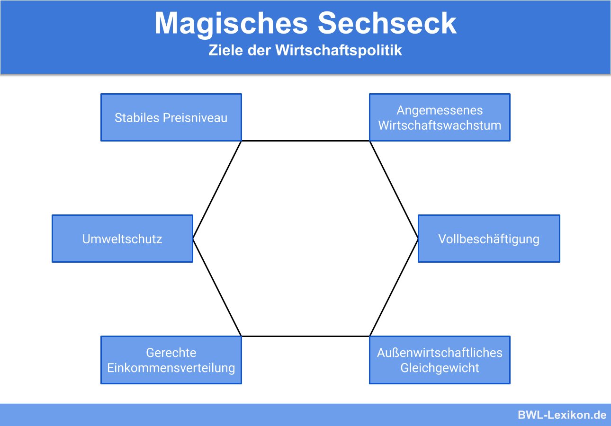

# Staat
## Wirtschaftsordnungen
### Ordoliberalismus
Diese Wirtschaftsordnung ist eine Kombination aus den Vorzügen der freien Marktwirtschaft und einer Ordnung mit Eingriff des Staates. Dies geschieht dadurch, dass im Allgemeinen Angebot und Nachfrage den Markt bestimmen, der Staat jedoch den Ordnungsrahmen vorgibt und Eingriffe in die Wirtschaft vornimmt, falls die Notwendigkeit besteht beispielsweise zum Schutz des Wettbewerbs durch Monopolaufsicht. Diese Wirtschaftsordnung, wie sie von Walter Eucken ins Leben gerufen wurde, gilt zudem als Wegbereiter der sozialen Marktwirtschaft.

### soziale Marktwirtschaft
Die Wirtschaftsordnung der Bundesrepublik Deutschland ist die soziale Marktwirtschaft. Die geistigen Väter Ludwig Erhardt und Alfred Müller-Armack sahen in dieser Form der wirtschaftlichen Ordnung die Möglichekit auf "Wohlstand für alle" und die Möglichkeit "das Prinzip der Freiheit auf dem Markte mit dem sozialen Ausgleich zu verbinden". Dies geschieht durch die Mischung einer Marktwirtschaft mit staatlichen Eingriffen, wie es beim Ordoliberalismus ebenfalls gehandhabt wird. Auch wenn die soziale Marktwirtschaft nicht im Grundgesetz festgeschrieben ist, so ist dieses werder mit der freien Marktwirtschaft (Rechtsstaatlichkeit (Art. 28 (1))) noch mit der Zentralverwaltungswirtschaft (persönliche Freizügigkeit (Art. 2 (1), Art. 11), Freiheit Gewerkschaften zu bilden (Art. 9 (3)), Berufsfreiheit (Art. 12 (2))) vereinbar. Des Weiteren äußert sich die soziale Marktwirtschaft im Grundgesetz im Rahmen der sogenannten Sozialpflichtigkeit. So ist in Artikel 14 festgehalten, wie es sich um Eigentum in der Bundesrepublik verhält. So ist Privateigentum möglich, es gilt jedoch: "Eigentum verpflichtet. Sein Gebrauch soll zugleich dem Wohle der Allgemeinheit dienen" (Art. 14 (2)).

Das System der sozialen Marktwirtschaft kann in vier Grundprinzipien nach Müller-Armack zusammengefasst werden. Diese sind wie folgt:

1. *Wettbewerbsprinzip*: Staat muss durch Regeln den freien Wettbewerb erhalten; in Deutschland u. a. durch Bundeskartellamt sichergestellt

2. *Sozialprinzip*: Unterstützung des Staates für sozial Schwache; beispielsweise durch Art. 28 (1) GG sichergestellt

3. *konjunkturpolitische Prinzipien*: abschwächen von Konjunkturschwankungen durch Staat; durch z.B. Zentralbank oder Bundeswirtschaftsministerium durchgeführt

4. *Prinzip der Marktkonformität*: alle staatlichen Handlungen dürfen die Wirtschaft nur so wenig wie unbedingt nötig beeinflussen

Walter Eucken fasst die Prinzipien der sozialen Marktwirtschaft wie folgt zusammen:

- Das Ziel der sozialen Marktwirtschaft sind primär die *freien Preise*, durch einen freien Wettbewerb, was zudem für Moral und Gerechtigkeit in der Wirtschaft sorgen soll, bzw. durch diese unterstützt werden soll.
- Dies wird durch sechs Kernprinzipien gewährleistet. Diese sind wie folgt:
  1. *Primat der Währungspolitik*: Verhinderung von Inflation und Deflation, was zu einem stabilen Wirtschaftsrahmen führt, u. a. durch stabile Preise und Planungssicherheit
  2. *Haftung*: jeder Wirtschaftsakteur ist für sein eigenes wirtschaftliches Handeln verantwortlich und muss für dessen Folgen haften
  3. *Vertragsfreiheit*: es ist für jeden Wirtschaftsakteur möglich Verträge frei und ohne Vorgaben zu schließen, solange keine Nachteile für unbeteiligte Dritte daraus entstehen
  4. *Offene Märkte*: der freie Markt ist in der sozialen Marktwirtschaft für jeden zugänglich; Einschränkungen für z.B. den Umweltschutz sind allerdings möglich
  5. *Privateigentum*: Produktionsmittel sind in der sozialen Marktwirtschaft privat, um einen freien, fairen Wettbewerb zu erzeugen; zudem darf das mögliche staatliche Eigentum den Wettbewerb nicht verzerren; auch gelten die in Art. 14 GG genannten Einschränkungen
  6. *Konstanz der Wirtschaftspolitik*: durch eine stetige Wirtschaftspolitik soll Sicherheit in der Wirtschaft gewährleistet werden
- Diese Kernprinzipien werden durch die folgenden vier Instrumente umgesetzt:
  1. *Monopolkontrolle*: stellt fairen Wettbewerb durch Unterbindung von Monopolen und Kartellen sicher
  2. *Einkommenspolitik*: der Staat nimmt eine Umverteilung des Vermögens für mehr soziale Gerechtigkeit durch, durch beispielsweise die gestaffelte Lohnsteuer
  3. *Vorkehrungen gegen anomale Angebotsreaktionen*: da solche Angebotsreaktionen schnell in einer Spirale enden, wird versucht diese zu verhindern; diese treten auf, wenn ein höheres Angebot bei sinkenden Preisen entsteht, beispielsweise wenn Bauern mehr verkaufen müssen bei geringen Preisen um die Existenz zu erhalten
  4. *Korrektur externer Effekte*: externe Effekte werden durch das Verursacherprinzip ausgeglichen durch Abgaben, Steuern und Reglementierungen

Allgemein gilt in der sozialen Marktwirtschaft, dass der Staat die Wirtschaft primär durch ordnungspolitische Maßnahmen reglementiert, jedoch diese durch Prozesspolitik unterstützt und ergänzt werden, wo dies notwendig ist.

## Staat in der Wirtschaft
### Funktionen des Staates
#### Allokationsfunktion
Die Allokationsfunktion des Staates umfasst die gerechte und passende Verteilung der Produktionsfaktoren und Produktionsmittel, da diese nur begrenzt zur Verfügung stehen aber unbegrenzte Bedürfnisse an diesen gegenüber stehen. Der Staat versucht bei der Verteilung dieser den maximalen Nutzen für die Gesamtheit zu erlangen, ohne zu große Einschnitte wie in der Zentralverwaltungswirtschaft vorzunehmen. Mittel zur Erreichung der optimalen Verteilung sind die Ordnungspolitik, die Wettbewerbspolitik aber auch die Umweltpolitik.

Unter der Ordnungspolitik versteht man die wirtschaftspolitischen Maßnahmen des Staates, welche den Handlungsraum des Markts eingrenzen und sozusagen die Spielregeln für den freien Markt sind. Dies geschieht durch legislative Maßnahmen wie Gesetze und andere Regelungen und sind somit auch in ihrer Wirksamkeit auf Langfristigkeit ausgelegt, da der Gesetzgebungsprozess schon alleine zu langwierig für kurzzeitiges Eingreifen ist. Beispiele für ordnungspolitische Maßnahmen sind der Wettbewerbsschutz, der Arbeitsschutz, Umweltregelungen, Arbeitsrechte, die Unabhängigkeit der Zentralbanken, aber auch die im Grundgesetz definierten Eigentumsrechte (Art. 14) oder die Tarifautonomie (Art. 9 (3)).

Die Wettbewerbspolitik umfasst all die gesetzlichen Maßnahmen, welche den freien Wettbewerb auf dem Markt gewährleisten sollen. Oberstes Ziel ist wie bereits genannt die Erhaltung des freien Wettbewerbs sowie die Schaffung von fairen Preisen. Diese ist ein Bestandteil der sozialen Marktwirtschaft und wird in Deutschland beispielsweise durch das Bundeskartellamt gewährleistet. Alle wettbewerbspolitischen Maßnahmen sind im *Gesetz gegen Wettbewerbsbeschränkungen*(GWB) festgehalten. So gibt es in Deutschland ein allgemeines Kartellverbot(§1 GWB), Regelungen für den Umgang mit einer marktbeherrschenden Stellung (§19 GWB, §20 GWB) und gesetzliche Maßnahmen zum Umgang mit Fusionen (§35 - 44 GWB). In diesem Rahmen kommen immer wieder die Begriffe Monopole, Oligopole und Kartelle auf. Diese sind wie folgt definiert:

Monopol
: Existenz eines alleinigen Anbieters auf dem Markt, welcher hierdurch enorme Marktmacht besitzt

Oligopol
: Existenz von nur wenigen Anbietern auf einem bestimmten Markt; in der Praxis relativ häufig anzutreffen (CPUs, Mineralöl, Kameras, etc.); erhöhen den Wettbewerbsdruck, da auf jede Reaktion eines Mitanbieters eine Gegenreaktion folgen muss; Gefahr von Absprachen (Kartellverbot)

Kartell
: vertragliche Absprache von Unternehmen auf dem gleichen Markt um Wettbewerbsvorteile zu erlangen; Unternehmen bleiben rechtlich eigenständig

Die Umweltpolitik versucht die negativen Auswirkungen aus wirtschaftlichem Handeln auf die Umwelt zu reduzieren und diese somit zu schützen. Dies geschieht durch Erhöhung der Kosten oder ein generelles Verbot von umweltschädlichem Handeln. Hierdurch steigen zudem die Produktionskosten für Unternehmen, da die Umwelt nicht mehr als kostenloses Gut betrachtet werden kann. Die umweltpolitischen Maßnahmen können wie in der Abbildung dargestellt, zusammengefasst werden. 

Eine weitere Maßnahme, wie der Staat die optimale Allokation sicherstellt sind öffentliche Güter. Dies sind Güter, nach welchen eine allgemeine Nachfrage, bzw. es ein allgemeines Bedürfnis danach gibt und welche deshalb von der öffentlichen Hand für die Allgemeinheit ohne Benutzungseinschränkungen (weil diese auch schwer umzusetzen sind) bereitgestellt werden. Beispiele sind Verkehrsstraßen, die Straßenbeleuchtung, aber auch Frieden als immaterielles Gut. Ein weiterer Aspekt von öffentlichen Gütern ist, dass diese besonders kostengünstig der Allgemeinheit bereitgestellt werden können, verglichen damit was die Kosten für jeden individuell wären ("Es braucht nur eine Straße von A nach B und nicht jeder Mensch braucht eine eigene.").

Im Rahmen der Allokation kommt es auch zu dem sogenannten Trittbrettfahrerproblem. Darunter versteht man, dass eine Nutzung eines Guts entsteht, wobei der Nutzende nicht für die Kosten für diese Nutzung aufkommt. Ein Beispiel ist die übermäßige Nutzung einer Straße, welche ein öffentliches Gut ist, jedoch ohne Beteiligung an den Kosten für die Reparatur durch dieses Nutzungsverhalten.

Zu der Allokationsfunktion des Staates gehört auch, wie dieser mit externen Effekten umgeht, bzw. wie dieser versucht diese auszugleichen. Externe Effekte sind alle positiven oder negativen Folgen, welche aus dem Handeln eines Wirtschaftsakteurs für unbeteiligte Dritte entstehen, ohne dass diese ausgeglichen werden. Ein Beispiel hierfür wäre der Wertverlust von Immobilien aufgrund von Lärmverschmutzung durch Industrieanlagen. Da negative externe Effekte einen Nachteil für die Betroffenen darstellt, wird von der Politik versucht diese zu verringern. Dies kann entweder dadurch geschehen, dass die externen Effekte reduziert werden, oder aber dass sie entschädigt werden. Zudem wird versucht Handlungen mit positiven externen Effekten zu begünstigen.  

Dies beides geschieht vor allem durch die sogenannte Internalisierung von externen Effekten, das heißt die externen Effekte werden versucht in die Entscheidungsfindung zu einer bestimmten Handlung integriert zu werden. Eine einfache Möglichkeit wie dies geschieht, sind private Verhandlungen zwischen Verursacher und Betroffenem um eine gemeinsame Lösung zu finden. Dies wird unter dem Coase-Theorem zusammengefasst. Laut diesem finden sich beide Parteien zu einer vertraglichen Regelung zusammen, da beide hiervon profitieren können. Im Falle eines negativen externen Effekts wäre dies beispielsweise, dass der Geschädigte dem Verursacher Zahlungen anbietet, sodass dieser die externen Effekte minimiert. Eine Lösung ist gefunden, wenn die Kosten der Reduktion gleich hoch sind wie der Nutzen dieser Reduktion für den Geschädigten. Das Problem an diesem Theorem ist, dass nicht immer ein einziger Verursacher beispielsweise auszumachen ist, oder dass die Verhandlungen Kosten mit sich bringen, welche die Verhandlung unattraktiv machen.  

Aufgrund dessen kann der Staat Auflagen erstellen, welche die Verursacher dazu zwingen ihre externen Effekte zu reduzieren. Dies sieht man beispielsweise bei der Vorschrift, dass Autos mit Verbrennungsmotor einen Katalysator besitzen müssen, da hierdurch die externen Effekte durch Umweltverschmutzung reduziert werden. Ökonomen kritisieren an diesem Vorgehen allerdings, dass dies zwar effektiv ist, jedoch der freie Markt eine effizientere Lösung finden kann. So mag es für den einen Verursacher leichter sein die externen Effekte zu reduzieren, als für einen anderen, wodurch eine Ineffizienz entsteht.  

Deshalb gibt es einen weiteren Ansatz zur Internalisierung von externen Effekten, die Pigou-Steuern. Dies sind vom Gesetzgeber festgelegte Steuern, welche bei Aktionen mit negativen externen Effekten gezahlt werden müssen. Somit wird der Verursacher gezwungen die Kosten für seine externen Effekte in seine Überlegungen einzubeziehen. Das Problem bei diesen Abgaben ist allerdings, dass die Höhe dieser vom Gesetzgeber nicht genau zu wissen ist, aber eine zu geringe Abgabe die externen Effekte nicht ausreichend reduziert und eine zu hohe den Nutzen aus der auslösenden Handlung verhindert. Dieses optimale Niveau wird auch $Q_{opt}$ genannt und liegt an dem Punkt, wo die gesellschaftlichen Grenzkosten (Kosten die der Gesellschaft aufgrund der externen Effekte entstehen) gleich dem Grenznutzen (dem Nutzen aus der auslösenden Handlung) entspricht. Ein Beispiel für eine Pigou-Steuer ist die $CO_2$-Steuer.  g

Zudem gibt es noch die handelbaren Emissionsrechte. Dies sind Zertifikate, welche vom Staat ausgegeben werden und den Ausstoß einer bestimmten Menge an Schadstoffen zulassen (diese Emission resultiert in einem negativen externen Effekt). Dabei handeln die Unternehmen untereinander mit den Emissionsrechten, was dazu führt, dass Angebot und Nachfrage den Preis für Emission definieren und manche Anbieter beispielsweise lieber ihre Produktion umgestalten, um die Emissionen zu verringern, als die Preise für eine Emission zu zahlen. Ähnlich wie bei den Pigou-Steuern gibt es hier allerdings ebenfalls das Problem, dass der Staat festlegen muss wie viele Emissionsrechte er auf den Markt gibt, sodass diese erneut dem optimalen Niveau entsprechen.

#### Distributionsfunktion
Unter der Distributionsfunktion des Staates versteht man primär, dass dieser für die gerechte Verteilung von Gütern und Vermögen in der Gesellschaft zuständig ist. Dies geschieht durch staatliche Einkommens- und Vermögensumverteilung. Dabei gilt allgemein gesehen das Prinzip von "oben nach unten", das heißt dass die Finanzmittel der wohlhabenderen Bevölkerungsteile zu den niedrigeren umverteilt wird, um die Gerechtigkeit zu erhöhen. Dabei kommen die Begriffe Primär- und Sekundäreinkommen auf. Dabei bezeichnet das primäre Einkommen das Einkommen aus Gehaltszahlungen, Zinsen usw., und das sekundäre die Einnahmen aus Sozialleistungen wie beispielsweise dem Kindergeld. Dabei soll das Sekundäreinkommen die Ungerechtigkeit durch das Primäreinkommen ausgleichen. 

Zur Distributionsfunktion gehört auch die Einkommenspolitik. Dieser Bereich der Wirtschaftspolitik beinhaltet alles, was direkt mit der Einkommensverteilung und Vermögensbildung zusammenhängt. Sie kann sich indirekt oder indirekt äußern, beispielsweise durch eine Lohngrenze oder die Verbesserung der Marktlage in einem bestimmten Sektor, zur Förderung des Lohns in diesem.

Auch gehört die Sozialpolitik zur Distributionsfunktion. Sie beinhaltet all dies, was die soziale Sicherheit für die Bürger, in wirtschaftlicher Sicht, sicherstellt. Wie dies zum Beispiel die Sozialversicherungen tun. Deshalb machen die Sozialversicherungen auch einen Großteil der deutschen Sozialpolitik aus. Die deutschen Sozialversicherungen sind die folgenden fünf: 

1. *Arbeitlosenversicherung*: soll Erwerbslose finanziell absichern und ihnen somit den Wiedereinstieg ermöglichen und die Vermittlung von Erwerbslosen verbessern; Träger die Bundesagentur für Arbeit; unterteilt in Arbeitsvermittlung (Berufsorientierung, Berufsausbildungsbeihilfe, Beratungsgespräche) und finanzielle Unterstützung (Arbeitslosengeld I (60% des Nettolohns des Vorjahres für 12 Monate (24 Monate für über 50-jährige)) und II (Mindestversorgung durch ca. 440€ pro Monat, im Volksmund "Hartz IV")); Einführung des aktuellen Systems im Rahmen der Agenda 2010: Prinzip: "Fördern und Fordern", Hartz I - IV Gesetze, Minijobs wurden geschaffen, Zusammenlegung von Arbeitslosen- & Sozialhilfe, System von ALG I & II
2. *Gesetzliche Unfallversicherung*: Ziel: weniger Arbeitsunfälle, durch Unfallvermeidungsmaßnahmen, aber auch finanzieller Unterstützung im Falle eines Unfall;, Berufsgenossenschaften sind Träger der Versicherung (Körperschaft des öffentlichen Rechts, bei der alle Unternehmen sich zwangsversichern müssen); Finanzierung ausschließlich durch Arbeitgeber; Zahlung von Kosten eines Unfalls, Sterbegeld, Hinterbliebenrente
3. *Gesetzliche Krankenversicherung*: erschafft soziale Absicherung im Krankheitsfall durch: Prävention von Krankheiten, Zahlung von ärztlichen Behandlungen, Versorgung mit Arzneimittel, häusliche Krankenpflege, Rehabilitation nach beispielsweise Unfällen im privaten Bereich, Verhütung, Krankengeld bei längerem Verdienstausfall (nach Lohnfortzahlung); zu jeweils Hälfte von Arbeitgeber und -nehmer gezahlt; Betrag abhängig vom Einkommen
4. *Deutsche Rentenversicherung*: finanzielle Unterstützung von Personen, die aus dem Berufsleben ausgeschieden sind; Höhe abhängig von geleisteten Beiträgen; neben klassischer Altersrente auch Erwerbsminderungsrente (Eintritt aufgrund von Berufsunfähigkeit vor dem 65. Lebensjahr) & Hinterbliebenenrente (für "Witwen und Waisen"); Finanzierung durch aktuelle Arbeitenden (je 9,3% von Arbeitgeber und -nehmer, steuerliche Zuschüsse vom Staat)
5. *Pflegeversicherung*: Ziel: Pflegebedürftigkeit verringern und Kosten für Pflege tragen; Träger sind Krankenkassen; Beitrag: 3,05% von je Arbeitgeber und -nehmer; Zuschuss von Pflegekosten je nach Pflegegrad (1 - 5) für häusliche, ambulante und stationäre Pflege

All dies soll Armut in Deutschland verhindern. Als von Armut gefährdet gelten Personen, welche weniger als 60% des mittleren Einkommens zur Verfügung haben, was in Deutschland ca. 16,7% (2014) sind.

Im Rahmen der Distributionsfunktion kommen auch Steuern und allgemein Abgaben auf, da diese häufiges Mittel zur Umverteilung sind. Da sie auch eine wichtige Einnahmequelle des Staates sind, wird ihnen ein eigener Abschnitt zugesprochen, weshalb an dieser Stelle nicht genauer darauf eingegangen wird.

#### Stabilisierungsfunktion
Auch hat der Staat die Aufgabe die Schwankungen in der Wirtschaft abzuschwächen und somit eine gesamtwirtschaftliche Stabilität zu erzeugen. Dabei versucht er sich einerseits an der Stetigkeit der Wirtschaftspolitik als eine Art Anker und versucht zudem konjunkturelle Schwankungen abzumildern.

Im sogenannten magischen Vier- bzw. Sechseck sind die wirtschaftspolitischen Hauptziele des Staates zusammengefasst. Dabei muss allerdings immer ein Kompromiss aus all diesen Zielen eingegangen werden, da die Ziele unter anderem auch in einem Konflikt untereinander stehen. So führt beispielsweise das Wirtschaftswachstum zumeist zu Umweltschädigung, welche nicht mit dem Ziel der Erhaltung einer lebenswerten Umwelt vereinbar ist. Deshalb versucht die Wirtschaftspolitik immer ein Kompromiss zwischen den Zielen zu erreichen, bei welchem alle Ziele möglichst stark erfüllt sind. Die Ziele sind dabei wie in der Abbildung erkennbar. 

Das magische Viereck, welches nur die vier Hauptziele beinhaltet ist zudem um den Umweltschutz und die gerechte Einkommensverteilung eingekürzt und beinhaltet somit lediglich: 

1. Preisniveaustabilität
2. hoher Beschäftigungsstand
3. außenwirtschaftliches Gleichgewicht
4. stetiges und angemessenes Wirtschaftswachstum

Diese Ziele sind auch in §1 StabG, dem *Gesetz zur Förderung der Stabilität und des Wachstums der Wirtschaft* festgehalten. Es gibt allerdings auch Kritikpunkte an diesen Zielen, da andere negative Folgen durch ausschließliche Fokusierung auf die Ziele außer Acht gelassen werden. Dieses Gesetz bietet zudem die Grundlage für die antizyklische Wirtschaftspolitik nach dem keynesschen Modell, des britischen Ökonomen John Maynard Keynes, in Deutschland. Diese Art der Wirtschaftspolitik wird auch als nachfrageorientierte Wirtschaftspolitik bezeichnet.

Damit die wirtschaftspolitischen Ziele wie sie im magischen Vier- bzw. Sechseck sind dauerhaft und nicht nur phasenweise erreicht werden, versucht der Staat die konjunkturellen Schwankungen in ihrer Gesamtheit abzuschwächen und eine Stetigkeit in die Wirtschaftsentwicklung zu bringen. Denn auf einen extremen Boom folgt zumeist auch eine extreme Depression, inwelcher die Vollbeschäftigung, das Wirtschaftswachstum und die Preisniveaustabilität gefährdet sind. Aber um die Möglichkeiten des Staates hierbei zu betrachten, muss zunächst die Konjunktur als ein ganzes betrachtet werden. Die Konjunktur lässt sich entsprechend der Abbildung in die vier Phasen Expansion (Aufschwung), Boom (Hochkonjunktur), Rezession (Abschwung) und Depression (Krise) einteilen.

Dazu, wie diese Schwankungen erklärt werden können, gibt es mehrere Theorien. Namentlich die monetäre Theorie, die Überinvestitions- und Unterkonsumtionstheorie und die exogene Theorie. Bei der monetären Theorie geht man davon aus, dass eine Erhöhung der Geldmenge im Umlauf durch mehr Konsum und Investition zu einem Aufschwung führt. Dieses Zunehmen der Geldmenge wird jedoch zeitgleich versucht von den Nationalbanken zu verhindern, da eine höhere Geldmenge auch mit einer Kaufkraftabnahme, also einer Inflation einher geht. Deshalb versuchen die Nationalbanken durch Anhebung der Leitzinsen die Geldmenge im Umlauf zu reduzieren, wodurch es zu einem Abschwung kommt, welcher mit einer Erhöhung der Geldmenge wiederum aufgefangen wird. Hierdurch entsteht ein Zyklus.  
Die Unterkonsumtions- und Überinvestitionstheorie sind in ihrem grundlegenden Ansatz sehr ähnlich. Sie begründen den konjunkturellen Abschwung mit einer Diskrepanz zwischen getätigten und durch den steigenden Konsum benötigten Investitionen im Aufschwung. So tritt ein Abschwung bei beiden Theorien ein, wenn eine zu starke Expansion der Produktion geschieht. Dies kann entweder damit begründet werden, dass die Unternehmen von einem stärkeren als real eintretenden Wachstum ausgehen oder damit, dass der Konsum hinter seinem möglichen Potenzial zurückbleibt, da dieser langsamer wächst als das Angebot, durch langsamer steigende Löhne der privaten Haushalte. Dies beides führt dazu, dass die kosten durch Investition nicht durch eine größere Nachfrage ausgeglichen werden können und die dadurch steigenden Stückpreise zu einem Abschwung führen. In Zahlen ausgedrückt bedeutet dies, dass die Grenzkosten größer sind als die Grenzerlöse, durch eine nach oben beschränkte Nachfrage.  
Die dritte Theorie zur Erklärung der Konjunkturschwankungen ist die externe Theorie. Dabei werden die Schwankungen in der Wirtschaft durch außerwirtschaftliche Ereignisse ausgelöst. Dies können Naturkatastrophen oder politische Gründe (Wahlen, etc.) sein. Ein Beispiel, wie sich die externen Theorie zeigte ist die Rezession ausgelöst durch die Coronapandemie.

Zur Erkennung, in welcher Phase des Konjunkturzyklus sich die Wirtschaft aktuelle befindet und wie stark diese ausfällt werden die sogenannten Konjunkturindikatoren verwendet. Diese können in drei Kategorien eingeteilt werden: Frühindikatoren, Präsenzindikatoren und Spätindikatoren.

| Frühindikatoren | Präsenzindikatoren | Spätindikatoren |
|-|-|-|
| werden für die Erstellung von Prognosen zur zukünftigen wirtschaftlichen Entwicklung verwendet  | zeigen die aktuelle konjunkturelle Situation | reagieren langsam auf wirtschaftliche Entwicklungen und werden zur späteren Analyse der Konjunktur verwendet |
|  |  |  |
|  |  |  |
| Aktienindex | Bruttoinlandsprodukt (BIP) | Arbeitslosenquote |
| Auftragseingänge | Industrieproduktion | Bruttoinlandsprodukt (BIP) |
| Einzelhandelsumsätze | Kapazitätsauslastung | Inflationsrate |
| Geldmengenwachstum | Lagerbestände | Insolvenzen |
| Geschäftsklimaindex | Offene Stellen | Preisniveauentwicklung |
| Gewinnerwartungen | Preise | Steuereinnahmen |
| Lagerbestände | Sparquote | Zinsniveauentwicklung |

### Einnahmequellen des Staates
Die Einnahmequellen des Staates sind in der zugehörigen Abbildung übersichtlich dargestellt.

# Ausland

# Anhang
Für weitere Informationen kann unter anderem die Basisbegriffeliste^[Link auf moodle: https://moodle.nbg.pf.schule-bw.de/moodle/pluginfile.php/40814/mod_resource/content/1/Hinweise%20zum%20Umgang%20mit%20Material%20und%20Basisbegriffe.pdf] verwendet werden.

